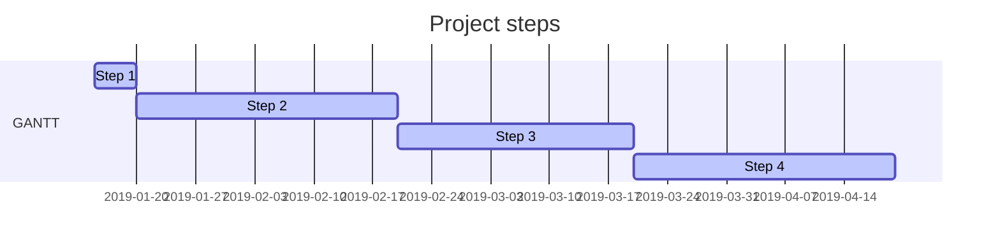

# Template of Project Plan
 

|  |  |
|:-:|:-:|
| Document | Project Plan |
| Author: | |
| Version: | |
| Date: | |

1.	Assignment background and basis, goals and tasks, delimitations and connections, result
2.	Project organization: introduction, responsibilities and decision-making process
3.	Project phases and financial objectives: task sets, breakdown and phasing, milestones, schedules and resource plans, budget
4.	Quality assurance methods: standards, approval procedure, change management, documentation, reviews, risk management, other complementary plans
5.	Communication and project progress monitoring: project start-up, workspaces and communication tools, meeting practices and communication, reporting and information, project folder
6.	End of project: delivery, implementation, maintenance, storage of project material, archiving, final report, official end of project

 
## 1 Project and end product description
 
“This document describes the background, objectives, tasks, phase division, resources and organization of the project X. In connection with the division of phases, each phase is briefly described separately. ”
 
### 1.1 Background and basis
 
“The aim of project  activities is to unite the....”
“Enterprise X needs to develop the <object> project”
“The project will be implemented within the xyz course organized by the Institute of Information Technology of Jyväskylä University of Applied Sciences.”
 
The object is often a broader concept than the actual task defined for the project. The object describes in a clear way, often based on a graphic representation, what kind of system entity or functionality the current project task will be part of. Thus, the current system and the client's current mode of operation are described here.
 
### 1.2 Objectives and tasks
 
* Produce a solution
* Produce a working demo (Proof Of Concept)

 
Define the main content of the work in this project; the task of the project is related to the entity described in the project object. <What is to be done?> / <What activities are to be developed and how?> <Vision of the future state> / <What is the end result to be produced (concrete)?> / <What are the partial or intermediate results?> <To whom is the result to be produced?>” the task is to keep the various parties aware of the project situation. At the end of each phase, a phase report will be drawn up to inform the executive board of the progress of the project. "
 
### 1.3 Delimitation and subscriptions
 

*  “Projects outputs will not be commercialized, but will be open innovations for the benefit of future students and companies.”
 
Clarify the role of the project by delimiting the excluded parts of the target system or the overall project. The external factors that significantly limit the performance of the task should also be described separately.
 
This also specifies the sets of tasks that are likely to be included in the current section at some point, but which will not be carried out within the framework of this project. Typical such tasks could be e.g. construction and training of the operating environment. Other restrictions could be, for example, the language used in the software interface.
 
Note: A project implemented during the project study period should not have strict schedule connections to other projects of the client
 
### 1.4 Rights
 
"The rights of the various parties are defined in the project agreement." If the rights to the results of the work have not been stated in a separate agreement, they must be expressed, for example, in this project plan.
 
### 1.5 Terms and definitions
 
This section introduces the definitions, terms, and abbreviations used in the project plan. For example, in different projects, the words "inspection" and "review" may have different meanings and this may lead to misunderstandings. Sometimes it may be appropriate to agree on different words for different audits (internal, with the client, course related). It is a good idea to open the abbreviations in the original language and add a short description in Finnish. For example, CASE = Computer aided software engineering.
 
## 2 Project organization
 
### 2.1 Introduction to the organization
 
The organization of the project includes teachers from Jyväskylä University of Applied Sciences, project staff, students, project team supervisors and the client's representatives. The organization chart is presented in the attachment(x)."
 
#### Project team
 
“The project team will perform the tasks assigned to the project by the management team within the available resources. During the project, the roles of group leader and secretary will rotate within the group, with each team member acting once in each role. ”
 
#### Executive team
 
“The executive team consists of elected representatives of the project team, supervisors and the client. If necessary, other persons, e.g. experts, may also be invited to the meetings of the executive team. The composition of the executive team is presented in an attachment of the project agreement. ”
 
#### Support Group
 
The task of the support group is to give the project team substantive guidance on how to complete the task. The section should introduce other stakeholders of the project (customer, external consultants, etc.) at personal level. Any person(s) from the client organization who participate in the project should be introduced. At least name, contact information, job description and role in the project should be introduced for any person(s) from the client organization who participate in the project.
 
### 2.2 Responsibilities and decision-making process
This part describes the responsibilities of all members of the project organization (e.g. executive team, project manager, secretary, team, supervisors) as well as the decision-making process (e.g. the project manager prepares and presents any items to the executive team for decision…).
 
## 3 Time objectives of the project
 
### 3.1 Partitioning and phasing

Partitioning a project means dividing the project into clear sub-assemblies and their corresponding implementation entities (sub-projects, phases, task entities and tasks). The progress of research and development projects is characterized by the formation of the end result and the refinement of the goal step by step. The partitioning of a project should be based on this (also applies to student projects at the IT Institute).

The life cycle of a project can be divided into different types of phases. At each stage, specific products are produced, such as a study, plans, prototype, device, etc. An evaluation, approval, or review is agreed at the end of each stage.

A software project is typically divided into seven phases: establishment, feasibility study, analysis, design, implementation, testing, and completion. Sometimes the feasibility study is its own project, sometimes the analysis is included in the design, etc. Testing is not necessarily its own stage, but is included in all stages.

Often a project proceeds incrementally, that is, one thing is planned and implemented in its entirety before moving on to the next issue. There is no single “correct” phase division, but if the client has his own method and related templates, then they will be used primarily in student projects. Agile application development is increasingly used, i.e. the software is done in 1-4 week sprints.

<What steps does the project include? (Short description of each)> <What are the results of each step? >

The following is a brief overview of each step, the time resources required, and the results. The phases and their tasks are described in more detail in the phase plans. It is important to know exactly who is doing the current phase and how much work to do to complete the tasks in this phase. Workload estimates for later phases can be presented at an initial rough level, which is then refined to a detailed level as the project progresses. This happens at the end of each phase, when the next phase is planned in more detail.

Note: The following are the start and stop steps. A so-called Gantt chart (attached) is also prepared for all phases of the project, their duration and workload, which also shows the dependencies between the phases and the most important stages (e.g. the dates of the executive team meetings).

Start dd.mm.yy - dd.mm.yy (X h)

Starting a project essentially involves project planning and the preparation of design documents, as well as the creation of communication practices with the client company. During the phase, for example, the group's website will be made, the assignment will be examined in more detail, familiarization with the target area will begin and a project plan will be drawn up in cooperation with the client's representatives. During the phase, an executive team is formed, a 1st executive team meeting is held and a project agreement is signed.

"The results of the phase are the creation of the group's image (name, logo, etc.), web pages, etc. and a project agreement with attachments."

<Here are the steps and tasks for your own project>

End dd.mm.yy - dd.mm.yy (X h)

“The closure phase includes measures related to the completion of the project. During the phase, the project team prepares a final project report and a presentation to the executive team. During the phase, the result of the project will be handed over to the client, the last meeting of the executive team will be held in week X and the project organization will be dissolved. The final phase will result in a final report on the project. ”

## 4 Quality management
Working methods, tools, instructions and standards applicable to the project.
This section lists all the methods, tools, and standards used with their version numbers. Often, the client has some method that the project team should follow. The client can also specify the document layout standards to be followed. Otherwise, the project team will tailor a suitable one from the templates provided by the IT Institute and  get it approved by the client.
The course sets certain requirements for project monitoring tools and reporting, which should be taken into account. However, the course does not force a certain way to use the tools, so it is worth making a plan for their use at this point.
The basics of project information and version control need to be clarified so that all project stakeholders know the location of the latest versions of documents. There will be several versions of the project plan and all other key documents of the project, to which version history must be added in order to be able to follow the progress of the project afterwards. If an individual piece of hardware or software rises to a critical position in terms of project implementation, it is a good idea to appoint a responsible person from within the team. The person should be familiar with the device or software, if possible. Below is a list of things to plan and document:
 
### 4.1 Procedure for approving interim and final results
The approval procedure that has been agreed in the project is recorded here.
 
### 4.2 Change Management
Describe the change management procedure for changes related to project policies or project results.
 
### 4.3 Documentation
Write down where the documents are stored / archived, how they are distributed and who is responsible for the different documents.
 
### 4.4 Risk management

List the risks, assess their severity and probability, and try to consider measures on how the most serious / probable risks could be prevented in advance. In addition, it would be good to have a plan of how to act if the risk materializes.

* [Risk Management Table](risk-management.md)

### 4.5 Review Policy

List and tentatively schedule project performance reviews based on the prepared implementation plan. List the reviews that will be held, the tentative date, the issues to be addressed, the participants, and the practices for delivering the review material (what, when, how).
Links to review protocol documents.
 
### 4.6 Plans to supplement the project plan
This section indicates which additional plans are available or will be developed during the project (e.g. communication, risk management, testing and deployment plan).
 
* Requirement specification?
* Risk Management plan
* Documentation provided by the client?
* Official sources?

 
 
 
### 4.7 Dates for reviewing and updating plans
The project plan responds to anomalies and environmental changes, so it is updated during the project. The points at which the timelines of the plan must at least be checked are recorded here.
 
### 4.8 Project Suspension Criteria
Any real-life project plan also includes project termination criteria. However, these are not used in student projects because the projects use a certain number of hours to produce the result and the result is handed over as it is at the end of the course. However, the project team will make a further development plan from which a possible new project will continue.
 
## 5 Communication and monitoring of project progress (communication plan)
List the workspaces and communication tools agreed in the project, meeting policy and communication, reporting and information.
 
## 6 End of the project
 
### 6.1 Delivery, commissioning of the final product
The end product of the project must also be documented at a reasonable level. The end product may include commissioning training for the customer and possibly an installation or commissioning service. If the role of the training in the project is significant (for example, the users of the software have not been involved in the project and do not know how the system works) the project plan must be accompanied by a plan for the training to be provided to the client. In addition, if necessary, the project plan must also be accompanied by an installation plan and a commissioning plan.
 
### 6.2 Recording, archiving and retention period of material produced by the project
"The rest of the project team's documentation for the IT Institute is stored in GitHub." The client should clearly define which documents can be left as lessons for subsequent projects. Typically, the various plans and the final report are such documents.
 
### 6.3 Formal closure of the project
It is important to determine when, where or how the project will end. A project decision can be a specific date, a certain degree of product readiness, a certain number of hours worked, a certain amount of money spent when a client adopts a product, the warranty period has expired, or when a client accepts a product.
* “The project ends dd.mm.yy, if…”
* "The project ends on dd.mm.yy, when the project agreement expires."

 
### 6.4 Closing Seminar
Usually projects are closed at a joint closing seminar. The participants and the time are recorded here.
 
### 6.5 Final report
The final report of the project will be prepared by the last meeting of the executive team.
## Attachments
Any plans supplementing the project plan are attached here.
