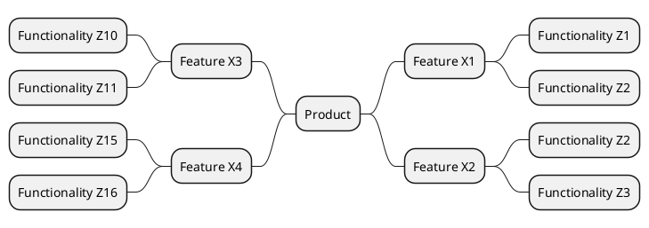

# Template of product mind map

This is a mind map view over product/service. The primary features (Xn) are described in the picture down below. All feature have Functionalitys which are named as (Zn). 
The map should be updated according the product under a development. 

All the product features can be also listed as below. This list  

| Feature | Functionalitys | Functional Requirement / User Story| 
|:-:|:-:|:-:|
| [Feature X1](templates/template-feature.md)| Z1, Z2| [FUNCTIONAL-REQ-XX1]() |
| [Feature X2](templates/template-feature.md)| Z2,Z3| [FUNCTIONAL-REQ-X1X]() |
| [Feature X3](templates/template-feature.md)| Z10,Z11| [FUNCTIONAL-REQ-1X1]()  |
| [Feature X4](templates/template-feature.md)| Z15,Z16| [FUNCTIONAL-REQ-XX7]()  |
