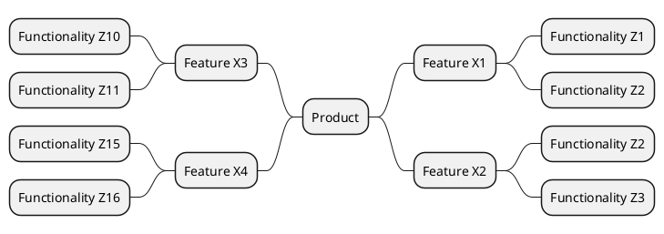

# Template of product mind map

| Feature ||| 
|:-:|:-:|:-:|
| [Feature X1](templates/template-feature.md)||  
| [Feature X2](templates/template-feature.md)|| 
| [Feature X3](templates/template-feature.md)|| 
| [Feature X4](templates/template-feature.md)|| 
