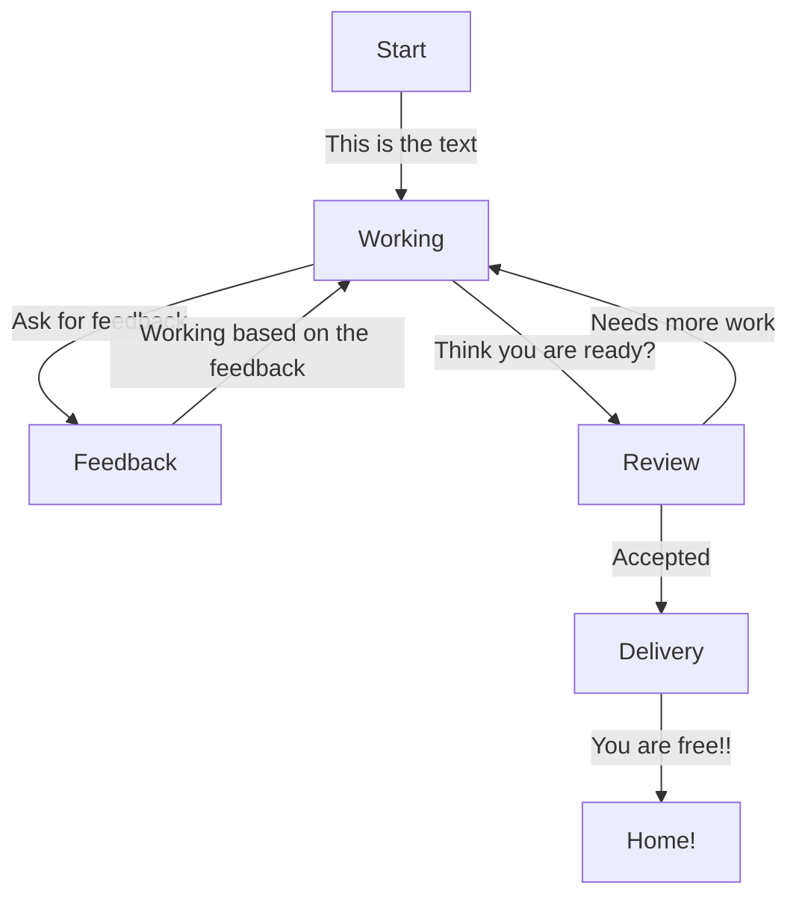

# State machine - template

This is an example of drawing a state machine using Mermaid-script. 

```mermaid
graph TD
    Start-->|This is the text|Working
    Working-->|Ask for feedback|Feedback
    Feedback-->|Working based on the feedback|Working
    Working-->|Think you are ready?|Review
    Review-->|Accepted|Delivery
    Delivery-->|You are free!!|Home!
    Review-->|Needs more work|Working

```

