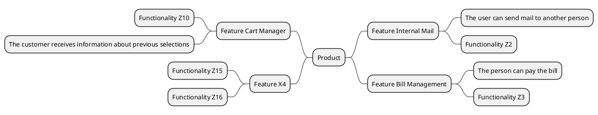

# Template of Requirement Specification 

## Requirement Specification for Service/Solution X

* Project: [INSERT PROJECT NAME HERE]
* Autohor: [Your Name/Team]
* Version: Document version number X.Y
* Template version: 1.9 - 28.9.2021 (NarsuMan)

## Some guidelines for writer of requirement specification

> If you need template documents you will find then under [template folder](./templates). With the PlantUML tool, it is possible to draw, for example, descriptions in the UML markup language and integrate them into MarkDown descriptions. During the course there is useful to familiarize yourself with its use http://plantuml.com/ and try to apply it as much as possible in different areas.

## Table of contents
 
>Update table of contents according project needs

1. [Introduction](#introduction)
1. [Principal / client](#Principal)
1. [Requirement Definition Factor](#Requirement Definition Factor)
1. [Service Description](#Service Description)
1. [Stakeholder Map](#Stakeholder Map)
1. [Stakeholders and Profiles](#Stakeholders and Profiles)
1. [Selected Customer Stories](#Selected Customer Stories)
1. [Service-Related Customer Paths](#Service-Related Customer Paths)
1. [Relevant Use Cases](#Relevant Use Cases)
1. [Key General Features/Functionalities](#Key Features / Functionalities)
1. [MockUp Prototype](#MockUp Prototype)
1. [Preliminary User Stories](#Preliminary User Stories)
1. [Service System Requirements](#Service System Requirements)
1. [Restrictions Affecting the Service](#Restrictions Affecting the Service)
1. [Service Related Equipment Requirements](#service Related Equipment Requirements)
1. [Requirements related to the service execution environment](#Requirements related to the service execution environment)
1. [Service-defined features / functionalities](#Service-defined features / functionalities)
1. [Functional Requirements for the Service](#Functional Requirements for the Service)
1. [Non-functional requirements of the service](#Non-functional requirements of the service)
1. [Preliminary Service Architecture](#Preliminary Service Architecture)
1. [Preliminary Service Placement View](#Preliminary Service Placement View)
1. [Preliminary database description of the service](#Preliminary database description of the service)
1. [Service Integrations with Other Systems](#Service Integrations with Other Systems)
1. [On Quality of Service](#On Quality of Service)
1. [Service Acceptance Tests](#Service Acceptance Tests)
1. [Release plan](#Release plan)
1. [Related Standards and Sources](#Related Standards and Sources)

## Introduction

> Describe what kind of project it is, a little background and essentially related things? If this is an exercise, then check if you can
use the real names of the real subscribers! If necessary, change the personal data and the official data of the client

## Principal / client

> Who is the subscriber to the requirements specification?

## About the author 

> Tell us briefly about yourself (as a pseudonym if necessary) or, for example, as an employee of an imaginary company.

## Short description of service/solution

> What can the service do? What are its users like? What is its role in general for the various stakeholders?
It is worth highlighting briefly the potential end user and the relevant stakeholders who will benefit from the service

## Business requirements / goals?

>Consider what kind of wishes / needs there are from a business perspective related to the service? If nothing comes to mind, then consider whose bank account the money comes from the service? Does the service achieve cost benefits? Does it improve cost efficiency? etc

| ReqID | Description | 								
|:-:|:-:|
| BUSINESS-REQ-0001 |  Registration as a new user should be easy for old users, because is's our user focus group 35% | 
| BUSINESS-REQ-0002 | ... |

## Stakeholder map

>Let's consider little what kind of user / stakeholders are involved in the planned software / service package?
To clarify these, all stakeholders are recorded in the form of a stakeholder map. At the same time, let's highlight what is
ko. motivation related to the service of the stakeholder / representative. The description can be created, for example, by drawing, in MindMap format or by applying a suitable UML notation. You can now check out the PlantUML tool mentioned earlier and try creating a stakeholder map (http://plantuml.com/) Note! The *PlantUML code block* is defined in the Gitlab's markdown version using different keywords instead of commonly used @ startuml / @ enduml lines. You will find example down below..

```plantuml
actor profile1
actor profile3
actor stake_holder1
actor stake_holder3
cloud example_of_service
profile1 -- example_of_service  : uses
profile2 -- example_of_service  : benefits
stake_holder1 -- example_of_service  : threat
stake_holder2 -- example_of_service  : competitor
```
> You can also describe stakeholders using other visualisation methods, so that the differences between the different profiles may become visible more "clearer"!


## Stakeholders and profiles

>We should define more precise some of relevant stakeholde profiles. Note that a large stakeholder instace (eg. company, institution) can contain several different stakeholder profiles. This is a reason to define several profiles. Different profiles can be at first look normal users, but they have personal needs, motives and values. This information benefits design process at early phase of product development.  

| Stakeholde/profile | Info / Link to description | Motivation? |
|:-:|:-:|:-:|
| eg. Stakeholder 1 | [Stake holder group-1](templates/template-profile.md) | |
| eg. Stakeholder 2 | [Stake holder gorup-2](templates/template-profile.md) | |
| eg. Stakeholder 3 / End user 1 | Person 17-35 Years old | Benefits x, y and z |
| eg. Stakeholder 4 / End user 2 | Person 36-45 Years old | Primary reason is... |
| eg. Admin user | [adminuser-profile](templates/template-profile.md) | supports service users |

## Customer story's as background information

>During requirement gathering process it's a good practice to do some interviewing among possible service users and importanto stakeholders. Gathering some information of different users will help to understand how service should be designed to fit a purpose. This information is valuable to understand in how the person/stakeholder benefits of solution/service in future. This process could be written as a customer story. 
Try to write a story from the perspective of the selected profile/stakeholder (other profiles / stakeholders may appear in the story). It is convenient to refer to previously created [Profile] descriptions as as a back ground of the story.

**Example of end use/customer story** 

*[Profile 1](template/template-profile.md) wakes up in the morning and checks on his phone if there is room in the X service from the morning. By using application he can find that there is several open slots available .........*

**end user profile 1 point of view** 

*[End user profile  1](pohjat/pohja-profiilikuvaus.md) is goint to start a cement mill on a construction site in the afternoon when she receives a message from the X service .........*

## Customer need

>Consider what kind of wishes / needs the end user has regarding the service? Interview some potential users in a real life situation? 

| ReqID | Description | 								
|:-:|:-:|
| CUSTOMER-REQ-0001 | eg.  As a [user](templates/template-profile.md) of solution I would like to use Faceboot authentication | 
| CUSTOMER-REQ-0002 |...|

## Customer Journey paths in Service/solution 

> Think about the customer story you wrote earlier and draw an outline of the customer path based on it.
What events are involved? Think of the service as a whole!
The case path description is used to describe a series of events that go through a selected situation during the use of the service.
There can be several customer-specific service paths, but the most important thing is to identify the most relevant at the beginning.
When describing the service path, you can use, for example, the Swim lane / BluePrint / state machine description or other description deemed appropriate. However, it is important to describe the path and use it, if necessary, to clarify the understanding of the service sought.
Go through the description you made with someone else? Go through the path and tell what happens during it.
It is a good idea to start sketching the customer path, for example on the basis of a customer story. If necessary, several paths should be needed to created from the perspective of different profiles. So it is not worth immersing too many events in one description

**Customer journey path as PlantUML Statemachine -diagram**

> Trying to sketch a customer path using the PlantUML tool. Definitely worth trying other ways too!
If necessary, other tools can be applied to the descriptions of the service paths. Eg https://canvanizer.com, PowerPoint etc
Try out also PlantUML SDL / Swimlane description?

```plantuml
[*] --> Step1
Step1 : First contact to service 
Step2 : Under Service 
Step3 : End of service
Step4 : Queue for service 
Step1 --> Step2
Step1 --> Step4
Step4 --> Step2
Step2 --> Step3
Step3 --> [*]
```
## Preliminary **User Storys**

| User Story ID |Description / link to issue |
|:-:|:-:|
| US1000 | As a user, I want to be able to generate a report of my purchases for the last month, as it makes it easier to manage my finances, #12|
| US1001 | User Story: As an administrator, I want to delete old accounts completely because it clarifies maintenance |
| US1002 | eg. you can also add hashtag and issue number here #12 |
| US1003 | ... |

## Selected Use Cases of service/solution

> While a [user]()uses the service there will be  service-related interaction events. Most importatnt scenarios using the service/solution should be described somehow. One way to to define usage scenario is a [Use Case](https://en.wikipedia.org/wiki/Use_case) description.
Use Cases diagrams can be drawn using [PlantUML](https://plantuml.com/use-case-diagram) scripts. UML Use Case description can be done as PlantUML description, but a more detailed use case requires a separate description document

```plantuml
rectangle Order {
Profile_1--(Making order)
Profile_1--(Modifying order)
Profile_1--(Cancelling order)
}
rectangle Order_management {
Administration_1--(Checking the Order)
Administration_1--(Modification of order)
Administration_1--(Transferring the order)
Service_1--(Order manual cancelling)
Service_1--(Order clear and restart)
}
```

>It is useful to record all relevant use cases in one broader Use Case description because it allows you to view
easier throughout the system. Attention! In the larger system as a whole, there may be several hundred different uses.
A more detailed description of the use case in the training environment is provided using a use case-specific template file. For every use case
an independent file is created.

| Use Case | Domain |
|:-:|:-:|
| eg. [Use Case 1 - User selects new avatar logo](templates/template-usecase.md) | User settings feature | 
| eg. [Use Case 2 - User creates new article ](templates/template-usecase.md) | Article feature | 
| .. | ..| 

## Preliminary MockUp-prototype layouts for solution/service

> When defining the needed features and functions for service/solution under design, it may be handy method to scetch up some visible elements of service layouts. On web desing those preliminary visions for eg user interface layout are called as "Mockups". Mockups help to valiate development team's understanding of needed design between customer and team. Mockup's are handy to use also to check needed functionalityes during selected use cases. Different layouts and visualisation of service can reveal more easily some hidden needs those should be gather on the requirements specification.

```plantuml
salt
{
  Just plain text
  [This is my button]
  ()  Unchecked radio
  (X) Checked radio
  []  Unchecked box
  [X] Checked box
  "Enter text here   "
  ^This is a droplist^
}
```

## System requirements 

> Commonly System requirements are higher-level requirements on the basis of which the system as a whole is defined.
> When designing services, from a technical point of view, different requirements arise
technologies, equipment, or physical structures of realization. When defining a software service
it is advisable to identify purely the technical / production requirements of the system in good time and record them in the requirements specification.
Excessive concentration on the recording of technical production / implementation requirements may not be recommended because
during design, software / service implementation requirements may still change. A solution that was considered handy during the development phase
may prove costly during the commercialization phase of the service.
Open in Google Translate

> In this section, it is worth considering, for example, the following

- How is the service produced? As a SAAS / PAAS / IAAS / HOSTED service etc
- Whether to use Cloud Services as part of the solution or to utilize our own servers
- Is it the so-called A hybrid service that utilizes multiple separate services
- How must the service be available 24 / 7h 100%? So is that even possible :)?
- What kind of SLA is prepared for the service?
- How much does the production of the service cost?
- What kind of data storage / archiving needs are related to the service?

> System level requirements look at the software / service as a whole and define it based on it
e.g., technical requirements for the execution environment, resources required to maintain the service.
System performance environment requirements include, for example, equipment requirements for the production environment or
system runtime requirements, which may include requirements for performance, maintenance, certifications, etc

> What kind of execution environments are then used, for example, in commercial solutions? You can explore the examples at [Stack Share] (https://stackshare.io/):

| RequirementsID | Description |
|:-:|:-:|
| SYSTEM-HW-REQ-0002 | The main services must be at least duplicated N + 1 |
| SYSTEM-HW-REQ-0003 | Server memory capacity> 16GB |
| SYSTEM-HW-REQ-0004 | Intel / AMD x64 processor |
 
### Constraints and standards that affect on service design

> The implementation and use of different software / services is often governed by laws and regulations. The requirements required by these are usually recorded as restrictions
and their impact often affects the implementation of the entire software / system. For this reason, they should be identified and clarified in a timely manner because of the impact
may be quite decisive in the long run. As an example, the [EU GDPR Act] (https://en.wikipedia.org/wiki/General_Data_Protection_Regulation).

| ReqId | Description |
|:-:|:-:| 
| CONSTRAINT-REQ-S00000 |  The service login process must follow XYZ policies [Login ft1] (bottoms / bottom property.md) |
| CONSTRAINT-REQ-S00002 | ... | 

### Service primay features and functionalities

>Let's outline some of basic features of solution/service as a short list. , i.e. what do you think is possible with the service?
Update the list later when it refines?

> It is useful to prepare a summary (A4 size) together with the client, which will contain the whole product in crystallization, if necessary.
- Functions
    - The user can send mail to another person
    - The customer receives information about previous selections
    - The person can pay the bill




* Describe main features by using [Product Mind Map](product-mind-map.md)?

It is worth noting that some of the functional requirements are in practice essential functions, i.e. they can be "upgraded" to features.
As an example, the Online Banking service has the essential function "payment from account", which is an important feature of the service in practice. Over here
there are a number of other smaller and more specific functional requirements associated with functionality
If you are asked what the service / software can do, try to identify the most important functions!
They are quite certainly essential features. Think about what functions you can do, for example, on the online banking page? What are the most important functions you use most often? Is it worth considering at the definition stage whether all the features are necessary? You should try to group the key features first. The features can be specified by functional requirements, which are called expand the feature description. In practice, the features are larger entities that make up the entire service / software.
The Finnish word feature may be a bit misleading, because often when presenting products, the aim is to emphasize its "information security" as a feature of the product. This is not to say that this is one feature of the product software but a general "design philosophy." The product may contain features that allow it to be called secure.

**eg. Priorization of essential features / functions **

* P1 = Mandatory
* P3 = Required
* P5 = Nice to have

| Feature | Priority  |
|:-:|:-:|
| eg. [Feature 1 - report generator](templates/template-feature.md) | P1 | 
| eg. [Feature 2 - billing log](templates/template-feature.md) | P1 | 
| eg. [Feature 3 - avatar icon](templates/template-feature.md) | P3 |

## Functional requirements of the service

> What are the functional requirements? Functional requirements describe the operation required of a software / system
Functional requirements are the most easily identifiable. Avoid writing multiple claims in the same sentence! Each requirement separately ..
You can present them in a table or refer to [one] (bases / baseline requirements list.md) for a larger entity

| ReqID | Description | Affected feature? |								
|:-:|:-:|:-:|
| FUNC-REQ-C0001 | eg. User profile X is able to authenticate using Faceboot-account | eg.  [Feature 6 - Service Login](templates/template-feature.md) |
| FUNC-REQ-C0002 | eg. User profile X is able to create weekly report about selling | eg. [Feature 1 - report generator](templates/template-feature.md)|


## Software / service non-functional requirements

> What were the non-functional requirements? You can present the different requirements in a separate table or refer here to [one] (bases / baseline requirements list.md) larger table.
[Non-Functional Requirements] (https://en.wikipedia.org/wiki/Non-functional_requirement) includes a wide range of different perspectives on a software purchase product. The main author
from a perspective are: Performance, usability, security, and maintainability
> You can present the different requirements in a separate table or refer here to [one] (bases / baseline requirements list.md) larger table.
How well does the service / component or other part of the service perform during the load? What are the bottlenecks. What requirements should the service be able to meet?

### Performance Requirements

> What are the performance requirements for the service?

| ReqID | Description | 								
|:-:|:-:|
| PERF-REQ-0000 | Login is possible for 100 users at the same time (100 request/s) | 							
| PERF-REQ-0001 | ... |

### Security Requirements

> What are the requirements for the service from a security perspective?

| ReqID | Description | 										
|:-:|:-:|
| SEC-REQ-0001 | The password must use at least MD5-level encryption, as required by the XY112 standard |
| SEC-REQ-0002 | ... |

### Availability Requirements

> What is meant by Availability? What kind of issues / guidelines must be taken into account when implementing the service available?

| ReqID |  Description | 								
|:-:|:-:|
| USAB-REQ-0000 | | Font should be size at 16pt  |	
| USAB-REQ-0001 |  User interface should be visible in high contrast mode |
| USAB-REQ-0001 |  ...... |

## Quality Assurance

> What issues need to be considered for product quality assurance point of view ?. 

* Link to [Master Test Plan]()
* Link to  [Test plan]()

### Preliminary Acceptance Tests

> Acceptance tests generally focus on the customer / end-user perspective. The aim is to validate, ie to validate whether the product meets the customer's wishes and whether it meets the set requirements.
Acceptance tests can be used to determine whether a product is also sufficiently high-performance, usable, or secure for customer use.

| AcceptanceTestId | Description | Feature 	|						
|:-:|:-:|:-:|
| [ACCTEST001 - Acceptance Test 1](../../50-Test-management/templates/acceptance-test.md) | eg. Verify login as new user | [Feature X]() |
| [ACCTEST002 - Acceptance Test 2](../../50-Test-management/templates/acceptance-test.md) | eg. Verify remove of personal data | [Feature Y]() |
| [ACCTEST003 - Acceptance Test 3](../../50-Test-management/templates/acceptance-test.md) | eg. Verify login with correct password | [Feature Z]() |

## Software architecture, placement view, database description, and integrations

> Software implementation requirements can be set for pre-defined technologies that must be followed in development.
This situation often occurs when the software is related to a previously implemented solution

* Link to [Software architecture](../../30-Architecture-and-design/sw-architecture.md)


### Deployment diagram

> The placement view allows you to describe how different parts of the service work when it is running.

### Integrations with other systems

> The requirements definition is to describe the dependence of the service / product on other systems. Are there any parts of the service to be purchased from an external service provider.
Examples are virtual machines, billing systems, control and other service production solutions.

* Link to [Software architecture](../../30-Architecture-and-design/sw-architecture.md)

**General view of integrations as UML Deployment Diagram**

```plantuml
node node1
node node2
node node3
node node4
node1 -0)- node2 : service X 
node1 -0)- node3 : service Y
node1 -0)- node4 : service Z
```

** Describing integration as a sequence diagram **

> If necessary, events between systems can be described, for example, in the form of a sequence diagram.

```plantuml
node1 ->node2: Log Start Request
node2 --> node1 : Logging started
```


## Standards and sources

> As part of the requirements definition, it is essential to identify important sources that are useful or relevant to the whole. Standards and pre-distributed guidelines are useful sources and as needed
clarify the meaning of the requirements.

| ID | Linkki |  |  
|:-:|:-:|:-:|
| JHS 165 ICT | http://www.jhs-suositukset.fi/c/document_library/get_file?uuid=b8118ad7-8ee4-459a-a12b-f56655e4ab9d&groupId=14 | Vaatimusmäärittely |
| SO 9241-11 | https://fi.wikipedia.org/wiki/K%C3%A4ytett%C3%A4vyys  | Käytettävyys | 
| ISO9001 | https://www.sfs.fi/julkaisut_ja_palvelut/tuotteet_valokeilassa/iso_9000_laadunhallinta/iso_9001_2015  | - | 
| - | -  | - | 
