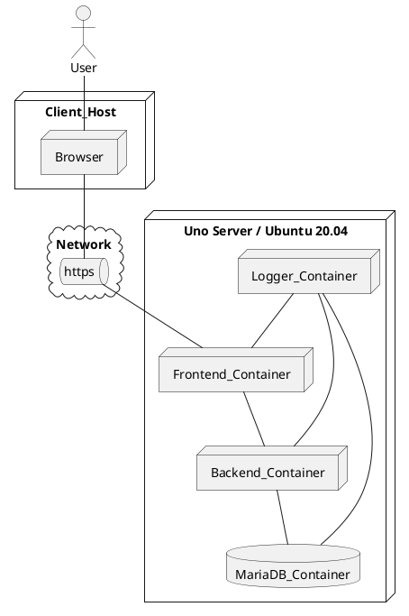

# Solution Architecture

# Architecture and technical solutions

This document is a "living" document that is constantly updated. In its current form, it is only a rough framework that "can" be used as a basis for technical documentation of projects. The structure can and must be modified! The goal is to create a document that seamlessly integrates the design documentation with the rest of the project documentation. The author assumes no responsibility for the content of this document.

TV: NarsuMan

## Title

Version number

Classification (Secret / Public etc ..)

Responsible person


## Introduction

* Introduction to the document ..





## Overview

* Briefly introduce the product or item
* The task of this document is to give the next developer, for example, an understanding of how the product has been implemented (Source code alone is not enough)
* What kind of tools and environments are needed if you plan to develop the product further


## Technologies used

  * JAVA / Java Script?
  * HABA language
  * Reasons why!

  
## Descriptions of product development environments

Describe at least the following:

* Development environment
* Test environment
* Execution environment
* Demo environment

In other words, how have those different environments been implemented in the project

## Tools used and their version numbers

* Translator for xyz v1.0.1
* debugger zky v2.05
* Firefox 123
* Reasons why!


## The most important technical solutions on which the product relies


  * Used libraries / frameworks (JQuery v 23456, JAVA EE 8 + Spring ZZZ, React IO)
  * Other jips and gimmicks
  * Reasons why!
  

## General software architecture

  *
  * Services
  

## Interfaces

  * [Example of living life] (https://virkailija.opintopolku.fi/koodisto-service/swagger/index.html)

## Description of the execution environment (production)

  * How the product is run in production
  * Deployment diagram


## Database descriptions (Databases as ER-diagram)

> When defining a service, it is common to describe the rough structure of the required data warehouse, eg in the form of an ER diagram.
This gives an idea of ​​what kind of solution is needed. You can apply PlantUML description to generate an ER diagram.

**Example**

```plantuml
' hide the spot
hide circle

' avoid problems with angled crows feet
skinparam linetype ortho

entity "Entity01" as e01 {
  *e1_id : number <<generated>>
  --
  *name : text
  description : text
}

entity "Entity02" as e02 {
  *e2_id : number <<generated>>
  --
  *e1_id : number <<FK>>
  other_details : text
}

entity "Entity03" as e03 {
  *e3_id : number <<generated>>
  --
  *e1_id : number <<FK>>
  other_details : text
}

e01 ||..o{ e02
e01 |o..o{ e03
```


##

