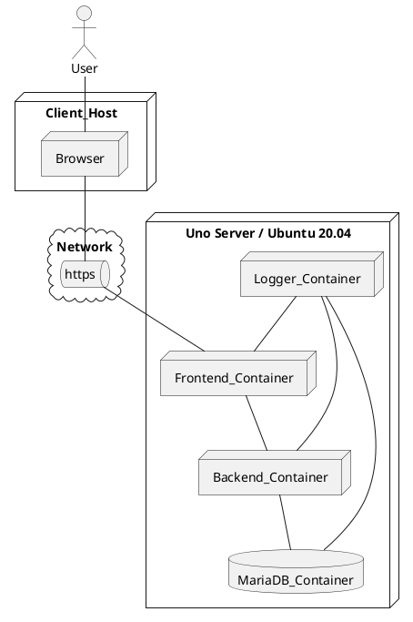

# Template of System Achitecture and design


# 1 INTRODUCTION
The chapter gives an overview of the design.
## 1.1 Purpose and coverage
The purpose of the document is presented, why it was made and for what purpose and to whom it is intended (implementation team or subcontractor of one's own company or who).
List what things are described in the document; especially if the reader is not used to reading design documents.
Determine the coverage of the design in relation to the definition. If the design does not cover the entire definition, it should be mentioned here (ie what other documents in the design phase exist, eg if the design of the user interface or database has been detached into its own documents).
## 1.2 Product and environment
Mention the name, purpose and objectives of the product. The general operating environment of the product: for example, PC, Windows98 and LAN.
## 1.3 Definitions, notations and abbreviations
Explain in alphabetical order words and concepts that are unfamiliar to the reader, or that may be thought to cause confusion with their particular use, or that are not generally known. These should be listed in alphabetical order. For example, the ASCII character set indicates whether it is 7-bit (eg ISO 10646) or 8-bit (eg ISO 8859-1).
## 1.4 References
List references to other sources (documents, standards, manuals, style guides, etc.) in alphabetical order by reference. References include the name, version, date, and where they can be found. Examples include:

  * documents referred to (eg definition)
  * documents related to the system or its construction
  * additional information
  * (coding) style instructions.
  * If the design does not cover the entire specification, it is mentioned here. At the same time, it will be clarified what other documents at the design stage exist.
  * For example, the design of a database or user interface may have been detached as a separate document).

## 1.5 Overview of the document

This section describes the structure, content, and organization of the document; what is covered in any chapter. This is especially important if the reader is not used to reading design documents.
If the first chapter is entirely on the same page as this section (1.5 overview) or is very short, it does not need to be mentioned in this section, but you can start with the things in Chapter 2.
The contents of each chapter are described more than just browsing the table of contents.
Possible appendices are also described here, e.g., appendices 1-4 contain class diagrams of the main parts of the system.

# 2. SYSTEM OVERVIEW
The chapter presents an overview of the system to be implemented, an introduction to the customer's environment and application area.

## 2.1 Description of the application area
Describe the environment to which the product or system relates. For example, the room reservation system of TUT's study office.

## 2.2 The integration of the system into its environment

Determine what the system does in this environment and whether the described system uses other programs or systems, i.e., whether it is part of a larger system.

## 2.3 Hardware environment

Describes the hardware environment in which the system operates. For example, what peripherals are needed, what is expected of the CPU, what features of the program are used by the program, what features of the hardware limit the technical solutions and what are the interfaces with other computers.

## 2.4 Software Environment

The software environment of the system with its exact versions is presented: operating system, compiler, other utilities, database software, telecommunication software, web browser, interfaces with other software and applications, and other programs running simultaneously on the hardware. If necessary, the development and testing environment can also be explained.

## 2.5 Key boundary conditions for implementation

Mention important boundary conditions. They are often customer requirements. These may include, but are not limited to, implementation hardware, software, laws or settings, response times, criticality, accuracy, security, and programming language.
Mention may also be made here of instructions on the language of the document and the code comments, variables and functions, etc.

## 2.6 Agreements and Standards

If design methods, description methods, documentation models, etc. according to standards and / or different agreements are used, then they are mentioned. The use of finished parts and the rules for naming them may also be described (if necessary, reference to the annex or its own document).
Various directives, regulations and guidelines are also mentioned if they affect the design. Here they can be mentioned by name and the whole source is presented in detail in section 1.5.
We will also comment on the confidentiality of the project material, if it is appropriate to mention it. Issues related to confidentiality include: distribution, storage, disposal of old versions, etc.


# 3. DESCRIPTION OF THE ARCHITECTURE

This is the most important point in the design document. The chapter contains things that everyone who implements the system needs to know and understand. The chapter describes (with reasons) e.g. design principles, technology choices, and software architecture in general. It is not necessarily advisable to subdivide into the chapters presented here, but to consider what is the most reasonable order of presentation in each case. For example, sections 3.1 and 3.2 should sometimes be combined.

*Example of Deployment Diagram*




## 3.1 Design principles

This section presents the “basic philosophy” of the implementation of the system to be developed. Philosophy defines the smallest and simplest possible set of basic concepts and rules by which design decisions are made now and in the future. The basic concepts and rules may be so closely related to some of the key modules in the architectural description in section 3.2 that it is worth moving their description here (or even combining sections 3.1 and 3.2). The technology choices made can also be part of the “rules”. Philosophy can be thought of as involving the implementation of a system in things that remain (probably) unchanged throughout its life cycle. The philosophy facilitates communication between implementers and harmonizes design solutions in different parts of the system. Examples:

  * The control system is implemented in a microcontroller without operating system support.
  * The system is divided into the following: hardware abstraction layer, operating system layer, and application module layer.
  * The purpose of the hardware abstraction layer is to hide the properties of the circuit board used, so that the implementation platform can be changed later if necessary.
  * The operating system implements process scheduling and interrupt handling control of the application module layer for the application module layer.
  * Application module layer modules are either passive (libraries) or active (processes). An example of a code frame for both types is given in Appendix x.
  * For each external interrupt source, the active application module dealing with shutdown.

For example, class and event sequence diagrams can be used to clarify the description.

## 3.2 Software architecture, modules and processes

This section details the division of software into subsystems, programs, processes, modules, packages, and / or classes. In addition, modular communication is described using, for example, event sequence diagrams.
The modules are distinguished from "finished parts", i.e. parts caught elsewhere as such or muo-Kate. These aspects can be described, for example, in the module diagram by various means of emphasis.
Naming conventions, references to style guides, etc. related to the implementation of all modules can also be presented here.


## 3.3 Database Architecture

This section describes the files and databases, e.g. division into files and / or databases, interfaces between files and databases, organization of files and databases, database software used (if any), security, recovery, backups, maintenance, upkeep.
The structure of the files and databases is presented (eg tables, ie relational descriptions, if the implementation is done with a relational database). In the design document, the data content descriptions of the specification document are converted to physical database descriptions. For example, when using a relational database, any inheritance relationships and many-to-many connections in the data content description of the definition document are decompressed. In addition, the indices required for navigation are defined. Based on the description, you should be able to write the SQL create table and create index statements needed to create the database.
The database solution and files describe:

  * Solution overview, databases, files and their interfaces
  * other software or systems using the database
  * database support software (eg backups, recovery, testing)
  * databases and files
  * database structure (class diagram with explanations)
  * Descriptions of the fields in the file records and columns in the database tables:
  * field name or identifier
  * field meaning
  * field length and shape
  * allowed values ​​type
  * processing or calculation rules
  * relationships with other information
  * upgrade criteria and methods
  * space requirements
  * maintenance considerations
  * backup aspects
  * security considerations.

**Example**

```plantuml
' hide the spot
hide circle

' avoid problems with angled crows feet
skinparam linetype ortho

entity "Entity01" as e01 {
  *e1_id : number <<generated>>
  --
  *name : text
  description : text
}

entity "Entity02" as e02 {
  *e2_id : number <<generated>>
  --
  *e1_id : number <<FK>>
  other_details : text
}

entity "Entity03" as e03 {
  *e3_id : number <<generated>>
  --
  *e1_id : number <<FK>>
  other_details : text
}

e01 ||..o{ e02
e01 |o..o{ e03
```


## 3.4 Error and Exception Procedures

Error and exception procedures at the general (architecture) level. Chapter 4 describes in more detail at the module level.
The texts of the error messages should be attached at the latest during design (it would be better to think about them already at the definition stage). The following types of error handling are taken into account:
  * general error handling rules
  * common error handling modules
  * Recognition of error messages
  * saving error messages (to memory, to disk)
  * grouping of error messages (severity, user or system)
  * error message texts.
Action in abnormal situations is part of the specification document, but a position must be taken at the latest in the design. For example, how the system behaves in the event of a power outage: "get up itself" or "get stuck".
.
# 4. MODULE / CATEGORY / PROCESS DESCRIPTIONS

The reading structure of this chapter is designed according to the architecture of the program: If a one-level breakdown is sufficient, the method presented here is used (4.1 Module X, 4.2 Module Y…). For example, if a program is divided into packages that contain multiple categories, you should make a separate section for each package, with each category described in the subsections. Things common to all classes in a package are described at the beginning of the chapter, and if the package has an interface, it is also described here. In large-scale projects, a separate design document is written for the internal structure of each package or subsystem.
Each module describes its function, interfaces with other parts, interface and implementation aspects. The technical details must be explained in such detail that the description can be used to test the module as a black box test.

## 4.1 Module X (each module has its own section 4.i)

### 4.1.1 Overview
Module name:
Module type: (class, function, process, package, subsystem, library)
Overview: A brief description of the module - why it exists, what it does.
Customers: which / what type of parts of the system need the services of this part (in the case of a general purpose component this item is missing).
Dependencies and interfaces to other modules: Briefly describe how a module takes advantage of other modules and services in its environment (can often be combined with an overview).
### 4.1.2 Interface in general
The services provided by the module and the common features of the interface functions (eg error handling) are described in general terms. In some cases, it is useful to give examples of using the module by describing the communication between the client and the module, for example as an event sequence diagram. Mention is also made here of any Standard and similar definitions that may appear outside the interface, possible capacity restrictions and their modification, status information stored by the module, etc.

### 4.1.3 Interface Functions

Each interface function is described separately in its own subsection:
  * Function name
  * Function parameters and return value
  * Action: what the function does
  * Prerequisites: describes what the state of the program must be before calling the function.
  * Post-conditions: describes the state of the program after the function call (eg side effects).
  * Error situations: exceptions and other error situations, operation when preconditions do not apply when called

### 4.1.4 Implementing the module

If necessary, instructions for implementation may be provided, for example:
  * Thoughts on the implementation of the internal data structures of the module.
  * Thoughts on the algorithms used.
  * Known potentially reusable components.
  * If the module is complex, pseudocode, activity diagrams, etc. can be used. If necessary, a separate module design document can be made.

### 4.1.5 Error handling

Describes error and exception handling at the module level.
# 5. FINISHED COMPONENTS AND SPECIAL TECHNICAL SOLUTIONS

If there are finished parts, ie external components, then such are described:
  * where they are obtained
  * where they are placed
  * use
  * other essentials (so that someone else can compile or add the application).
If some things differ from the usual working methods of the project. "Solutions that deviate from standard industry practice" that a person in the industry might not immediately guess.
For example, the following, if necessary:
  * security, safety
  * backups
  * recoveries
  * maintainability
  * flexibility
  * portability or portability.
Especially if there is some special or unusual way to do something.
Implementing tools can also be mentioned here, if it is indeed important to tell already at this (design) stage (rare and not recommended, for example B compiler version 2.77 which supports D library 4.56). The project plan contains detailed information on the implementation tools.
For example, can a program automatically recover from power outages or operating system "crashes"?


# 6. SOLVED SOLUTIONS

Considered, but rejected, solutions should be recorded with their rationale in an appropriate chapter or section with dates. Thus, the next reader of the document sees that something has been thought about as well. Also, if you are reading a design document yourself in six months, it may be difficult to remember what things have been considered when making the system.

At the end of the project, the rejected solution options are collected at the end of the project plan
# 7. FURTHER DEVELOPMENT IDEAS

Gather useful ideas that come to mind along the way, but which are not planned or implemented in this project; for example due to lack of time, lack of money, lack of resources or skills and competences.
For example, ideas for further development should be numbered to make it easier to refer to them later. The date and the name (letters) of the proposer will help in the follow-up, especially if the source is outside the project, if after one year the project unexpectedly receives funding for further development.
At the end of the project, this chapter is collected at the end of the project plan. The ideas for further development can also be presented as a separate appendix, which can be appended to other project documents if necessary. 

## 7. IDEAS FOR FURTHER DEVELOPMENT

Gather useful ideas that come to mind along the way, but which are not planned or implemented in this project; for example due to lack of time, lack of money, lack of resources or skills and competences.
For example, ideas for further development should be numbered to make it easier to refer to them later. The date and the name (letters) of the proposer will help in the follow-up, especially if the source is outside the project, if after one year the project unexpectedly receives funding for further development.
At the end of the project, this chapter is collected at the end of the project plan. The ideas for further development can also be presented as a separate appendix, which can be appended to other project documents if necessary.

## 8. ITEMS STILL OPEN

The figure is unofficial and should no longer be at the end of the project. This can be used to mark issues that are open during the life cycle of the document, ie that need to be resolved, so that they can be clarified before the document is finally completed.


**Original Source** http://www.cs.tut.fi/ohj/dokumenttipohjat/pohjat/suunnittelu/hytt_drsuunnittelu.doc

**Thank you for original authors!**

