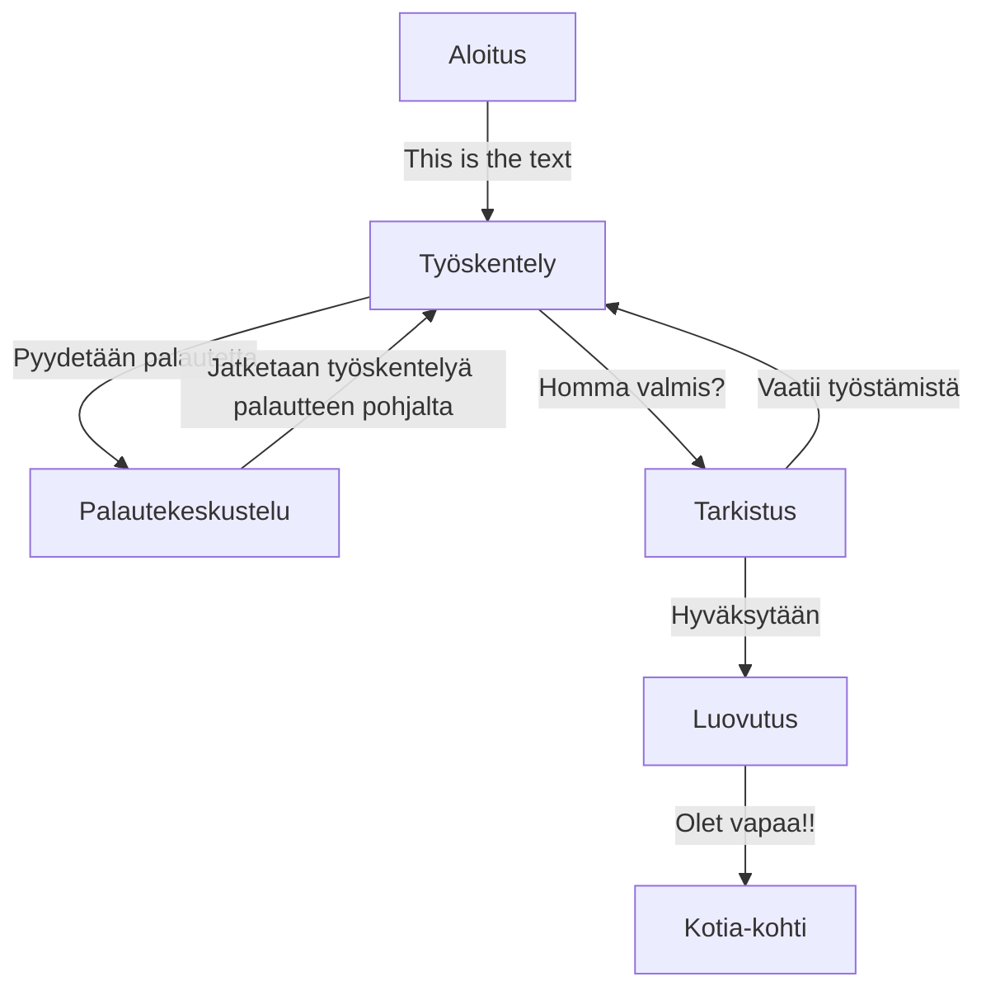

# Tilakonekuvaus -pohja

Voit käyttää tilakonekuvauksia varsin kätevästi osana MarkDown -dokumentaatiota, kun 
käytät Mermaid -skriptausta.. Tutustu.. 

```mermaid
graph TD
    Aloitus-->|This is the text|Työskentely
    Työskentely-->|Pyydetään palautetta|Palautekeskustelu
    Palautekeskustelu-->|Jatketaan työskentelyä palautteen pohjalta|Työskentely
    Työskentely-->|Homma valmis?|Tarkistus
    Tarkistus-->|Hyväksytään|Luovutus
    Luovutus-->|Olet vapaa!!|Kotia-kohti
    Tarkistus-->|Vaatii työstämistä|Työskentely
    
  
```

