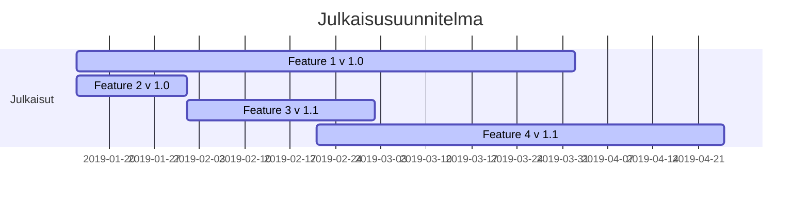

# Julkaisusuunnitelma

**Julkaisu "EarlyAdopter"**

Versio 1.0

**Konfiguraatio**

| Ominaisuus | Versio | Testattavissa | Julkaistaan |
|:-:|:-:|:-:|:-:|
| [Feature 1]() | 1.0 | x.y.201z | x+2,y+3.201z |
| [Feature 2]() | 1.0 | x.y.201z | x+2,y+3.201z |
| [Feature 3]() | 1.1 | x.y.201z | x+2,y+3.201z |
| [Feature 4]() | 1.1 | x.y.201z | x+2,y+3.201z |
| [Feature 5]() | 2.3 | x.y.201z | x+2,y+3.201z |
| [Feature 6]() | 0.9 | x.y.201z | x+2,y+3.201z |
| [Feature 7]() | 1.1 | x.y.201z | x+2,y+3.201z |

**Julkaisu "EarlyAdopter Enhanced"**

Versio 1.1

**Konfiguraatio**

| Ominaisuus | Versio | Testattavissa | Julkaistaan |
|:-:|:-:|:-:|:-:|
| [Feature 1]() | 1.0 | x.y.201z | x+2,y+3.201z |
| [Feature 2]() | 1.1 | x.y.201z | x+2,y+3.201z |
| [Feature 3]() | 1.1 | x.y.201z | x+2,y+3.201z |
| [Feature 4]() | 1.1 | x.y.201z | x+2,y+3.201z |
| [Feature 5]() | 2.5 | x.y.201z | x+2,y+3.201z |
| [Feature 6]() | 0.9 | x.y.201z | x+2,y+3.201z |
| [Feature 7]() | 1.2 | x.y.201z | x+2,y+3.201z |

**Julkaisu "EarlyAdopter Enhanced and stabilized"**

Versio 1.2

**Konfiguraatio**

| Ominaisuus | Versio | Testattavissa | Julkaistaan |
|:-:|:-:|:-:|:-:|
| [Feature 1]() | 1.0 | x.y.201z | x+2,y+3.201z |
| [Feature 2]() | 1.2 | x.y.201z | x+2,y+3.201z |
| [Feature 3]() | 1.1 | x.y.201z | x+2,y+3.201z |
| [Feature 4]() | 1.1 | x.y.201z | x+2,y+3.201z |
| [Feature 5]() | 2.5 | x.y.201z | x+2,y+3.201z |
| [Feature 6]() | 0.9 | x.y.201z | x+2,y+3.201z |
| [Feature 7]() | 1.3 | x.y.201z | x+2,y+3.201z |
