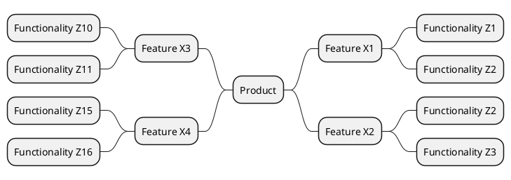

# Tuote MindMap (pohja)

>Tässä on kuvattu ohjelmisto MindMapin muodossa. Kuvauksesta selviävät ohjelmiston tärkeimmät ominaisuudet (Feature) ja niihin liittyvät toiminnot (Function).

Alla on kerätty kaikki ominaisuudet listan muotoon. On myös mahdollista viitata suoraan [julkaisusuunnitelmaan](../40-Julkaisusuunnittelu/julkaisusuunnitelma.md)

| Ominaisuus | Siihen liittyvä toiminnallisuudet | Vaatimukset | 
|:-:|:-:|:-:|
| [Ominaisuus X1](pohjat/pohja-ominaisuus.md)| Z1, Z2| [FUNCTIONAL-REQ-XX1]() |
| [Ominaisuus X2](pohjat/pohja-ominaisuus.md)| Z2,Z3  | [FUNCTIONAL-REQ-X1X]() |
| [Ominaisuus X3](pohjat/pohja-ominaisuus.md)| Z10,Z11| [FUNCTIONAL-REQ-1X1]()  |
| [Ominaisuus X4](pohjat/pohja-ominaisuus.md)| Z15,Z16| [FUNCTIONAL-REQ-XX7]()  |
