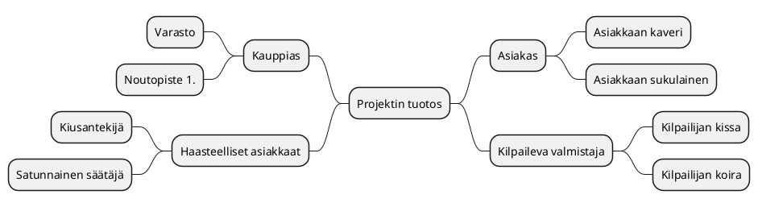
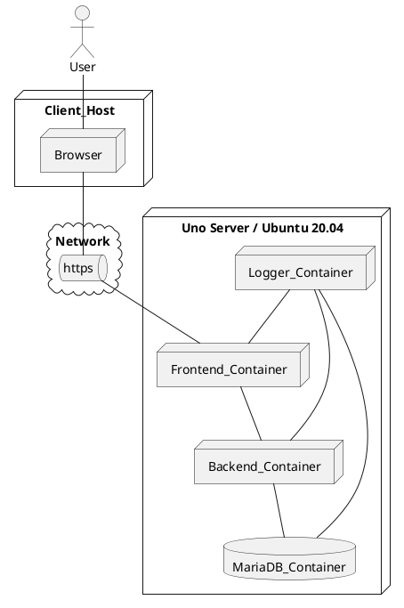

# Tiivistetty vaatimusmäärittely

|  |  |
|:-:|:-:|
| Dokumentti | Tiivistetty vaatimusmääritelmä |
| Laatija: | |
| Versio: | |
| Päivämäärä: | |

## Johdanto

>Kuvaa tavoiteltua kokonaisuutta, hieman taustaa ja aiheeseen olennaisesti liittyviä asioita? Jos kyseessä harjoitustehtävä, niin tarkista voitko 
käytää olemassa olevia tilaajien oikeita nimiä! Muussa tapauksessa vaihdetaan kaikki nimet itse keksittyihin :)

## Tavoitteet 

>Mitä toteutettavan palvelun/ratkaisun avulla tavoitellaan? Tämä voidaan käsitellä myös projektisuunnitelmassa, mutta vaatimusmäärittelyn yhteydessä voidaan tarkemmin kuvat tavoiteltua ratkaisua.

* Tavoite A
* Tavoite B
* Tavoite C

## Kohderyhmä

>Kenelle ratkaisua/palvelua kehitetään? Kannattaa nostaa esiin lyhyesti mahdolliset loppukäyttäjä ja oleellisiin palvelusta hyötyviin sidosryhmät

* Kohderyhmä A
* Kohderyhmä B
* Kohderyhmä C

## Sidosryhmäkartta

>Kuvaa sidosryhmäkartan avulla millaisia käyttäjä, sidosryhmiä tai muita toimijoita liittyy olennaisesti suunniteltun ratkaisuun/palveluun? Kirjataan kaikki tunnistetut sidosryhmät sidosryhmäkartan muotoon. Samalla kirjataan sidosryhmän/toimijan motivaatio palvelua kohtaan. Sidosryhmä kuvauksen voi laatia esim. piirtämällä se eri työkalulla, MindMap-muodossa tai soveltaen sopivaa PlantUML-generaattoria. (Suositeltava vaihtoehto)

>*Tarina väliin*
>*Palvelua kehitettäessä on otettava selvää taustoista ja pyrittävä ymmärtämään itse toimialaa tai tarkasteltua toimintaympäristöä. Tähän tarvitaan taustatietoa ja asiakastuntemusta. Henkilöt joilla on ns. toimialaosaamista (Domain Knowledge) ovat tässä vaiheessa vahvoilla. Kannattaa kuunnella asiakasta ja kerätä tietoa perehtymällä aiheeseen myös itsenäisesti. Toimeksiantajalla on varmasti tarjolla tietoa, jonka pohjalta on helpompi ymmärtää toimialaa, joka saattaa olla alkuvaiheessa arvoitus ratkaisun tekijälle*

>Tutustu aiemmin mainittuun PlantUML-työkaluun ja kokeilaan luoda tuotteeseen liittyvä sidosryhmäkartta. Löydät ohjeistuksen osoitteesta [http://plantuml.com/](http://plantuml.com/). Huomio, että Gitlabin yhteydessä PlantUML-koodilohkon kuvaamisessa ei käytetä @startuml/@enduml- täg merkintää vaan 
>* Alkuun merkintä *```plantuml*
>* Ja loppuun merkintä *```* 
>Alla olevan sidosryhmäkuvauksen voi ylikirjoittaa ja samalla tutustua miten diagrammia voidaan tuottaa PlantUML:n avulla.



**Tarkennettut sidosryhmätprofiilit** 

> Sidosryhmäkartan avulla saadaan yleiskuva eri toimijoista (actor), jotka liittyvät oleellisesti ratkaisuun/palveluun. Jos pohdimme tarkemmin esimerkiksi erilaisia palvelun loppukäyttäjiä voimme huomata niissä olevan selkeitä eroja.
Tästä johtuen joudutaan tarkentamaan ja erittelemään kuvausta ja luomaa tarvittasessa ns. profiilikuvaus. Tämän kuvauksen avulla voidaan tarkemmin tunnistaa kohderyhmän luonnetta. Tarkemman kuvauksen tuottamiseksi voidaan luoda tarvittaessa profiilikohtainen kuvaustiedosto. Tämä tiedosto voidaan luoda kopioimalla *pohja-profiilikuvaus* ja nimeämällä se profiilin mukaisesti. Tarkennettuja kuvauksia luodaan tarpeen mukaan. Alla olevassa taulukossa on esitelty muutamia esimerkki profiileja ja tarpeelliset tiedot löytyvät taulukosta.

| ID | Tyyppi | Nimi | Piirteet |  Motivaatio |
|:-:|:-:|:-:|:-:|:-:|
| SR-001 | Sidosryhmä/Profiili | [Asiakas A](pohjat/pohja-profiilikuvaus.md) | Nuori 16-22V | Selkeä tarve palvelulle ja tarvitsee palvelua usein |
| SR-002 | Sidosryhmä/Profiili | [Asiakas B - Profiili 1](pohjat/pohja-profiilikuvaus.md) | "Aikuinen" 22-45V | Tarve satunnainen, mutta yleisin asiakas  |
| SR-003 | Sidosryhmä/Profiili | Rahoittaja | Pääomasijoittaja | Palvelun tuottamat tuotot |
| SR-004 | Sidosryhmä/Profiili | Verottaja | Nuori karhu | Kerätä verotuloja  |

## Palveluun liittyviä asiakaspolkuja

>Mietitään toimeksiantoa ja pohditaan liittyykö sen käyttöön jotain yleisiä tapahtumia esimerkiksi ennen käyttöä tai sen jälkeen. Miten palvelu/ratkaisu otetaan käyttöön ja millä tavoin sitä käytetään osana  palvelupolkuja? 
>Asiaspolkukuvauksen avulla kuvataan tapahtuma sarjaa joka käydään jossain valitussa tilanteessa läpi palvelun käytön aikana. Asiakas ohtaisia palvelupolkuja voi olla useita erilaisia, mutta tärkeintä on tunnistaa alkuvaiheessa oleellisimmat. 
>Palvelupolun kuvaukseen voidaan hyödytnää sim. Uimaratakaaviota (Swim Lane) tai tilakonekuvausta (State Machine Diagram) tai muuta sopivaksi katsottua tapaa. Tärkeintä on kuvata polku ja sen avulla selkeyttämään ymmärrystä tavoitellusta palvelusta. 

>**Eri kuvauksia tehdään yhteisen ymmärryksen saavuttamiseksi, ei pelkästään yksittäisen kehittäjän iloksi**

>*Pieni tarina*
>*Mieti millä tavoin eri henkilöt valikoituvat Play Station/Steam/XBOX/Nintendo pelijärjestelmien käyttäjiksi? Mitkä ovat perusteet henkilökohtaiselle palvelun valinnalle? Onko käyttäjäryhmissä selkeitä eroja? Millaisia pelejä nämä ryhmät arvostavat? Millä tavoin liittyminen palveluun tapahtuu käytännössä? Mistä löytyy tarvittaessa VISA-kortti? Vaihda mielessäsi henkilön ikää ja huomaat, että ns. asiakaspolku (customer journey path) vaihtelee iän mukaan! Tämä on erittäin tärkeä hahmottaa ajoissa, koska palvelun kehittäjän on otettava huomioon erilaiset potentiaaliset asiakkaat.* 

**asiakaspolku PlantUML-esimerkki tilakoneena**

> Kokeillaan luonnostella esimerkki valitusta asiakaspolku PlantUML-työkalun avulla. Kannattaa kokeilla ehdottomasti myös muita tapoja! Esimerkkinä käytetään UML-kuvauksista tuttua tilankonetta (State Diagram)


**Asiakaspolku esimerkki: Asiakkaan saapuminen liiketilaan onnistuneen ulkomainoksen pohjalta**

>Tässä polussa voidaan pohtia miten asiakkaan päätöstä voidaan vahvistaa?


```plantuml
Step1: Palvelun kuvaus esillä näyteikkunan mainosnäytössä 
Step2: Asiakas astuu ovesta sisään 
Step3: Palveluun tutustuminen jatkuu sisätiloissa itsenäisesti
Step4: Asiakas kysyy myyjää
Step5: Myyjä esittelee tuotteen lyhyesti
Step6: Asiakas pohdiskelee asiaa
Step7: Asiakas tekee sopimuksen palvelusta
Step8: Asiakas ei ota tuotettava
Step9: Myyjä suosittelee lisäpalveluita
Step10: Myyjä pyytää asiakkaan sähköposti-osoitetta ja henkilöturvatunnusta
Step11: Asiakas kieltäytyy luovuttamasta HETUa ja kauppa keskeytyy
Step12: Miten tämä voidaan välttää?

[*] --> Step1
Step1 --> Step2
Step2 --> Step3
Step3 --> Step6
Step3 --> Step4
Step4 --> Step5
Step5 --> Step6
Step6 --> Step7
Step6 --> Step8
Step9 --> Step6
Step8 --> Step12
Step7 --> Step9
Step9 --> Step10
Step10 --> Step11
Step11 --> Step12
```


## Tärkeimmät toiminnallisuudet/ominaisuudet


>Mietitään seuraavaksi millaisia ovat palvelun tärkeimmät toiminnalliset omiaisuudet? Kirjataan ne ranskalaisilla viivoilla ja luodaan samalla MindMap-kuvaus, josta eri palvelun osa-alueet selviävät. 
Mieti tilannetta, että sinulta kysytään mitä palvelulla voi käytännösä tehdä? Saat aikaa vastata 15 sekuntia. Mitä vastaat? Mitä toimintoja nostatat esiin? 

- Palvelun oleelliset toiminnot (Esimerkkejä) 

**Ominaisuus (Feature) A  -Sisäinen sähköposti**

    - Asiakas_A voi lähettää postia toiselle henkilölle
    - Asiakas_A voi saada tietoa aiemmin tehdyistä valinnoista

**Ominaisuus (Feature) B - Laskutus**

    - Ylläpito-henkilö voi poistaa laskun Asiakaalta
    - Ylläpito-henkilö voi luoda uuden laskun Asiakkaalle 

    - Asiakas_B voi jakaa kuvan

**Ominaisuus (Feature) C - Pelitilanteen talletus**

    - Pelaaja_B kykenee tallettamaan tilanteen
    - Asiakas_B voi liittää Asiakkaan_A ryhmään uuden henkilön

**Ominaisuus (Feature) D - Suorasoitto**

    - Asiakas_A voi soittaa tuntemalleen kaverille


**Kirjataan eri toiminnalliset ominaisuudet MindMap-muotoon ja samalla tarkennetaan niihin liittyviä tarkempia toimintoja**
 


# Toiminnalliset vaatimukset (Functional Requirements)

Toiminnalliset vaatimukset ovat aiemmin kirjattua toimintoja, jota palvelulta/ratkaisulta edellytetään. Jotkin toiminnallisista vaatimuksista ovat luonteeltaan laajempia kokonaisuuksia, eli ns. ominaisuuksia (Feature), joihin voidaan sisällyttää erilaisia toimintoja (Functions). Yllä kuvattu MindMap-kuvaus sisältää sekä ominaisuuksia, että niihin liittyviä toimintoja.

Kun tunnistetaan perinteisesti toiminnallisia vaatimuksia kirjataan ne itsenäisenä taulukkoon. Seuraavat ehdot kannattaa ottaa huomioon:

* *Vaatimus on oltava mitattavissa*
* *Vaatimukseen ei tule sisällyttää useampia vaatimuksia*
* *Vaatimus kannattaa perustella, jos tarpeen*
* *Vaatimuksen ei saa ylikirjoittaa aiemmin määriteltyä vaatimusta*

Toiminnalliset vaatimukset voidaan kirjata taulukkoon ja näin saadaa käsitys tuotteen toiminnoista. Jotkin vaatimuksista ovat käytännössä ominaisuuksia


| ID | Kuvaus | Toiminnallisuus johon vaatimus vaikuttaa | Ominaisuus	|				
|:-:|:-:|:-:|:-:|
| [FUNCREQ-C0001]() | Palveluun kirjautumiseen voi käyttää Facebook-tunnuksia | [Kirjautumis-ikkuna](pohjat/pohja-ominaisuus.md) |
| [FUNCREQ-C0002]() | Käyttöliittymää voidaan ohjata tarvittaessa äänikomennoilla | [Ääniohjaustuki](pohjat/pohja-ominaisuus.md) |
| [FUNCREQ-C0003]() | ... | ... |

## Toiminnalliset ominaisuudet


### Käyttöliittymänäkymä/mockup 

>Ohjelmistotuotteen tavoitetilan kuvaamiseen tarvitaan usein visuuaalisia esityksiä. Miltä tuotteen tulisi näyttää ja mitä käyttöliittymään tarvitaan? Tässä tehtävässä voidaan hyödyntää nykyaikaisia MockUp-työkaluja. Näiden välineiden avulla voidaan luoda kokeiltava prototyyppi, jota voidaan käyttää apuna palvelun määrittelyssä. 

>Perinteisesti käyttöliittymä hahmotelmat ja kuvaukset on tehty piirtämällä käyttöliittymäehdotuksia kuvia ja näitä hyödynnetään suunnittelun apuna. 
Uutta palvelua määriteltäessä tarvitaan käsitys toivotusta toteuttamistavoista ja tähän MockUp-kuvakset ovat hyödyllisiä apu. Käyttöliittymän rakennetta voidaan kuvata myös PlantUML-kuvauksien avulla. Näitä kuvauksia voidaan luodat tarvittaessa useampia.

**Esimerkki yksinkertaisesta käyttöliittymän dialogista**

```plantuml
salt
{
  Just plain text
  [This is my button]
  ()  Unchecked radio
  (X) Checked radio
  []  Unchecked box
  [X] Checked box
  "Enter text here   "
  ^This is a droplist^
}
```


## Palvelun alustavat käyttötarinat 

>Ohjelmistojen kehittämisessä yleistynyt tapa käyttää kehitystavoitteiden määrittelyssä lähtökohtana eri käyttäjien konkreettisia toimintoja. Tarpeelliset toiminnallisuudet kirjataan User Story, eli käyttötarinoiden muodossa. Tutustu aiheeseen [User Story](https://en.wikipedia.org/wiki/User_story)

>Käyttötarina kuvauksen yleinen muoto on: 

*As a <-role-> I can <-capability->, so that <-receive benefit->*

>Käytä esimerkissä aiemmin määrittelemääsi profiili/sidosryhmää ja kirjoita tarvittava toiminnallisuus/tarve taulukkoon alla.

| ID | Tyyppi | Kuvaus | Linkki |
|:-:|:-:|:-:|:-:|
| UserStory-001 | Käyttäjätarina | Esim. Käyttäjänä haluan, että voin luoda raportin tekemistäni ostoista viimeisen kuukauden ajalta, koska se helpottaa oman talouteni hallintaa | #1 |
| UserStory-002 | Käyttäjätarina | Esim. Käyttäjänä haluan, että voin poistaa historian tekemistäni ostoista viimeisen kuukauden ajalta, koska en halua muistella menneitä | #2 |

## Palveluun liittyvät tekniset vaatimukset

>Kokonaisvaltaisia ohjelmisto palveluja määriteltäessa on hyvä tunnistaa ja kuvata tarvittavat teknologiat, laitteistot tai muut ratkaisut. 
Nämä tekniset vaatimukset kertovat yleensä toimintaympäristöstä, jossa suunniteltavaa tuotetta/palvelua tullaan suorittamaan. Vaatimuksilla kuvataan vaadittua toimintaympäristöä, jossa palvelun on mahdollista toimia. Esimerkkeinä tarvittava palvelinympäristö, tietovarastot, varmistukset ja muut palvelun toiminnan kannalta tärkeät vaatimukset.

*Esimerkkinä on kirjattu muutamia laitteistovaatimuksia Hardware Requirements*

| ID | Tyyppi | Kuvaus | 
|:-:|:-:|:-:|
| HWREQ-0001 | Tekniset vaatimukset | Palvelun tärkeimpien palvelujen on oltava vähintään kahdennettu N+1 | |
| HWREQ-0002 | Tekniset vaatimukset | Palvelimen muistikapasiteeti >32GB  ||
| HWREQ-0003 | Tekniset vaatimukset | Palvelimen fyysinen sijainti on oltava EU-aluella| |
| HWREQ-0004 | ... | ... ||


# Laadulliset eli ei-toiminnalliset vaatimukset (Non-functional Requirements)

>Mitä olivat ei-toiminnalliset vaatimukset? Voit esittää eri vaatimuksia erillisessä taulukossa tai viitata tässä [yhteen](pohjat/pohja-vaatimuslistalle.md) laajempaan taulukkoon. [Ei-toiminnalliset vaatimukset](https://en.wikipedia.org/wiki/Non-functional_requirement) sisältää laajan joukko eri näkökulmia sähköiseen palveluun liittyen. Tärkeimmät kirjoittajan näkökulmasta ovat seuraavat: Suorituskyky, tietoturva ja saavutettavuus 
>* Suorituskyky (Performance Requirement)
>* Tietoturva (Security Requirement)
>* Saavutettavuus (Accessability Requirement)
>*

## Suorituskykyvaatimukset (Performance Requirements)


>Millaisia vaatimuksia palveluun kohdistuu suorituskyvyn näkökulmasta?

| ID | Tyyppi | Kuvaus |
|:-:|:-:|:-:|
| PERFREQ-0000 | Suorituskyky | Kirjautuminen on mahdollista yhtäaikaa 100 käyttäjällä (100 request/s) |					
| PERFREQ-0001 | Suorituskyky | Palvelun maksimi käyttäjä määrä on ? |
| PERFREQ-0002 | Suorituskyky | ... ||

## Tietoturvavaatimukset (Security Requirements)


>Millaisia vaatimuksia palveluun kohdistuu tietoturvan näkökulmasta? Tutustu samalla [VAHTI ohjeistukseen](https://vm.fi/documents/10623/360844/K%C3%A4sikirjan+liite+Tietoturvavaatimukset/56b3fb8f-bb54-4a65-a37f-79f6985d868c)

| ID | Tyyppi | Kuvaus | Miten testataan? |
|:-:|:-:|:-:|:-:|
| SECURITY-REQ-0001 | Salasanassa on käytettävä vähintään MD5-tason salausta, koska [CONSTRAIN-000]() sitä edellyttää | [Testitapaus X]() |
| SECURITY-REQ-0002 | Jokainen tapahtuma palvelussa on kirjattava käyttölogiin, että niitä voidaan tarkastella myöhemmin | [Testitapaus Y]() |
| SECURITY-REQ-0003 | ... | ... |

## Saavutettavuusvaatimukset (Accessablity Requirements)


>Mitä tarkoitetaan saavutettavuudella? Millaisia asioita/ohjeistuksia on otettava huomioon palvelua toteutettaessa? Tutustu [saavutettavuusdirektiiviin](https://saavutettavuusdirektiivi.fi/saavutettavuus-verkkopalveluissa/) ja kirjaa  

| ID  | Luokka | Kuvaus | Miten testataan? |
|:-:|:-:|:-:|:-:|
| ACCESSREQ-0000 | Saavutettavuus | | [Testit]() |	
| ACCESSREQ-0001 | Saavutettavuus | | [Testit]() |
| ACCESSREQ-0002 | Saavutettavuus | ... | ... |

### Rajaukset ja reunaehdot (Constraints and limitations)

>Eri ohjelmistojena/palvelujen toteutusta ja käyttöä ohjaavat usein lait ja säädökset. Näiden edellyttämät vaatimukset kirjataan vaatimusmäärittelyyn rajauksina. Rajausten (Constraints) vaikutus voi koskea koko palvelua palvelun jonkin osa-kokonaisuuden toteuttamista. Tästä syystä eri rajoitteet on tunnistettava ajoissa, koska vaikutus saataa olla varsin ratkaiseva pitemmällä tähtäimella. Esimerkkinä tästä on viime vuonna voimaan tullut [EU GDPR-säädös](https://en.wikipedia.org/wiki/General_Data_Protection_Regulation).
Kannattaa tutkia esimerkiksi https://www.sfs.fi/aihealueet/terveydenhuolto/laakinnalliset_laitteet tai http://docs.jhs-suositukset.fi/jhs-suositukset/JHS190/JHS190.html

| ID | Tyyppi | kategoria | Vastuullinen |
|:-:|:-:|:-:|:-:|
| CONSTRAIN-000  | Rajaus | Palvelun kirjautumisprosessin on noudatettava JUHTA-hyväksyttyjä käytänteitä  | [Kirjautuminen ft1](pohjat/pohja-ominaisuus.md) |
| CONSTRAIN-001 | Rajaus | On huomioitava Standardi ZZZ osana palvelun tapahtuma login talletusta | [Log-palvelin](pohjat/pohja-ominaisuus.md)|
| CONSTRAIN-002 | Rajaus | ... | ... |

### Palvelun yleinen ohjelmistoarkkitehtuuri

>Vaatimusmäärittelyn voidaan sisällyttää erilaisia kuvauksia, joiden avulla voidaan esittää miten ohjelmistopalvelu on käytännössä mahdollista toteuttaa. Tämän kuvauksen voi tuottaa esimerkkinä UML-kuvauskieleen liittyvä sijoittelunäkymä, eli Deployment Diagram", kuvauksen avulla voi esittää miten palvelu on tarkoitus toteuttaa käytännössä. Missä sijaitsevat eri osat palvelusta ja miten eri osat on kytketty toisiinsa.



## Palveluun liittyvät järjestelmäintegraatiot

>Alla olevat kuvaukset ovat esimerkkejä UML-kuvauksen mahdollisuuksista, kannattaa tutustua tarkemmin laajempaan vaatimusmäärittely pohjaan, koska siitä löytyy esimerkkejä. Järjestelmien välisiä yhteyksiä voidaan kuvata tarvittaessa esim. UML-kuvauksiin liittyvän sekvenssikaavion muodossa (Sequence Diagram). 

```plantuml
Client_Host --> Service_Frontend: Login Request
Service_Frontend --> Service_Backend : Logging request check
Service_Backend --> MariaDB : SQL Request for user account
MariaDB --> Service_Backend : Account and password 
Service_Backend --> Service_Frontend : Request Result pass
Service_Frontend --> Client_Host : Logged in

```
## Standardit ja lähteet

>Kirjataan käytetyt lähteet alla olevaan taulukkoon.

| ID | Nimi | Linkki | Kuvaus |  
|:-:|:-:|:-:|:-:|
| REF1 | JHS 165 ICT | [JHS Suositukset - vaatimusmäärittelylle](http://www.jhs-suositukset.fi/c/document_library/get_file?uuid=b8118ad7-8ee4-459a-a12b-f56655e4ab9d&groupId=14) | Vaatimusmäärittelyn suositus |
| REF2 | ISO 9241-11  | [Käytettävyys](https://fi.wikipedia.org/wiki/K%C3%A4ytett%C3%A4vyys)  | Usability | 
| REF3 |  EN 301 549 | [Saavutettavuus](https://fi.wikipedia.org/wiki/Saavutettavuus) | Availability |
| REF4 |  GDPR | [GDPR Asetus](https://europa.eu/youreurope/business/dealing-with-customers/data-protection/data-protection-gdpr/index_fi.htm) | General_Data_Protection_Regulation |
