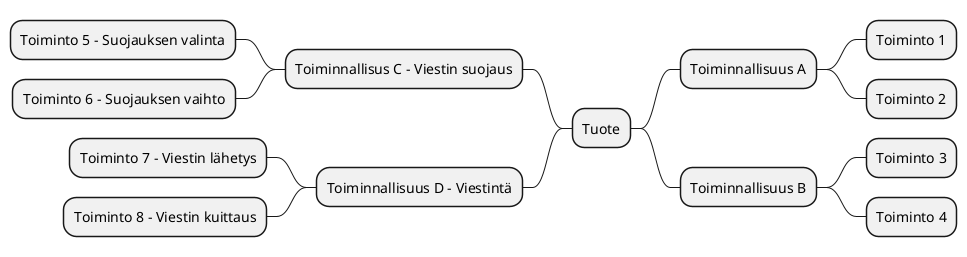
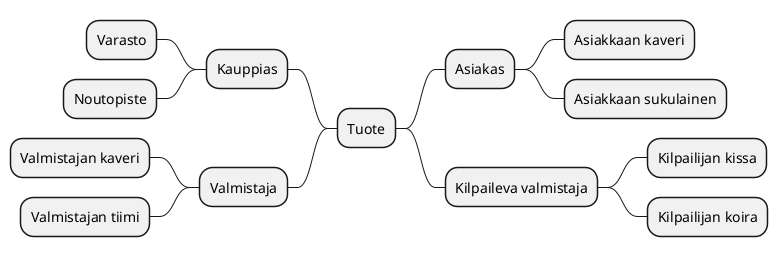

# Tiivistetty vaatimusmäärittely

* [SIJOITA TOIMEKSIANNON NIMI TÄHÄN] 
* Projektimäärittely/vaatimusmäärittely tiivispohja v 0.2 16.10.2020 (NarsuMan)


## Johdanto

>Kuvaa millaisesta projektista on kyse, hieman taustaa ja aiheeseen olennaisesti liittyviä asioita? Jos kyseessä harjoitustehtävä, niin tarkista voitko 
käytää todellisten tilaajien oikeita nimiä! Muuta aina oletuksena henkilötiedot ja toimeksiantajan viralliset tiedot 


>Mitä ratkaisun avulla voidaan tehdä? Millaisia ovat sen käyttäjät? Mikä sen tehtävä on yleisesti eri sidosryhmien kannalta? 
Kannattaa nostaa esiin lyhyesti mahdolliset loppukäyttäjä ja oleellisiin palvelusta hyötyviin sidosryhmät

**Mindmap-yleiskuvaus**

Mitä projektin tavoitteet ovat esim. MindMap-muodossa Pohjana esimerkki ohjelmistoratkaisun sisältämisitä toiminnallisuuksista. 




```plantuml
[*] --> Tuote
Tuote --> Sidosryhma
Sidosryhma --> Kiusallinen_henkilo
Sidosryhma --> Normaali_loppukayttja
Sidosryhma --> Haasteellinen_loppukayttaja
Sidosryhma --> Edistynyt_loppukayttaja
Sidosryhma --> Mahdollinen_asiakas
```


## Sidosryhmäkartta

>Mietitään tarkemmin millaisia käyttäjä/sidosryhmiä liittyy suunniteltuun ratkaisuun/ohjelmistoon/palvelukokonaisuuteen? 
Näitä selkeyttääksemme kirjataan kaikki sidosryhmät sidosryhmäkartan muotoon. Nostetaan samalla esiin mikä on 
ko. sidosryhmän/edustajan palveluun liittyvä motivaatio. Kuvauksen voi laatia esim. piirtämällä, MindMap-muodossa tai soveltaen sopivaa UML-notaatiota.

> Voit tutustu nyt aiemmin mainittuun PlantUML-työkaluun ja kokeilla luoda sidosryhmäkartta käyttäen (http://plantuml.com/)
> Huomaa! PlantUML-lohkon määrittelyssä käytetään Gitlab-ympäristössä eri avainsanoja @startuml/@enduml- rivien sijaan  
> Älä käytä skandinaavisia merkkejä PlantUML-kuvauksessa,koska niiden julkaisu www-sivulla ei toimi!**




## Sidosryhmät ja profiilit 

> Eritellään sidosryhmäkartasta eri sidosryhmät/profiilit listaksi.  Tarvittaessa kuvataan tarkemmin valitut sidosryhmät ja tarkennetaan niitä, jos toimeksianto sitä edellyttää


* [Sidosryhmä-001](pohjat/pohja-profiilikuvaus.md) 
* [Sidosryhmä-002](pohjat/pohja-profiilikuvaus.md) 
* [Sidosryhmä-003]() 
* [Sidosryhmä-004]()
* [Sidosryhmä-005]()

## Tunnistetut riskit


> Millaisia riskeja liittyy ratkaisun/ohjelmiston/tuoteen kehittämiseen, tuotteen markkinoihin, mahdollisiin kilpailijoihin, resursseihin? 
Nämä on hyvä tunnistaa alkuvaiheessa ja kirjata ne listaksi, jossa jokainen riski kuvataan itsenäisen tunnisteen avulla

* RISK-001 - Riskin kuvaus 
* RISK-002 - Riskin kuvaus
* RISK-003 - Riskin kuvaus
* RISK-004 - Riskin kuvaus

> Avainsanat SWOT, Riskianalyysi

## Palveluun liittyviä asiakaspolkuja

> Mieti toimeksiantoa ja pohdi onko siitä tunnistettavissa ns. palvelupolkuja? 
> Asiaspolkukuvauksen avulla kuvataan tapahtuma sarjaa joka käydään jossain valitussa tilanteessa läpi palvelun käytön aikana. 
> Asiakas kohtaisia palvelupolkuja voi olla useita, mutta tärkeintä on tunnistaa alkuvaiheessa oleellisimmat. 
> Palvelupolkua kuvattaessa voi hyödyntää esim. Swim lane/BluePrint/tilakone-kuvausta tai muuta sopivaksi katsottua kuvausta.
> Tärkeää on kuitenkin kuvata polku ja käyttää sitä tarvittaessa selkeyttämään ymmärrystä tavoitellusta palvelusta. 
> Käy läpi tekemäsi kuvausta jonkun toisen henkilön kanssa yhdessä? Käy läpi polku ja kerro mitä sen aikana tapahtuu..

**asiakaspolku PlantUML-esimerkki tilakoneena**

> Kokeillaan luonnostella asiakaspolkua PlantUML-työkalun avulla. Kannattaa kokeilla ehdottomasti myös muita tapoja!
> Sovella esim. PlantUML SDL/Swimlane kuvausta?

```plantuml
[*] --> Asiakas_astuu_sisaan
Asiakas_astuu_sisaan : Ensimmainen kontakti 
Step3 : Under Service 
Step3 : End of service
Step4 : Queue for service 
Asiakas_astuu_sisaan --> Step2
Step1 --> Step4
Step4 --> Step2
Step2 --> Step3
Step3 --> [*]
```

## Tärkeimmät toiminnallisuudet/ominaisuudet


> Hahmotellaan tähän kohtaan ominaisuudet pelkästään "ranskalaisilla viivoilla", eli mitä palvelulla mielestäsi on mahdollista tehdä?
> Mieti tilannetta, kun joku kysyy mitä palvelulla voi tehdä? Mitä vastaat ja mitkä toiminnot nostatat esiin ehdottomasti valtteina verrattuna muihin vastaaviin palveluihin?
> Päivitä lista myöhemmin, kun se tarkentuu? 
> Tässä kohtaa kannattaa tarkistaa mitä olivat asiakkaan esittämät toiveet palvelusta? Niistä voisi löytyä ehkä joitain tässä vaiheessa?
> Tarkemmat toiminnallisuudet tarkentuvat myöhemmin dokumentissa.  
> Tässä vaiheessa riittää:

- Oleellisia toimintoja 
    - Asiaksi-profiili-1 voi lähettää postia toiselle henkilölle
    - Asiakas-profiili-2 voi saada tietoa aiemmin tehdyistä valinnoista
    - Ylläpito-henkilö voi poistaa laskun
    - Ylläpito-henkilö voi luoda uuden laskun
    - muita?

## Alustavat käyttäjätarinat

> Ketterä kehitys on tuonut mukanaan tavan kuvata asiakkaan tarpeita ns. User Storyjen muodossa. Yritä tunnistaa toimeksiantoon liittyviä käyttäjätarinoita.

* User Story: [Käyttäjänä haluan, että voin luoda raportin tekemistäni ostoista viimeisen kuukauden ajalta, koska se helpottaa oman talouteni hallintaa]()
* User Story: [Pääkäyttäjän haluan poistaa vanhat tunnukset kokonaan, koska se selkeyttää ylläpitoa]()
* Käytännössä ylempi kuvaus on hieman jäykkä ja on järkevitä kirjata storyt suoraan esim. GitLab-issuen muotoon! 
* Kokeile osoittaa hiirelle linkkejä oikealla ja avaa ne tämän jälkeen ---> #25 tai #26

## Palvelun liittyvät tekniset vaatimukset 

**Tämä osa-alue vielä kesken**

> Teknisiä ratkaisuja määriteltäessa vaatimukset liittyvät eri teknologioihin, laitteistoihin tai palvelun vaatimiin fyysisiin ratkaisuihin. 
Sähköisiä ratkaisuja määriteltäessä kannattaa erottaa puhtaasti tekniset/tuotannolliset vaatimukset ja kirjata ne vaatimusmäärittelyyn teknisinä vaatimuksina. 

* HW-REQ-0002 | System Technical Requirement | Palvelun tärkeimpien palvelujen on oltava vähintään kahdennettu N+1 | |
* HW-REQ-0003 | System Technical Requirement | Palvelimien vähimmäis muistikapasiteeti >32GB  ||
* HW-REQ-0004 | System Technical Requirement | Prosessorin tyyppi Intel/AMD x64||
* HW-REQ-0005 | System Technical Requirement | Palvelimen fyysinen sijainti on kotimaassa (FI) ||
* HW-REQ-0005 | System Technical Requirement | Verkkoyhteyden nopeus palveluun vähintään >100MB/s ||
* HW-REQ-0005 | System Technical Requirement | Palvelinkaapin suositeltava koko 1m X 1m X 2m ||

### Toimeksiannon kannalta tärkeät oleelliset rajaukset

(Rajaus = Constrain)

> Eri ohjelmistojena/palvelujen toteutusta ja käyttöä ohjaavat usein lait ja säädökset. Näiden edellyttämät vaatimukset voidaan kirjataan tarvittaessa vaatimusmäärittelyyn.
Rajausten vaikutus koskee usein palvelun jonkin osa-kokonaisuuden toteuttamista. Tästä syystä eri rajoitteet on tunnistettava ajoissa, koska vaikutus 
saataa olla varsin ratkaiseva pitemmällä tähtäimella. Esimerkkinä tästä on viime vuonna voimaan tullut [EU GDPR-säädös](https://en.wikipedia.org/wiki/General_Data_Protection_Regulation).
> Kannattaa tutkia esimerkiksi https://www.sfs.fi/aihealueet/terveydenhuolto/laakinnalliset_laitteet tai http://docs.jhs-suositukset.fi/jhs-suositukset/JHS190/JHS190.html

| Id | Vaatimuksen kuvaus | kategoria | Vastuullinen |
|:-:|:-:|:-:|:-:|
| CONSTRAINT-REQ-S00000 | Constrain | Palvelun kirjautumisprosessin on noudatettava XYZ-käytäntöjä  | [Kirjautuminen ft1](pohjat/pohja-ominaisuus.md) |
| CONSTRAINT-REQ-S00001 | Constrain | On huomioitava Standardi ZZZ osana palvelun tapahtuma login talletusta | [Log-palvelin](pohjat/pohja-ominaisuus.md)|
| CONSTRAINT-REQ-S00002 | Constrain |||


# Toiminnalliset vaatimukset (Functional Requirements)

>Mitä toimintoja palveluun liittyy? Nämä kannattaa kirjata ensi ns. toiminnallisina vaatimuksina? Toiminnallisilla vaatimuksilla kuvataan ohjelmistolta/järjestelmältä vaadittuja toimintoja.
Toiminnalliset vaatimukset ovat helpoimmin tunnistettavia. Vältä useamman vaatimuksen kirjaamista samaan lauseeseen! Jokainen vaatimus erikseen.

| VaatimusID | Tyyppi | Kuvaus | Ominaisuus johon vaikuttaa |								
|:-:|:-:|:-:|:-:|
| FUNCTIONAL-REQ-C0001 | Functional Requirement | Käyttäjänä (Asiakas Profiilit 1-4) voin kirjautua käyttäen Facebook-tunnuksia | [Kirjautuminen ft1](pohjat/pohja-ominaisuus.md) |
| FUNCTIONAL-REQ-C0002 | Functional Requirement | Käyttöliittymän on toimittava myös ääniohjattuna, koska käyttäjillä saattaa olla näkövammoja | [Kirjautuminen ft1](pohjat/pohja-ominaisuus.md), [Tilaushallinta](pohjat/pohja-ominaisuus.md) |
| FUNCTIONAL-REQ-C0003 | Functional Requirement |||
| FUNCTIONAL-REQ-C0004 | Functional Requirement |||

# Laadulliset eli ei-toiminnalliset vaatimukset

>Mitä olivat ei-toiminnalliset vaatimukset? Voit esittää eri vaatimuksia erillisessä taulukossa tai viitata tässä [yhteen](pohjat/pohja-vaatimuslistalle.md) laajempaan taulukkoon.
[Ei-toiminnalliset vaatimukset](https://en.wikipedia.org/wiki/Non-functional_requirement) sisältää laajan joukko eri näkökulmia sähköiseen palveluun liittyen. Tärkeimmät kirjoittajan 
näkökulmasta ovat seuraavat: Suorituskyky, tietoturva ja saavutettavuus 

* Suorituskyky
* Tietoturva
* Saavutettavuus

## Suorituskyky vaatimukset


>Millaisia vaatimuksia palveluun kohdistuu suorituskyvyn näkökulmasta?

* PERFORMANCE-REQ-0000 | Non-Functional Performance | Kirjautuminen on mahdollista yhtäaikaa 100 käyttäjällä (100 request/s) | [Kirjautuminen ft1](ft1-ominaisuus.md) |								
* PERFORMANCE-REQ-0001 | Non-Functional Performance |||
* PERFORMANCE-REQ-0002 | Non-Functional Performance |||


## Tietoturva vaatimukset


>Millaisia vaatimuksia palveluun kohdistuu tietoturvan näkökulmasta?

> Tutustu [Ssecurity cards-metodiin](http://securitycards.cs.washington.edu/cards.html)

* SECURITY-REQ-0001 | Salasanassa on käytettävä vähintään MD5-tason salausta, koska standardi XY112 sitä edellyttää | [Kirjautuminen ft1](ft1-ominaisuus.md) |
* SECURITY-REQ-0002 |||
* SECURITY-REQ-0003 |||

## Saavutettavuus vaatimukset


>Mitä tarkoitetaan äyttävyydellä? Millaisia asioita/ohjeistuksia on otettava huomioon palvelua toteutettaessa?

* AVAILABILITY-REQ-0000 | [Toiminnallinen-ominaisuus-1](ft1-ominaisuus.md) | |	
* AVAILABILITY-REQ-0001 | [Toiminnallinen-ominaisuus-2](ft2-ominaisuus.md) | |
* AVAILABILITY-REQ-0002 |  |


### Palvelun yleinen rakenne sijoittelunäkymänä (Deployment diagram)

## Palveluun liittyvät muut järjestelmät

> Järjestelmien välisiä tapahtumia voi kuvata tarvittaessa esim. sekvenssikaavion muodossa. 

```plantuml
node1 ->node2: Log Start Request
node2 --> node1 : Logging started
```
## Standardit ja lähteet

> Vaatimusmäärittelyn osana on oleellista tuoda esiin tärkeät lähteet, joista on hyötyä tai merkitystä kokonaisuuden kannalta. Standardit ja ennalta jaetut ohjeistukset ovat hyödyllisiä lähteitä ja tarvittaessa 
selkeyttävät vaatimusten merkitystä.

| ID | Linkki |  |  
|:-:|:-:|:-:|
| JHS 165 ICT | http://www.jhs-suositukset.fi/c/document_library/get_file?uuid=b8118ad7-8ee4-459a-a12b-f56655e4ab9d&groupId=14 | Vaatimusmäärittely |
| SO 9241-11 | https://fi.wikipedia.org/wiki/K%C3%A4ytett%C3%A4vyys  | Käytettävyys | 
| ISO9001 | https://www.sfs.fi/julkaisut_ja_palvelut/tuotteet_valokeilassa/iso_9000_laadunhallinta/iso_9001_2015  | - | 
| - | -  | - | 
