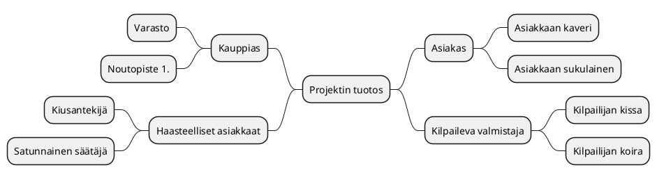
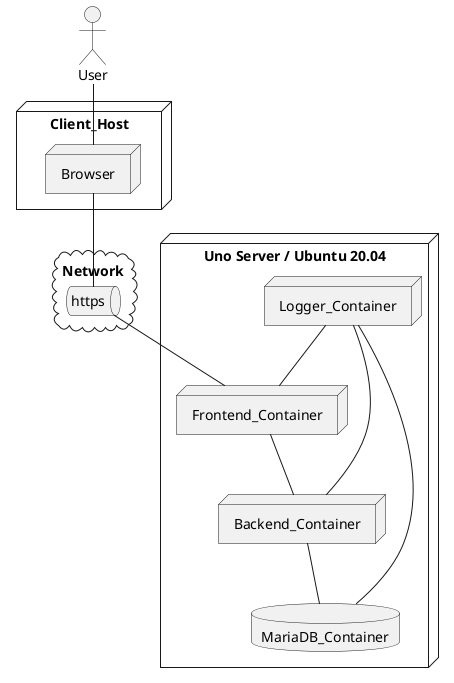

# Tiivistetty vaatimusmäärittely

>Vaatimusmäärittelyn kirjoittajalle!
Poista työn edetessä eri ohjetekstit ja korvaa taulukoissa annetut esimerkit toimeksiantoon liittyvillä tiedoilla. Älä muuta otsikointia ratkaisevasti, mutta voit poistaa ylimääräiset höpinät ja video linkit pois :)

Löydät viimeisimmän version osoitteesta [Lyhennetty-vaatimusmääritelmä](https://jamkit.pages.labranet.jamk.fi/project-templates/fi-opf-2021-core-template-v2/20-Vaatimustenhallinta/vaatimusmaaritely-tiivis/)

>Terveisin,
>Ohjaajat

|  |  |
|:-:|:-:|
| Dokumentti | Tiivistetty vaatimusmääritelmä |
| Laatija: | *nimi* |
| Versio: | *0.0?* |
| Päivämäärä: | 1.x.202y |

## Johdanto


>Kuvaa tavoiteltua kokonaisuutta, hieman taustaa ja aiheeseen olennaisesti liittyviä asioita? Jos kyseessä harjoitustehtävä, niin tarkista voitko 
käytää olemassa olevia tilaajien oikeita nimiä! Muussa tapauksessa vaihdetaan kaikki nimet itse keksittyihin :)

## Tavoitteet 


>Mitä toteutettavan palvelun/ratkaisun avulla tavoitellaan? Tämä voidaan käsitellä myös projektisuunnitelmassa, mutta vaatimusmäärittelyn yhteydessä voidaan tarkemmin kuvat tavoiteltua ratkaisua.

* [Linkki projektisuunnitelmaan?]()
* Tavoite A
* Tavoite B
* Tavoite C

## Kohderyhmä


>Kenelle ratkaisua/palvelua kehitetään? Kannattaa nostaa esiin lyhyesti mahdolliset loppukäyttäjä ja oleellisiin palvelusta hyötyviin sidosryhmät

* Kohderyhmä A
* Kohderyhmä B
* Kohderyhmä C

## Sidosryhmäkartta

>Kuvaa sidosryhmäkartan avulla millaisia käyttäjä, sidosryhmiä tai muita toimijoita liittyy olennaisesti suunniteltun ratkaisuun/palveluun? Kirjataan kaikki tunnistetut sidosryhmät sidosryhmäkartan muotoon. Samalla kirjataan sidosryhmän/toimijan motivaatio palvelua kohtaan. Sidosryhmä kuvauksen voi laatia esim. piirtämällä se eri työkalulla, MindMap-muodossa tai soveltaen sopivaa PlantUML-generaattoria. (Suositeltava vaihtoehto)

<iframe width="560" height="315" src="https://www.youtube.com/embed/ujNtdGzK1JY" title="YouTube video player" frameborder="0" allow="accelerometer; autoplay; clipboard-write; encrypted-media; gyroscope; picture-in-picture" allowfullscreen></iframe>


>*Tarina väliin*
>*Palvelua kehitettäessä on otettava selvää taustoista ja pyrittävä ymmärtämään itse toimialaa tai tarkasteltua toimintaympäristöä. Tähän tarvitaan taustatietoa ja asiakastuntemusta. Henkilöt joilla on ns. toimialaosaamista (Domain Knowledge) ovat tässä vaiheessa vahvoilla. Kannattaa kuunnella asiakasta ja kerätä tietoa perehtymällä aiheeseen myös itsenäisesti. Toimeksiantajalla on varmasti tarjolla tietoa, jonka pohjalta on helpompi ymmärtää toimialaa, joka saattaa olla alkuvaiheessa arvoitus ratkaisun tekijälle*

>Tutustu aiemmin mainittuun PlantUML-työkaluun ja kokeilaan luoda tuotteeseen liittyvä sidosryhmäkartta. Löydät ohjeistuksen osoitteesta [http://plantuml.com/](http://plantuml.com/). Huomio, että Gitlabin yhteydessä PlantUML-koodilohkon kuvaamisessa ei käytetä @startuml/@enduml- täg merkintää vaan 
>* Alkuun merkintä *```plantuml*
>* Ja loppuun merkintä *```* 
>Alla olevan sidosryhmäkuvauksen voi ylikirjoittaa ja samalla tutustua miten diagrammia voidaan tuottaa PlantUML:n avulla.




**Tarkennettut sidosryhmätprofiilit** 


> Sidosryhmäkartan avulla saadaan yleiskuva eri toimijoista (actor), jotka liittyvät oleellisesti ratkaisuun/palveluun. Jos pohdimme tarkemmin esimerkiksi erilaisia palvelun loppukäyttäjiä voimme huomata niissä olevan selkeitä eroja.
Tästä johtuen joudutaan tarkentamaan ja erittelemään kuvausta ja luomaa tarvittasessa ns. profiilikuvaus. Tämän kuvauksen avulla voidaan tarkemmin tunnistaa kohderyhmän luonnetta. Tarkemman kuvauksen tuottamiseksi voidaan luoda tarvittaessa profiilikohtainen kuvaustiedosto. Tämä tiedosto voidaan luoda kopioimalla *pohja-profiilikuvaus* ja nimeämällä se profiilin mukaisesti. Tarkennettuja kuvauksia luodaan tarpeen mukaan. Alla olevassa taulukossa on esitelty muutamia esimerkki profiileja ja tarpeelliset tiedot löytyvät taulukosta.

| ID |  Nimi | Kuvaus | Motivaatio |
|:-:|:-:|:-:|:-:|
| SR-001 | [Asiakas profiili A](pohjat/pohja-profiilikuvaus.md) | Nuori 16-22V | Selkeä tarve palvelulle ja tarvitsee palvelua usein |
| SR-002 | [Asiakas profiili B](pohjat/pohja-profiilikuvaus.md) | Aikuinen 22-45V | Tarve satunnainen, mutta yleisin asiakas  |
| SR-003 | [Sidosryhmä - Rahoittaja]() | Pääomasijoittaja | Palvelun tuottamat tuotot |
| SR-004 | [Sidosryhmä - verottaja]() | Nuori karhu | Kerätä verotuloja  |

## Palveluun liittyviä asiakaspolkuja

>Mietitään toimeksiantoa ja pohditaan liittyykö sen käyttöön jotain yleisiä tapahtumia esimerkiksi ennen käyttöä tai sen jälkeen. Miten palvelu/ratkaisu otetaan käyttöön ja millä tavoin sitä käytetään osana  palvelupolkuja? 
>Asiaspolkukuvauksen avulla kuvataan tapahtuma sarjaa joka käydään jossain valitussa tilanteessa läpi palvelun käytön aikana. Asiakas ohtaisia palvelupolkuja voi olla useita erilaisia, mutta tärkeintä on tunnistaa alkuvaiheessa oleellisimmat. 
>Palvelupolun kuvaukseen voidaan hyödytnää sim. Uimaratakaaviota (Swim Lane) tai tilakonekuvausta (State Machine Diagram) tai muuta sopivaksi katsottua tapaa. Tärkeintä on kuvata polku ja sen avulla selkeyttämään ymmärrystä tavoitellusta palvelusta. 

>**Eri kuvauksia tehdään yhteisen ymmärryksen saavuttamiseksi, ei pelkästään yksittäisen kehittäjän iloksi**

>*Pieni tarina*
>*Mieti millä tavoin eri henkilöt valikoituvat Play Station/Steam/XBOX/Nintendo pelijärjestelmien käyttäjiksi? Mitkä ovat perusteet henkilökohtaiselle palvelun valinnalle? Onko käyttäjäryhmissä selkeitä eroja? Millaisia pelejä nämä ryhmät arvostavat? Millä tavoin liittyminen palveluun tapahtuu käytännössä? Mistä löytyy tarvittaessa VISA-kortti? Vaihda mielessäsi henkilön ikää ja huomaat, että ns. asiakaspolku (customer journey path) vaihtelee iän mukaan! Tämä on erittäin tärkeä hahmottaa ajoissa, koska palvelun kehittäjän on otettava huomioon erilaiset potentiaaliset asiakkaat.* 

**asiakaspolku PlantUML-esimerkki tilakoneena**

> Kokeillaan luonnostella esimerkki valitusta asiakaspolku PlantUML-työkalun avulla. Kannattaa kokeilla ehdottomasti myös muita tapoja! Esimerkkinä käytetään UML-kuvauksista tuttua tilankonetta (State Diagram)


**Asiakaspolku esimerkki: Asiakkaan saapuminen liiketilaan onnistuneen ulkomainoksen pohjalta**

>Tässä polussa voidaan pohtia miten asiakkaan päätöstä voidaan vahvistaa?


```plantuml
Step1: Palvelun kuvaus esillä näyteikkunan mainosnäytössä 
Step2: Asiakas astuu ovesta sisään 
Step3: Palveluun tutustuminen jatkuu sisätiloissa itsenäisesti
Step4: Asiakas kysyy myyjää
Step5: Myyjä esittelee tuotteen lyhyesti
Step6: Asiakas pohdiskelee asiaa
Step7: Asiakas tekee sopimuksen palvelusta
Step8: Asiakas ei ota tuotettava
Step9: Myyjä suosittelee lisäpalveluita
Step10: Myyjä pyytää asiakkaan sähköposti-osoitetta ja henkilöturvatunnusta
Step11: Asiakas kieltäytyy luovuttamasta HETUa ja kauppa keskeytyy
Step12: Miten tämä voidaan välttää?

[*] --> Step1
Step1 --> Step2
Step2 --> Step3
Step3 --> Step6
Step3 --> Step4
Step4 --> Step5
Step5 --> Step6
Step6 --> Step7
Step6 --> Step8
Step9 --> Step6
Step8 --> Step12
Step7 --> Step9
Step9 --> Step10
Step10 --> Step11
Step11 --> Step12
```

## Palvelun ominaisuudet (Features)


>Mietitään seuraavaksi miltä ovat palvelun tärkeimmät toiminnalliset ominaisuudet? Kirjataan ne tässä vaiheessa ranskalaisilla viivoilla ja luodaan niiden pohjalta hahmotelma MindMap-kuvauksen muodossa. Kuvan avulla palvelun eri osa-alueet saattava hahmottua selkeämmin. 
>* Mieti esimerkisi tilannetta, että sinulta kysytään mitä kehittämällasi palvelulla voi käytännössä tehdä? Saat aikaa vastata 15 sekuntia. Mitä vastaat? 
>* Mitä toimintoja nostatat esiin? 
> * Miksi tuotteesi on parempi kuin muut?


<iframe width="560" height="315" src="https://www.youtube.com/embed/jXYQH2hCsHY" title="YouTube video player" frameborder="0" allow="accelerometer; autoplay; clipboard-write; encrypted-media; gyroscope; picture-in-picture" allowfullscreen></iframe>


**Toiminnalliset ominaisuudet ja niiden toiminnot**

*Toiminnallinen ominaisuus (Feature) A  -Sisäinen sähköposti*

    - (Toiminto) Asiakas_A voi lähettää postia ulkopuoliselle henkilölle
    - (Toiminto) Asiakas_A voi saada postia palvelun sisäiseltä käyttäjältä

*Toiminnallinen Ominaisuus (Feature) B - laskutus*

    - (Toiminto) Ylläpito_henkilö voi poistaa laskun Asiakaalta
    - (Toiminto) Ylläpito_henkilö voi luoda uuden laskun Asiakkaalle 

*Toiminnallinen Ominaisuus (Feature) C - pelitilanteen talletus*

    - (Toiminto) Pelaaja_B kykenee tallettamaan tilanteen
    - (Toiminto) Asiakas_B voi liittää Asiakkaan_A ryhmään uuden henkilön

*Toiminnallinen Ominaisuus (Feature) D - suorasoitto*

    - (Toiminto) Asiakas_A voi soittaa tuntemalleen kaverille


**Esitetään ominaisuudet MindMap-muodossa ja samalla linkitetään niihin liittyvät toiminnot**


# Toiminnalliset vaatimukset (Functional Requirements)

>Voidaan yleisesti sanoa, että palveluun liittyvät toiminnot (Functions) voidaan kirjata alkuvaiheessa toiminnallisina vaatimuksina (Functional Requirement), mutta osa niistä osoittautuu käytännössä palvelun kannalta laajemmiksi toiminnoiksi, eli ominaisuuksiksi (Features) ja tästä syystä niitä käsitellään hieman eritavoin kehityksen aikana. 

<iframe width="560" height="315" src="https://www.youtube.com/embed/pTv2hild0FQ?controls=0" title="YouTube video player" frameborder="0" allow="accelerometer; autoplay; clipboard-write; encrypted-media; gyroscope; picture-in-picture" allowfullscreen></iframe>


>Kun määritellään toiminnallisia vaatimuksia voidaan ne kirjataan yksinkertaisen taulukon muotoon. Seuraavat ehdot kannattaa ottaa huomioon:

* *Vaatimus on oltava mitattavissa*
* *Vaatimuksen on oltava yksiselitteinen ja selkeä*
* *Vaatimukseen ei tule sisällyttää useampia vaatimuksia*
* *Vaatimus kannattaa perustella, jos tarpeen*
* *Vaatimuksen ei saa ylikirjoittaa aiemmin määriteltyä vaatimusta*
* *Edustaako esitetty vaatimus itseasiassa ominaisuutta?*

| ID | Toiminnallisen vaatimuksen kuvaus | Toiminnallinen ominaisuus	|				
|:-:|:-:|:-:|
| [FUNCREQ-C0001]() | Palveluun kirjautumisessa voidaan käyttää Facebook-tunnuksia | [Kirjautumis-ominaisuus](pohjat/pohja-ominaisuus.md) |
| [FUNCREQ-C0002]() | Käyttöliittymää voidaan ohjata tarvittaessa äänikomennoilla | [Ääniohjaustuki-ominaisuus](pohjat/pohja-ominaisuus.md) |
| [FUNCREQ-C0003]() | Käyttäjä voi vaihtaa kirjautumisikkunassa kielen | Kirjatumis-ominaisuus |
| [FUNCREQ-C0004]() | Käyttäjä voi tarvittaessa tulostaa kuitin ostoksistaan | Osto-raportointi-ominaisuus |
| [FUNCREQ-C0005]() | Pääkäyttäjä voi tarkastella asiakkaan viimeisiä ostotapahtumia lokin kautta | Lokihallinta-ominaisuus |
| [FUNCREQ-C0006]() | Käyttäjä voi kirjautua käyttäen Google-tunnuksia | Kirjautumisikkuna-ominaisuus |
| [FUNCREQ-C0007]() | Käyttäjä voi lopettaa palvelun käytön poistaen samalla kaiken henkilötiedon palvelusta | GDPR-tunnuksen-poisto-ominaisuus | 
| [FUNCREQ-C0008]() | Käyttäjä voi kirjautua käyttäen Google-tunnuksia | Kirjautumis-ominaisuus |
| [FUNCREQ-C0009]() | Käyttäjä voi vaihtaa tarvittaessa salasanan kirjautumisivun kautta | Kirjautumis-ominaisuus |


## Ominaisuudet (Feature) ja priorisointi (Priority)

>Ominaisuuden käsiteen rinnalla käytetään suomenkielisessä kirjallisuudessa myös sanaa *piirre*, jotka vastaavat englannin kielisessä yleisesti käytettyä *feature*-käsitettä. 
>Tarina väliin: 
>Ymmärtääksesi paremmin ominaisuuden käsitteen mieti seuraavaa: Kilpailevat streaming-palvelut esim. Netflix, HBO, Disney etc tarjota asiakkaalle palveluissaan pitkälti samoja ominaisuuksia, mutta niiden toiminnoissa voi olla ratkaisevia eroja. Yksittäiset toimintojen toteutus voi vaihdella palvelusta riippuen. Yleiset toiminnot, kuten "play", "pause" ja "stop" löytyvät kaikista palveluista, mutta miten toimii esimerkiksi "fast forward"-toiminnot? Muita eroja palvelujen välillä voi tulla esiin yleisessä käytettävyydessä, suorituskyvyssää tai tietoturvassa.

<iframe width="560" height="315" src="https://www.youtube.com/embed/ghpjWtlDnF0" title="YouTube video player" frameborder="0" allow="accelerometer; autoplay; clipboard-write; encrypted-media; gyroscope; picture-in-picture" allowfullscreen></iframe>

Eri ominaisuudet ovat tärkeitä palvelukehityksen kannalta, koska niiden avulla erotutaan kilpailijoista ja niiden avulla voidaan saavuttaa uusia asiakkuuksia. Eri ominaisuuksien/piirteiden/featureiden toteuttamien vaatii kehitystiimin aikaa, rahaa ja resursseja. Tästä johtuen kehitystyön mielekkään etenemisen näkökulmasta joudutaan eri ominaisuuksien toteutusta priorisoimaan. Alla olevassa taulukossa on kerätty muutamia kuvitteellisen palvelun ominaisuuksia ja priorisoitu ne perustelujen kanssa.
>Priorisoinnilla voidaan esittää mitkä ominaisuuksiasta ovat tärkeitä asiakkaan tai toteutuksen näkökulmasta. 

| Ominaisuus | Prioriteetti | Kuvaus |
|:-:|:-:|:-:|
| [Lokihallinta-ominaisuus](pohjat/pohja-ominaisuus.md) | P1 | Asiakkaan kannalta tärkeä ominaisuus, tulee käyttöön heti ensimmäisenä päivänä | 
| [Kirjautumis-ominaisuus](pohjat/pohja-ominaisuus.md) | P1 | Tämän on toimittava ehdottomasti | 
| [Raportointi-ominaisuus](pohjat/pohja-ominaisuus.md) | P5 | Tämän voi tehdä myöhemmin |
| [Viestitys-ominaisuus](pohjat/pohja-ominaisuus.md) | P2 | Erittäin tarpeellinen, mutta ensin kirjautuminen kuntoon |
| [GDPR-tunnuksen-poisto-ominaisuus](pohjat/pohja-ominaisuus.md) | P3 | Ei niin kiire, mutta tarvitaan joka tapauksessa |
| ... | ... | ... |

>Pelkästään ominaisuuksien listaamisen sijaan on hyödyllistä suunnitella ennakkoon missä vaiheessa eri ominaisuudet voidaan toteuttaa ja liittää osaksi palvelua. Tätä työtä kutsutaan lyhyesti julkaisusuunnitteluksi (Release Planning).
Julkaisua suunniteltaessa voidaan ryhmitellä eri ominaisuudet ja luoda niistä "konfiguraatioita".   

* [Julkaisuhallinta - esimerkki](..//40-Julkaisusuunnittelu/julkaisusuunnitelma.md)

## Käyttöliittymänäkymä/mockup 


>Eri toiminnallisuuksien selkeyttämiseksi voidaan hyödyntää myös piirroksia ja eri tavoin tuotettuja kuvauksia. Näiden avulla pyritään hahmottamaan miltä tuotteen tulisi näyttää ja mitä asioita esimerkiksi käyttöliittymätoteutuksessa olisi otettava huomioon? Tähän tarkoitukseen voidaan soveltaa kätevästi verkkopalveluina toimivia MockUp/prototyyppi-piirtotyökaluja. Näiden välineiden avulla voidaan luoda helposti käyttöliittymästä prototyyppi, jota voidaan koekäyttää eri kohderyhmillä. 
>Ominaisuuksien toteutuksiin liittyvät prototyyppi kuvaukset kannataa liittää ominaisuuksien määrittelydokumentteihin, jolloin ne löytyvät asian mukaisesta paikasta. Esimerkkinä [Feature-ominaisuus](pohjat/pohja-ominaisuus.md)
>Perinteisesti käyttöliittymä hahmotelmat ja kuvaukset on tehty piirtämällä käyttöliittymästä staattisia kuvia ja näitä on käytetty suunnittelun apuna. Tämä onnistuu myös soveltamalla apuna PlantUML-kuvauksia. (ks. alla)
>Kannattaa kuitenkin tutustua ja kokeilla arjolla olevia prototyyppi/MockUp-työkaluja tähän tarkoitukseen. 

 * [Linkki prototyyppiin / MockUp-toteutukseen]()

**Esimerkki yksinkertaisesta käyttöliittymän dialogista**

```plantuml
salt
{
  Just plain text
  [This is my button]
  ()  Unchecked radio
  (X) Checked radio
  []  Unchecked box
  [X] Checked box
  "Enter text here   "
  ^This is a droplist^
}
```

## Ketterän kehittämisen käyttötarinat - User Story 


>Ohjelmistokehityksessä on yleistynyt tapa käyttää tavoitteiden määrittelyssä palvelua käyttävien sidosryhmien esittämiä kuvauksia tarvittavista toiminnoista. Nämä asiakkaalta/sidosryhmiltä saadut ehdotukset kirjataan User Story, eli käyttötarinan muotoon. Kannattaa tutustu aiheeseen [User Story](https://en.wikipedia.org/wiki/User_story). Käyttäjätarinat ovat kehitystiimin kannalta erittäin oleellisia määrittelyjä, koska ne ovat käytännössä toimintoja joita toteutetaan palveluun. User Storyjen avulla ohjataa kokonaisia kehitystiimejä tuotekehityksen aikana.

>Käyttötarina kuvauksen yleinen muoto on: 

* Englanniksi: As a <-role-> I can <-capability->, so that <-receive benefit->*

* Vapaasti suomennettuna: Palvelun käyttäjän <-roolissa X-> voin tarvittaessa suorittaa <-toiminnon->, koska <-perustelu->* 

>Yksittäinen käyttötarina (User Story) voidaan kirjata esim Gitlab-palvleussa ns. Issuen muodossa. Issue esimerkin voit löytää osoittesta #9 
>User Storyt voidaan alkuvaiheessa kerätä myös taulukkoon/listaan ja ne siirretään ajalla Issue-muotoon.

| ID |  Kuvaus | Gitlab Issue Linkki |
|:-:|:-:|:-:|
| US-001 | Käyttäjänä haluan, että voin luoda raportin tekemistäni ostoista viimeisen kuukauden ajalta, koska se helpottaa oman talouteni hallintaa | #8 |
| US-002 | Käyttäjänä haluan, että voin poistaa historian tekemistäni ostoista viimeisen kuukauden ajalta, koska en halua muistella menneitä | Linkki  #8 |


## Tietojärjestelmiä yleisesti koskevista vaatimuksista

>Laajoja tietojärjestelmiä/ohjelmistoja suunniteltaessa vaatimuksia voidaan kirjata eri näkökulmista. Tietojärjestelmien suunnittelussa voi käyttää analogiana kuvaa jäävuoresta, josta pinnalla näkyy osa, mutta iso osa (90%) on piilossa veden alla. Tämä pätee tietojärjestelmän vaatimuksiin. Korkealta tasolta katsottuna näyttää kokonaisuus ehkä selkeältä, mutta yksityiskohtiin mentäessä työ hankaloituu. 


>Vaatimusmäärittelyn työstäminen voidaan nähdä kahden eri näkökulman kannalta.

**Ongelma kenttä (Problem Domain) vs Ratkaisu kentttä (Solution Domain)**

>Eli on tunnettava riittävän tarkasti ongelmakenttä (Asiakkaan/toimeksiantajan tarve), että voidaan kehittää siihen sopiva ratkaisu (esim. ohjelmistopalvelu)

>Tietojärjestelmän vaatimusten eri muotoja voivat olla olla esimerkiksi
>* Asiakasvaatimukset (Customer Needs)
>* Liiketoimintavaatimukset (Business Requirements/Needs)
>* Järjestelmävaatimukset (System Requirements)
>* Ali-järjestelmän vaatimukset (Sub-System Requirement)
>* Komponenttitason vaatimukset (Component Requirements)

>Opintojakson kannalta keskitytään tunnistamaan toiminnalliset vaatimukset, ei-toiminnalliset vaatimukset (suorituskyky, tietoturva ja saavutettavuus)

* [Vaatimusmäärittelystä Wikipediassa](https://en.wikipedia.org/wiki/Requirements_analysis)

*Vaatimusten jäljitettävyydestä*

>Eri vaatimusten eri muodoilla voidaan tarkastella kehitettävää tuotetta eri näkökulmista, mutta eri tasojen välillä olevilla vaatimuksilla voi olla yhteys. 
Näitä yhteyksiä kutsutaan vaatimusten jäljitettävyydeksi (Traceablity). 

> * *Asiakasvaatimus CUST001* -> *Ominaisuus FEA001* --> *Toiminnallinen vaatimus Y*
> * *Asiakasvaatimus CUST001* -> *Liiketoiminnan vaatimus BISREQ100* -> *Ominaisuus FEA001*
> * *Tietoturvavaatimus SEC001* -> *Ominaisuus FEA001*

>Vahvan jäljitettävyyden avulla voidaan tarkastella yksittäisten muutosten vaikutusta koko tuotteeseen. Tässä tilanteessa voidaan yksittäistä vaatimusta "törmäyttää" ja nähdään minne kaikkialle vaikutus ulottuu (Impact analysis).
>Tämän vaatii vaatimusmäärittelytyön tueksi tarkoitukseen sopia työkaluja (Requirement Management Tools)

## Palveluun liittyvät tekniset vaatimukset

>Kokonaisvaltaisia ohjelmisto palveluja määriteltäessa on tärkeä tunnistaa ja määritellä palvelun tuottamiseksi tarvittavat teknologiat, laitteistot tai muut tärkeät osa-järjestelmät. Esimerkkinä tarvittava palvelinympäristö, tietokanta, varmistusjärjestelmät ja muut palvelun toiminnan kannalta oleelliset tarpeet.

*Esimerkkinä on kirjattu muutamia laitteistovaatimuksia (Hardware Requirements)*

| ID | Kuvaus | 
|:-:|:-:|
| HWREQ-0001 | Palvelun on oltava skaalattavissa HA-proxy ratkaisun varassa | |
| HWREQ-0002 | Palvelimen muistikapasiteeti >32GB  ||
| HWREQ-0003 | Palvelimen fyysinen sijainti on oltava EU-aluella| |
| HWREQ-0004 |... ||

## Laadulliset vaatimukset (Non-functional Requirements)

<iframe width="560" height="315" src="https://www.youtube.com/embed/YAnPGPj0gK0" title="YouTube video player" frameborder="0" allow="accelerometer; autoplay; clipboard-write; encrypted-media; gyroscope; picture-in-picture" allowfullscreen></iframe>

>Laadulliset vaatimukset tarkastelevat palvelua ns. ei-toiminnallisesta näkökulmasta. Kuulostaa ehkä äkkiseltään hankalalta, mutta mieti seuraavia kysymyksiä?

* *Miten tuottesta saadaan kehitettyä riittävän turvallinen? Onko joitain vaatimuksia, jotka on täytettävä tästä johtuen? (tietoturva-security)*
* *Mitkä asiat on huolehdittava, että tuote on hyväksyttävissä viranomaisten käyttöön? (yhteensopivuus-conformance)*
* *Miten paljon käyttäjiä palvelussa voi olla yhtäaikaa(suorituskyky-performance)
* *Onko palvelun tarkoitus joskus toimia laajemmalle käyttäjäkunnalle(skaalautuvuus-scalability)*
* *Miten voidaan varmistaa, että palvelu on saavutettavissa kaikkien käyttäjien kannalta?(skaalautuvuus-scalability)*
* *Onko tarvetta eri kieliversioille?(saavutettavuus-accessability)*
* *Mitä on otettava huomioon palvelua jatkokehitettäessä? (ylläpidettävyys-maintainability)*
* *Mitä teknologioita voidaan käyttää?(ylläpidettävyys-maintainability)*

>[Ei-toiminnalliset vaatimuksia](https://en.wikipedia.org/wiki/Non-functional_requirement) on useita eri tyyppejä, mutta opintojen kannalta tärkeimmiksi on valittu: suorituskyky, tietoturva ja saavutettavuus 
>* Suorituskyky (Performance Requirement)
>* Tietoturva (Security Requirement)
>* Saavutettavuus (Accessability Requirement)

### Suorituskykyvaatimukset (Performance Requirements)


>Millaisia vaatimuksia palveluun kohdistuu suorituskyvyn näkökulmasta?
>Mitä tarkoittaa suorituskyvyn testaus, eli [load testing](https://en.wikipedia.org/wiki/Load_testing) Tutustu myös K6-työkaluun? [K6-Load Tester](https://k6.io/)

| ID | Kuvaus |
|:-:|:-:|
| PERFREQ-0000 | Kirjautuminen on mahdollista yhtäaikaa x käyttäjällä |					
| PERFREQ-0001 | Palvelun maksimi käyttäjä määrä on ? |
| PERFREQ-0002 | Palvelun kotisivu aukeaa < Xs ||

### Tietoturvavaatimukset (Security Requirements)


>Millaisia vaatimuksia palveluun kohdistuu tietoturvan näkökulmasta? 
> Tutustu [VAHTI 1/2013 Sovelluskehityksen tietoturvaohje](https://www.suomidigi.fi/ohjeet-ja-tuki/vahti-ohjeet/vahti-12013-sovelluskehityksen-tietoturvaohje)

| ID |  Kuvaus |
|:-:|:-:|
| SECURITY-REQ-0001 | Salasanassa on käytettävä vähintään MD5-tason salausta, koska vaatimus [CONSTRAIN-000]() sitä edellyttää |
| SECURITY-REQ-0002 | Jokainen tapahtuma palvelussa on kirjattava käyttölogiin, että niitä voidaan tarkastella myöhemmin | 
| SECURITY-REQ-0003 | ... |

### Saavutettavuusvaatimukset (Accessablity Requirements)


>Mitä tarkoitetaan saavutettavuudella? Millaisia asioita/ohjeistuksia on otettava huomioon palvelua toteutettaessa? Tutustu lähteeseen: [https://www.saavutettavuusvaatimukset.fi/](https://www.saavutettavuusvaatimukset.fi/)

| ID  |  Kuvaus |
|:-:|:-:|
| ACCESSREQ-0000 | Palvelun käyttöliittymässä on oltava mahdollista valita selkeä kontrasti-teema |	
| ACCESSREQ-0001 | Käyttöliittymän Fonttikokoa on voitava muuttaa päävalikon kautta |
| ACCESSREQ-0002 |  ... |

## Rajaukset ja reunaehdot (Constraints and limitations)

>Eri ohjelmistojena/palvelujen toteutusta ja käyttöä ohjaavat usein lait ja säädökset. Näiden edellyttämät vaatimukset kirjataan vaatimusmäärittelyyn rajauksina. Rajausten (Constraints) vaikutus voi koskea koko palvelua palvelun jonkin osa-kokonaisuuden toteuttamista. Tästä syystä eri rajoitteet on tunnistettava ajoissa, koska vaikutus saataa olla varsin ratkaiseva pitemmällä tähtäimella. Esimerkkinä tästä on viime vuonna voimaan tullut [EU GDPR-säädös](https://en.wikipedia.org/wiki/General_Data_Protection_Regulation).
Kannattaa tutkia esimerkiksi https://www.sfs.fi/aihealueet/terveydenhuolto/laakinnalliset_laitteet tai http://docs.jhs-suositukset.fi/jhs-suositukset/JHS190/JHS190.html

| ID |  Rajaus/reunaehto | Mihin vaikuttaa |
|:-:|:-:|:-:|
| CONSTRAIN-000  |  Palvelun kirjautumisprosessin on noudatettava JUHTA-hyväksyttyjä käytänteitä  | [Feature Kirjautuminen](pohjat/pohja-ominaisuus.md) |
| CONSTRAIN-001 |  Palvelussa on huomioitava JHS:n suosituksest lokihallinasta | [Feature - Lokihallinta](pohjat/pohja-ominaisuus.md)|
| CONSTRAIN-002 |  ... | ... |

## Ohjelmistoarkkitehtuuri

>Vaatimusmäärittelyn osaksi voidaan tarvittaessa liittää teknillisiä kuvauksia, joiden avulla voidaan tarkentaa eri vaatimuksia. Yksi tärkeä dokumentti voi olla esimerkiksi tekninen arkkitehtuuri. Tämä kuvaus voidaan lyhyessä muodossaan liittää osaksi vaatimusmäärittelyä, mutta yleensä se on varsin laaja itsenäinen dokumentaation osa. Arkkitehtuuri ratkaisujen kuvaamiseksi voidaan laatia yödyntäen apuna UML-kuvauskielen eri diagrammeja. Esimerkkinä alla on  sijoittelunäkymä ([Deployment Diagram](https://plantuml.com/deployment-diagram)). Sijoittelunäkymän avulla voidaan kuvata miten palvelun eri palvelut sijaitsevat ja miten ne kytkeytyvät toisiinsa.

Ohjelmistoarkkitehtuurin kuvaus on itsessään laaja osa-alue ja käytännössä se edellyttää laajempaa dokumentaatiota.

<iframe width="560" height="315" src="https://www.youtube.com/embed/OYmvbqBd2BY" title="YouTube video player" frameborder="0" allow="accelerometer; autoplay; clipboard-write; encrypted-media; gyroscope; picture-in-picture" allowfullscreen></iframe>

* [Linkki laajempaan ohjelmistoarkkitehtuurikuvaukseen](../30-Suunnittelu-ja-toteutus/arkkitehtuuri-ja-tekninentoteutus.md)




## Palveluun liittyvät järjestelmäintegraatiot

>Ohjemiston arkkitehtuuriin kuvauksissa voidaan ottaa tarkasteluun palvelun liittyvät ulkopuoliset palvelut tai muut integraatiot eri järjestelmiin
>Alla olevat kuvaukset on esimerkkejä UML-kuvausten mahdollisuuksista. Tässä kuvauksessa käytetään UML:n sekvenssikaaviota ([Sequence Diagram](https://plantuml.com/sequence-diagram)) kuvaamaan valittua tapahtumaketjua. 

```plantuml
Client_Host --> Service_Frontend: Login Request
Service_Frontend --> Service_Backend : Logging request check
Service_Backend --> MariaDB : SQL Request for user account
MariaDB --> Service_Backend : Account and password 
Service_Backend --> Service_Frontend : Request Result pass
Service_Frontend --> Client_Host : Logged in

```
## Standardit ja lähteet

>Kirjataan käytetyt lähteet alla olevaan taulukkoon.

| ID | Nimi | Linkki | Kuvaus |  
|:-:|:-:|:-:|:-:|
| REF1 | JHS 165 ICT | [JHS Suositukset - vaatimusmäärittelylle](http://www.jhs-suositukset.fi/c/document_library/get_file?uuid=b8118ad7-8ee4-459a-a12b-f56655e4ab9d&groupId=14) | Vaatimusmäärittelyn suositus |
| REF2 | ISO 9241-11  | [Käytettävyys](https://fi.wikipedia.org/wiki/K%C3%A4ytett%C3%A4vyys)  | Usability | 
| REF3 |  EN 301 549 | [Saavutettavuus](https://fi.wikipedia.org/wiki/Saavutettavuus) | Availability |
| REF4 |  GDPR | [GDPR Asetus](https://europa.eu/youreurope/business/dealing-with-customers/data-protection/data-protection-gdpr/index_fi.htm) | General_Data_Protection_Regulation |
| REF5 | KATAKRI V11 | [Katakri](https://www.defmin.fi/files/1870/KATAKRI_versio_II.pdf) | Kansallinen turvallisuusauditointikriteeristö |


