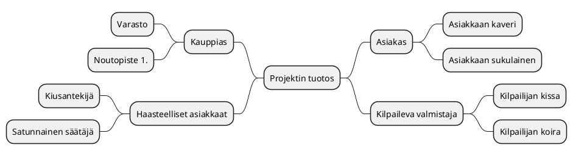
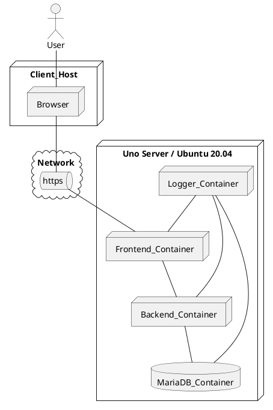

# Tiivistetty vaatimusmäärittely

|  |  |
|:-:|:-:|
| Dokumentti | Tiivistetty vaatimusmääritelmä |
| Laatija: | |
| Versio: | |
| Päivämäärä: | |

## Johdanto

>Kuvaa tavoiteltua kokonaisuutta, hieman taustaa ja aiheeseen olennaisesti liittyviä asioita? Jos kyseessä harjoitustehtävä, niin tarkista voitko 
käytää olemassa olevia tilaajien oikeita nimiä! Muussa tapauksessa vaihdetaan kaikki nimet itse keksittyihin :)

## Tavoitteet 

>Mitä toteutettavan palvelun/ratkaisun avulla tavoitellaan? Tämä voidaan käsitellä myös projektisuunnitelmassa, mutta vaatimusmäärittelyn yhteydessä voidaan tarkemmin kuvat tavoiteltua ratkaisua.

* Tavoite A
* Tavoite B
* Tavoite C

## Kohderyhmä

>Kenelle ratkaisua/palvelua kehitetään? Kannattaa nostaa esiin lyhyesti mahdolliset loppukäyttäjä ja oleellisiin palvelusta hyötyviin sidosryhmät

* Kohderyhmä A
* Kohderyhmä B
* Kohderyhmä C

## Sidosryhmäkartta

>Kuvaa sidosryhmäkartan avulla millaisia käyttäjä, sidosryhmiä tai muita toimijoita liittyy olennaisesti suunniteltun ratkaisuun/palveluun? Kirjataan kaikki tunnistetut sidosryhmät sidosryhmäkartan muotoon. Samalla kirjataan sidosryhmän/toimijan motivaatio palvelua kohtaan. Sidosryhmä kuvauksen voi laatia esim. piirtämällä se eri työkalulla, MindMap-muodossa tai soveltaen sopivaa PlantUML-generaattoria. (Suositeltava vaihtoehto)

>*Tarina väliin*
>*Palvelua kehitettäessä on otettava selvää taustoista ja pyrittävä ymmärtämään itse toimialaa tai tarkasteltua toimintaympäristöä. Tähän tarvitaan taustatietoa ja asiakastuntemusta. Henkilöt joilla on ns. toimialaosaamista (Domain Knowledge) ovat tässä vaiheessa vahvoilla. Kannattaa kuunnella asiakasta ja kerätä tietoa perehtymällä aiheeseen myös itsenäisesti. Toimeksiantajalla on varmasti tarjolla tietoa, jonka pohjalta on helpompi ymmärtää toimialaa, joka saattaa olla alkuvaiheessa arvoitus ratkaisun tekijälle*

>Tutustu aiemmin mainittuun PlantUML-työkaluun ja kokeilaan luoda tuotteeseen liittyvä sidosryhmäkartta. Löydät ohjeistuksen osoitteesta [http://plantuml.com/](http://plantuml.com/). Huomio, että Gitlabin yhteydessä PlantUML-koodilohkon kuvaamisessa ei käytetä @startuml/@enduml- täg merkintää vaan 
>* Alkuun merkintä *```plantuml*
>* Ja loppuun merkintä *```* 
>Alla olevan sidosryhmäkuvauksen voi ylikirjoittaa ja samalla tutustua miten diagrammia voidaan tuottaa PlantUML:n avulla.



**Tarkennettut sidosryhmätprofiilit** 

> Sidosryhmäkartan avulla saadaan yleiskuva eri toimijoista (actor), jotka liittyvät oleellisesti ratkaisuun/palveluun. Jos pohdimme tarkemmin esimerkiksi erilaisia palvelun loppukäyttäjiä voimme huomata niissä olevan selkeitä eroja.
Tästä johtuen joudutaan tarkentamaan ja erittelemään kuvausta ja luomaa tarvittasessa ns. profiilikuvaus. Tämän kuvauksen avulla voidaan tarkemmin tunnistaa kohderyhmän luonnetta. Tarkemman kuvauksen tuottamiseksi voidaan luoda tarvittaessa profiilikohtainen kuvaustiedosto. Tämä tiedosto voidaan luoda kopioimalla *pohja-profiilikuvaus* ja nimeämällä se profiilin mukaisesti. Tarkennettuja kuvauksia luodaan tarpeen mukaan. Alla olevassa taulukossa on esitelty muutamia esimerkki profiileja ja tarpeelliset tiedot löytyvät taulukosta.

| ID |  Nimi | Kuvaus | Motivaatio |
|:-:|:-:|:-:|:-:|
| SR-001 | [Asiakas profiili A](pohjat/pohja-profiilikuvaus.md) | Nuori 16-22V | Selkeä tarve palvelulle ja tarvitsee palvelua usein |
| SR-002 | [Asiakas profiili B](pohjat/pohja-profiilikuvaus.md) | Aikuinen 22-45V | Tarve satunnainen, mutta yleisin asiakas  |
| SR-003 | [Sidosryhmä - Rahoittaja]() | Pääomasijoittaja | Palvelun tuottamat tuotot |
| SR-004 | [Sidosryhmä - verottaja]() | Nuori karhu | Kerätä verotuloja  |

## Palveluun liittyviä asiakaspolkuja

>Mietitään toimeksiantoa ja pohditaan liittyykö sen käyttöön jotain yleisiä tapahtumia esimerkiksi ennen käyttöä tai sen jälkeen. Miten palvelu/ratkaisu otetaan käyttöön ja millä tavoin sitä käytetään osana  palvelupolkuja? 
>Asiaspolkukuvauksen avulla kuvataan tapahtuma sarjaa joka käydään jossain valitussa tilanteessa läpi palvelun käytön aikana. Asiakas ohtaisia palvelupolkuja voi olla useita erilaisia, mutta tärkeintä on tunnistaa alkuvaiheessa oleellisimmat. 
>Palvelupolun kuvaukseen voidaan hyödytnää sim. Uimaratakaaviota (Swim Lane) tai tilakonekuvausta (State Machine Diagram) tai muuta sopivaksi katsottua tapaa. Tärkeintä on kuvata polku ja sen avulla selkeyttämään ymmärrystä tavoitellusta palvelusta. 

>**Eri kuvauksia tehdään yhteisen ymmärryksen saavuttamiseksi, ei pelkästään yksittäisen kehittäjän iloksi**

>*Pieni tarina*
>*Mieti millä tavoin eri henkilöt valikoituvat Play Station/Steam/XBOX/Nintendo pelijärjestelmien käyttäjiksi? Mitkä ovat perusteet henkilökohtaiselle palvelun valinnalle? Onko käyttäjäryhmissä selkeitä eroja? Millaisia pelejä nämä ryhmät arvostavat? Millä tavoin liittyminen palveluun tapahtuu käytännössä? Mistä löytyy tarvittaessa VISA-kortti? Vaihda mielessäsi henkilön ikää ja huomaat, että ns. asiakaspolku (customer journey path) vaihtelee iän mukaan! Tämä on erittäin tärkeä hahmottaa ajoissa, koska palvelun kehittäjän on otettava huomioon erilaiset potentiaaliset asiakkaat.* 

**asiakaspolku PlantUML-esimerkki tilakoneena**

> Kokeillaan luonnostella esimerkki valitusta asiakaspolku PlantUML-työkalun avulla. Kannattaa kokeilla ehdottomasti myös muita tapoja! Esimerkkinä käytetään UML-kuvauksista tuttua tilankonetta (State Diagram)


**Asiakaspolku esimerkki: Asiakkaan saapuminen liiketilaan onnistuneen ulkomainoksen pohjalta**

>Tässä polussa voidaan pohtia miten asiakkaan päätöstä voidaan vahvistaa?


```plantuml
Step1: Palvelun kuvaus esillä näyteikkunan mainosnäytössä 
Step2: Asiakas astuu ovesta sisään 
Step3: Palveluun tutustuminen jatkuu sisätiloissa itsenäisesti
Step4: Asiakas kysyy myyjää
Step5: Myyjä esittelee tuotteen lyhyesti
Step6: Asiakas pohdiskelee asiaa
Step7: Asiakas tekee sopimuksen palvelusta
Step8: Asiakas ei ota tuotettava
Step9: Myyjä suosittelee lisäpalveluita
Step10: Myyjä pyytää asiakkaan sähköposti-osoitetta ja henkilöturvatunnusta
Step11: Asiakas kieltäytyy luovuttamasta HETUa ja kauppa keskeytyy
Step12: Miten tämä voidaan välttää?

[*] --> Step1
Step1 --> Step2
Step2 --> Step3
Step3 --> Step6
Step3 --> Step4
Step4 --> Step5
Step5 --> Step6
Step6 --> Step7
Step6 --> Step8
Step9 --> Step6
Step8 --> Step12
Step7 --> Step9
Step9 --> Step10
Step10 --> Step11
Step11 --> Step12
```


## Toiminnalliset ominaisuudet


>Mietitään seuraavaksi millaisia ovat palvelun tärkeimmät toiminnalliset ominaisuudet? Kirjataan ne tässä vaiheessa ranskalaisilla viivoilla ja luodaan niiden pohjalta hahmotelma MindMap-kuvauksen muodossa. Kuvan avulla palvelun eri osa-alueet saattava hahmottua selkeämmin. 
>Mieti esimerkisi tilannetta, että sinulta kysytään mitä kehittämällasi palvelulla voi käytännössä tehdä? Saat aikaa vastata 15 sekuntia. Mitä vastaat? Mitä toimintoja nostatat esiin? Miksi tuotteesi on parempi kuin muut?

*Toiminnalliset ominaisuudet ja niiden toiminnot*

**Toiminnallinen ominaisuus (Feature) A  -Sisäinen sähköposti**

    - (Toiminto) Asiakas_A voi lähettää postia toiselle henkilölle
    - (Toiminto) Asiakas_A voi saada tietoa aiemmin tehdyistä valinnoista

**Toiminnallinen Ominaisuus (Feature) B - laskutus**

    - (Toiminto) Ylläpito-henkilö voi poistaa laskun Asiakaalta
    - (Toiminto) Ylläpito-henkilö voi luoda uuden laskun Asiakkaalle 

**Toiminnallinen Ominaisuus (Feature) C - pelitilanteen talletus**

    - (Toiminto) Pelaaja_B kykenee tallettamaan tilanteen
    - (Toiminto) Asiakas_B voi liittää Asiakkaan_A ryhmään uuden henkilön

**Toiminnallinen Ominaisuus (Feature) D - suorasoitto**

    - (Toiminto) Asiakas_A voi soittaa tuntemalleen kaverille


**Kuvataan tunnistettja toiminnallisuuksia MindMapin-muodossa ja samalla linkitetään niihin liittyävät toimintoja**


# Toiminnalliset vaatimukset (Functional Requirements)

>Voidaan yleisesti sanoa, että kaikki palveluun liittyvät toiminnot (Functions) voidaan kirjata aluksi toiminnallisina vaatimuksina (Functional Requirement), mutta osa niistä osoittautuu käytännössä palvleun ominaisuuksiksi (Feature) ja tästä syystä niitä käsitellään myöhemmin erikseen.  
>Kun määritellään toiminnallisia vaatimuksia voidaan ne kirjataan yksinkertaisen taulukon muotoon. Seuraavat ehdot kannattaa ottaa huomioon:

* *Vaatimus on oltava mitattavissa*
* *Vaatimuksen on oltava yksiselitteinen ja selkeä*
* *Vaatimukseen ei tule sisällyttää useampia vaatimuksia*
* *Vaatimus kannattaa perustella, jos tarpeen*
* *Vaatimuksen ei saa ylikirjoittaa aiemmin määriteltyä vaatimusta*

| ID | Toiminnallisen vaatimuksen kuvaus | Toiminnallinen ominaisuus	|				
|:-:|:-:|:-:|:-:|
| [FUNCREQ-C0001]() | Palveluun kirjautumisessa voidaan käyttää Facebook-tunnuksia | [Kirjautumis-ominaisuus](pohjat/pohja-ominaisuus.md) |
| [FUNCREQ-C0002]() | Käyttöliittymää voidaan ohjata tarvittaessa äänikomennoilla | [Ääniohjaustuki-ominaisuus](pohjat/pohja-ominaisuus.md) |
| [FUNCREQ-C0003]() | Käyttäjä voi vaihtaa kirjautumisikkunassa kielen | Kirjatumis-ominaisuus |
| [FUNCREQ-C0004]() | Käyttäjä voi tarvittaessa tulostaa kuitin ostoksistaan | Ostoraportit-ominaisuus |
| [FUNCREQ-C0005]() | Pääkäyttäjä voi tarkastella asiakkaan viimeisiä ostotapahtumia lokin kautta | Lokihallinta-ominaisuus |
| [FUNCREQ-C0006]() | Käyttäjä voi kirjautua käyttäen Google-tunnuksia | Kirjautumisikkuna-ominaisuus |
| [FUNCREQ-C0007]() | Käyttäjä voi lopettaa palvelun käytön poistaen samalla kaiken henkilötiedon palvelusta | GDPR-tunnuksen-poisto-ominaisuus | 
| [FUNCREQ-C0008]() | Käyttäjä voi kirjautua käyttäen Google-tunnuksia | Kirjautumis-ominaisuus |
| [FUNCREQ-C0009]() | Käyttäjä voi vaihtaa tarvittaessa salasanan kirjautumisivun kautta | Kirjautumis-ominaisuus |


## Toiminnalliset ominaisuudet

Palvelun toiminnallisilla ominaisuuksilla on tärkeä tehtävä tuotekehityksen kannalta. Nämä ns. Featuret ovat juuri niitä palveluun kehitettäviä toimintoja, joita voidaan tarvittaessa markkinoida mahdollisille asiakkaille. 
Eri ominaisuuksien toteuttamien täytyy priorisoida, koska niiden tekemiseen tarvitaan aikaa. Alla olevassa taulukossa on kerätty muutamia päätoimintoja ja niiden prioriteeti kehityksen kannalta.
>Priorisoinnilla voidaan esittää mitkä ominaisuuksiasta ovat tärkeitä asiakkaan tai toteutuksen näkökulmasta. 


| Ominaisuus | Prioriteetti | Kuvaus |
|:-:|:-:|:-:|
| [Lokihallinta-ominaisuus](pohjat/pohja-ominaisuus.md) | P1 | Asiakkaan kannalta tärkeä ominaisuus | 
| [Kirjautumis-ominaisuus](pohjat/pohja-ominaisuus.md) | P1 | Tämä on saatava ensimmäisen kuntoon | 
| [GDPR-tunnuksen-poisto-ominaisuus](pohjat/pohja-ominaisuus.md) | P3 | Ei niin kiire, mutta tarvitaan ehdottomasti |
| ... | ... | ... |

>Pelkästään ominaisuuksien listaamisen sijaan on tärkeää suunnitella  ennakkoon missä vaiheessa eri ominaisuuksia voidaan toteuttaa ja tuotteen toimeksiantaja saa parhaan hyödyn tuotekehityksestä. Tätä suunnittelutyötä kutsutaan lyhyesti julkaisun suunnitteluksi (Release Planning).
Julkaisusuunnitelmassa voidaan ryhmitellä eri ominaisuudet ja luoda niistä "konfiguraatioita".   

* [Julkaisuhallinta - esimerkki](..//40-Julkaisusuunnittelu/julkaisusuunnitelma.md)


## Käyttöliittymänäkymä/mockup 

>Ohjelmistotuotteen eri toiminnallisuuksien kuvaamiseen tarvitaan avuksi usein visualisointia. Miltä tuotteen tulisi näyttää ja mitä on käyttöliittymässä otettava huomioon? Tähän tehtävään voidaan soveltaa nykyaikaisia MockUp/prototyyppi-työkaluja. Näiden työvälineiden avulla voidaan luoda helposti käyttöliittymäprototyypp, jota voidaan määrittelytyön apuan. 

>Perinteisesti käyttöliittymä hahmotelmat ja kuvaukset on tehty piirtämällä käyttöliittymästä staattisia kuvia ja näitä on käytetty suunnittelun apuna. 
Tämä onnistuu myös soveltamalla PlantUML-kuvauksia. 

>Käyttöliittymän prototyyppi kuvaukset kannataa liittää ominaisuuksien määrittelyä tarkentaviin dokumentteihin. [Feature-ominaisuus-esimerkki](pohjat/pohja-ominaisuus.md)

**Esimerkki yksinkertaisesta käyttöliittymän dialogista**

```plantuml
salt
{
  Just plain text
  [This is my button]
  ()  Unchecked radio
  (X) Checked radio
  []  Unchecked box
  [X] Checked box
  "Enter text here   "
  ^This is a droplist^
}
```

## Ketterän kehittämisen käyttötarinat - User Story 

>Ohjelmistokehityksessä on yleistynyt tapa käyttää tavoitteiden määrittelyssä palvelua käyttävien sidosryhmien esittämiä kuvauksia tarvittavista toiminnoista. Nämä asiakkaalta/sidosryhmiltä saadut ehdotukset kirjataan User Story, eli käyttötarinan muotoon. Kannattaa tutustu aiheeseen [User Story](https://en.wikipedia.org/wiki/User_story). Käyttäjätarinat ovat kehitystiimin kannalta erittäin oleellisia määrittelyjä, koska ne ovat käytännössä toimintoja joita toteutetaan palveluun. User Storyjen avulla ohjataa kokonaisia kehitystiimejä tuotekehityksen aikana.

>Käyttötarina kuvauksen yleinen muoto on: 

*As a <-role-> I can <-capability->, so that <-receive benefit->*
*Palvelun käyttäjän <-roolissa X-> toivon, että voin suorittaa <-toiminnon->, koska <-perustelu-> 

>Yksittäinen käyttötarina (User Story) voidaan kirjata esim Gitlab-palvleussa ns. Issuen muodossa. Issue esimerkin voit löytää osoittesta #9 
>User Storyt voidaan alkuvaiheessa kerätä myös taulukkoon/listaan ja ne siirretään ajalla Issue-muotoon.

| ID |  Kuvaus | Gitlab Issue Linkki |
|:-:|:-:|:-:|
| US-001 | Käyttäjänä haluan, että voin luoda raportin tekemistäni ostoista viimeisen kuukauden ajalta, koska se helpottaa oman talouteni hallintaa | #8 |
| US-002 | Käyttäjänä haluan, että voin poistaa historian tekemistäni ostoista viimeisen kuukauden ajalta, koska en halua muistella menneitä | Linkki  #8 |

## Palveluun liittyvät tekniset vaatimukset

>Kokonaisvaltaisia ohjelmisto palveluja määriteltäessa on tärkeä tunnistaa ja määritellä palvelun tuottamiseksi tarvittavat teknologiat, laitteistot tai muut tärkeät osa-järjestelmät. Esimerkkinä tarvittava palvelinympäristö, tietokanta, varmistusjärjestelmät ja muut palvelun toiminnan kannalta oleelliset tarpeet.

*Esimerkkinä on kirjattu muutamia laitteistovaatimuksia Hardware Requirements*

| ID | Kuvaus | 
|:-:|:-:|
| HWREQ-0001 | Palvelun on oltava skaalattavissa HA-proxy ratkaisun varassa | |
| HWREQ-0002 | Palvelimen muistikapasiteeti >32GB  ||
| HWREQ-0003 | Palvelimen fyysinen sijainti on oltava EU-aluella| |
| HWREQ-0004 |... ||


## Laadulliset vaatimukset (Non-functional Requirements)


>Laadulliset vaatimukset tarkastelevat palvelussa tarkastellaan palvelua ei toiminnallisesta näkökulmasta. Kuulostaa ehkä äkkiseltään hankalalta, mutta mieti seuraavia kysymyksiä?

* *Miten tuottesta saadaa turvallinen?*
* *Mitkä asiat on huolehdittava, että tuote on hyväksyttävissä viranomaisten käyttöön?*
* *Miten paljon käyttäjiä voi olla yhtäaikaa*
* *Onko palvelun tarkoitus joskus toimia laajemmalla käyttäjäkunnalla*
* *Miten voidaan varmistaa, että palvelu on saavutettavissa kaikkien käyttäjien kannalta?*

>[Ei-toiminnalliset vaatimuksia](https://en.wikipedia.org/wiki/Non-functional_requirement) on useita eri tyyppejä, mutta opintojen kannalta tärkeimmiksi on valittu: suorituskyky, tietoturva ja saavutettavuus 
>* Suorituskyky (Performance Requirement)
>* Tietoturva (Security Requirement)
>* Saavutettavuus (Accessability Requirement)

### Suorituskykyvaatimukset (Performance Requirements)


>Millaisia vaatimuksia palveluun kohdistuu suorituskyvyn näkökulmasta?

| ID | Kuvaus |
|:-:|:-:|
| PERFREQ-0000 | Kirjautuminen on mahdollista yhtäaikaa 100 käyttäjällä (100 request/s) |					
| PERFREQ-0001 | Palvelun maksimi käyttäjä määrä on ? |
| PERFREQ-0002 | ... ||

### Tietoturvavaatimukset (Security Requirements)


>Millaisia vaatimuksia palveluun kohdistuu tietoturvan näkökulmasta? 
> Tutustu samalla [VAHTI ohjeistukseen](https://vm.fi/documents/10623/360844/K%C3%A4sikirjan+liite+Tietoturvavaatimukset/56b3fb8f-bb54-4a65-a37f-79f6985d868c)

| ID |  Kuvaus |
|:-:|:-:|
| SECURITY-REQ-0001 | Salasanassa on käytettävä vähintään MD5-tason salausta, koska [CONSTRAIN-000]() sitä edellyttää |
| SECURITY-REQ-0002 | Jokainen tapahtuma palvelussa on kirjattava käyttölogiin, että niitä voidaan tarkastella myöhemmin | 
| SECURITY-REQ-0003 | ... |

### Saavutettavuusvaatimukset (Accessablity Requirements)


>Mitä tarkoitetaan saavutettavuudella? Millaisia asioita/ohjeistuksia on otettava huomioon palvelua toteutettaessa? Tutustu [saavutettavuusdirektiiviin](https://saavutettavuusdirektiivi.fi/saavutettavuus-verkkopalveluissa/) ja kirjaa  

| ID  |  Kuvaus |
|:-:|:-:|
| ACCESSREQ-0000 | Palvelun käyttöliittymässä on oltava korkeakontrasti teema, että se on luettava |	
| ACCESSREQ-0001 | Käyttöliittymän fonttikokoa on voitava muuttaa valikon kautta |
| ACCESSREQ-0002 |  ... |

## Rajaukset ja reunaehdot (Constraints and limitations)

>Eri ohjelmistojena/palvelujen toteutusta ja käyttöä ohjaavat usein lait ja säädökset. Näiden edellyttämät vaatimukset kirjataan vaatimusmäärittelyyn rajauksina. Rajausten (Constraints) vaikutus voi koskea koko palvelua palvelun jonkin osa-kokonaisuuden toteuttamista. Tästä syystä eri rajoitteet on tunnistettava ajoissa, koska vaikutus saataa olla varsin ratkaiseva pitemmällä tähtäimella. Esimerkkinä tästä on viime vuonna voimaan tullut [EU GDPR-säädös](https://en.wikipedia.org/wiki/General_Data_Protection_Regulation).
Kannattaa tutkia esimerkiksi https://www.sfs.fi/aihealueet/terveydenhuolto/laakinnalliset_laitteet tai http://docs.jhs-suositukset.fi/jhs-suositukset/JHS190/JHS190.html

| ID |  Rajaus/reunaehto | Mihin vaikuttaa |
|:-:|:-:|:-:|
| CONSTRAIN-000  |  Palvelun kirjautumisprosessin on noudatettava JUHTA-hyväksyttyjä käytänteitä  | [Feature Kirjautuminen](pohjat/pohja-ominaisuus.md) |
| CONSTRAIN-001 |  Palvelussa on huomioitava JHS:n suosituksest lokihallinasta | [Feature - Lokihallinta](pohjat/pohja-ominaisuus.md)|
| CONSTRAIN-002 |  ... | ... |

## Palvelun yleinen ohjelmistoarkkitehtuuri


>Vaatimusmäärittelyn osaksi voidaan sisällyttää tuotteeseen liittyen teknisisä kuvauksia, joiden avulla voidaan tarkentaa ohjelmistopalvelun vaatimuksia. Tärkeä dokumentti on tekninen arkkitehtuuri, joka voidaan lyhyessä muodossa liittää osaksi vaatimusmäärittelyä, mutta yleensä se on itsenäinen dokumentaation osa. Arkkitehtuuri kuvauksen voi laatia hyödyntäen apuan UML-kuvauskieleen sijoittelunäkymää (Deployment Diagram), jonka avulla voidaan kuvata miten palvelun eri osat toimivat käytännössä, eli missä sijaitsevat eri osat palvelusta ja miten ne kytkeytyvät toisiinsa.

Ohjelmistoarkkitehtuurin kuvaus on itsessään laaja osa-alue ja käytännössä se edellyttää laajempaa dokumentaatiota.

* [Ohjelmistoarkkitehtuurin kuvaus](../30-Suunnittelu-ja-toteutus/arkkitehtuuri-ja-tekninentoteutus.md)




## Palveluun liittyvät järjestelmäintegraatiot

>Alla olevat kuvaukset ovat esimerkkejä UML-kuvauksen mahdollisuuksista, kannattaa tutustua tarkemmin laajempaan vaatimusmäärittely pohjaan, koska siitä löytyy esimerkkejä. Järjestelmien välisiä yhteyksiä voidaan kuvata tarvittaessa esim. UML-kuvauksiin liittyvän sekvenssikaavion muodossa (Sequence Diagram). 

```plantuml
Client_Host --> Service_Frontend: Login Request
Service_Frontend --> Service_Backend : Logging request check
Service_Backend --> MariaDB : SQL Request for user account
MariaDB --> Service_Backend : Account and password 
Service_Backend --> Service_Frontend : Request Result pass
Service_Frontend --> Client_Host : Logged in

```
## Standardit ja lähteet

>Kirjataan käytetyt lähteet alla olevaan taulukkoon.

| ID | Nimi | Linkki | Kuvaus |  
|:-:|:-:|:-:|:-:|
| REF1 | JHS 165 ICT | [JHS Suositukset - vaatimusmäärittelylle](http://www.jhs-suositukset.fi/c/document_library/get_file?uuid=b8118ad7-8ee4-459a-a12b-f56655e4ab9d&groupId=14) | Vaatimusmäärittelyn suositus |
| REF2 | ISO 9241-11  | [Käytettävyys](https://fi.wikipedia.org/wiki/K%C3%A4ytett%C3%A4vyys)  | Usability | 
| REF3 |  EN 301 549 | [Saavutettavuus](https://fi.wikipedia.org/wiki/Saavutettavuus) | Availability |
| REF4 |  GDPR | [GDPR Asetus](https://europa.eu/youreurope/business/dealing-with-customers/data-protection/data-protection-gdpr/index_fi.htm) | General_Data_Protection_Regulation |
