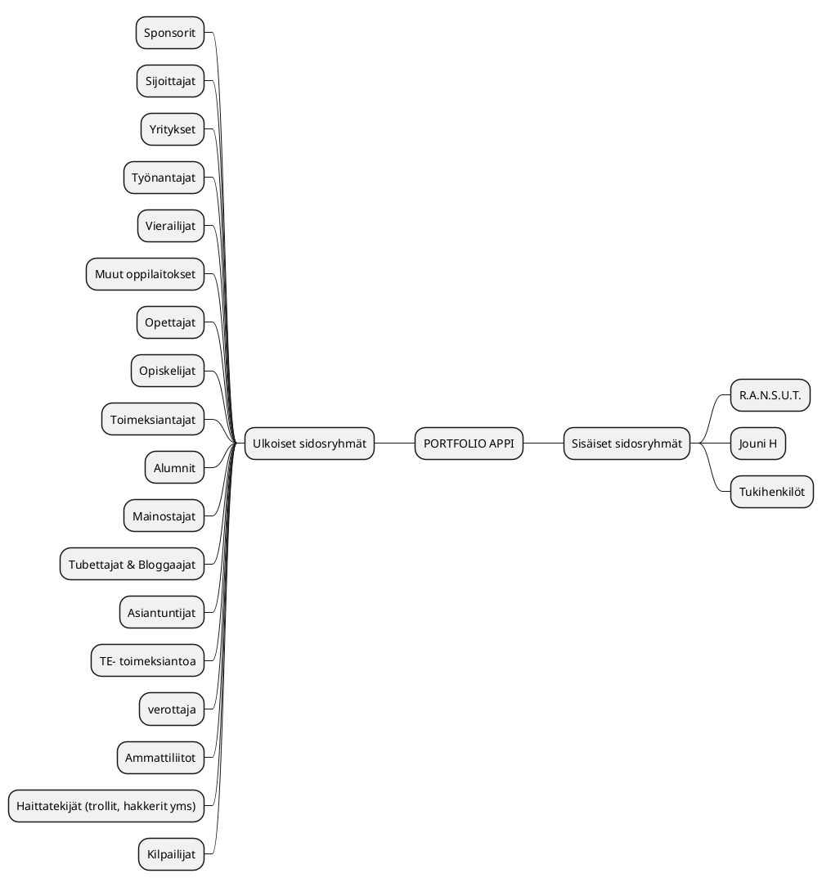
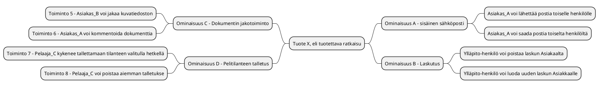
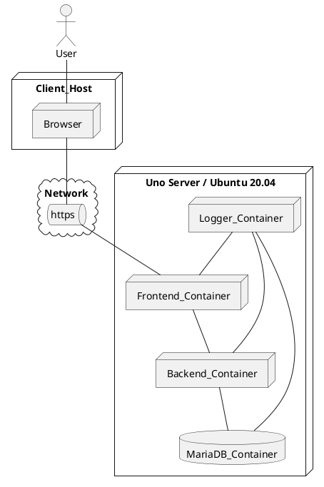

# Tiivistetty vaatimusmäärittely

|  |  |
|:-:|:-:|
| Dokumentti | Tiivistetty vaatimusmääritelmä |
| Laatija: | *R.A.N.S.U.T.* |
| Versio: | *1.0* |
| Päivämäärä: | 25.2.2022 |

>Vaatimusmäärittelyn kirjoittajalle!Eri ohjevideot on siirretty harjoitustehtävien kuvauksiin, eli jos jokin osa-alue ei aukea käy läpi videot ensin! 
Kun editoit dokumentaatiota kannattaa viimeistään ennen palautusta poistaa eri ohjeistukset ja korvata taulukoissa annetut esimerkit pelkästään toimeksiantoon liittyvällä tiedolla. Älä muuta otsikointia ratkaisevasti!
Jos haluat tarkistaa mitä alkuperäinen pohja sisälsi, niin löydät viimeisimmän version osoitteesta [Lyhennetty-vaatimusmääritelmä](https://jamkit.pages.labranet.jamk.fi/project-templates/fi-opf-2021-core-template-v2/20-Vaatimustenhallinta/vaatimusmaaritely-tiivis/)
>Terveisin,
>Ohjaajat

## Johdanto


>*Kerro mitä tällä dokumentilla tavoitellaan? Kuvaa projektissa tavoiteltua kokonaisuutta, hieman taustaa ja aiheeseen olennaisesti liittyviä asioita? Jos kyseessä harjoitustehtävä, niin tarkista voitko todella käyttää olemassa olevia tilaajien oikeita nimiä! Muussa tapauksessa vaihdetaan kaikki nimet itse keksittyihin :)*

## Kohderyhmä 

>Kenelle palvelu on tarkoitettu? Mitä palvelulla pyritään edistämään?
* Kohderyhmä A Sisäiset sidosryhmät
* Kohderyhmä B Ulkoiset sidosryhmät 


Katso seuraava luku -Sidosryhmäkartta


## Sidosryhmäkartta

>*Kuvaa sidosryhmäkartan avulla millaisia käyttäjä, sidosryhmiä tai muita toimijoita liittyy olennaisesti suunniteltun ratkaisuun/palveluun? Kirjataan kaikki tunnistetut sidosryhmät sidosryhmäkartan muotoon. Samalla kirjataan sidosryhmän/toimijan motivaatio palvelua kohtaan. Sidosryhmä kuvauksen voi laatia esim. piirtämällä se eri työkalulla, MindMap-muodossa tai soveltaen sopivaa PlantUML-generaattoria. (Suositeltava vaihtoehto)*

>**Tarinaa väliin**

>*Palvelua kehitettäessä on otettava selvää taustoista ja pyrittävä ymmärtämään itse toimialaa tai tarkasteltua toimintaympäristöä. Tähän tarvitaan taustatietoa ja asiakastuntemusta. Henkilöt joilla on ns. toimialaosaamista (Domain Knowledge) ovat tässä vaiheessa vahvoilla. Kannattaa kuunnella asiakasta ja kerätä tietoa perehtymällä aiheeseen myös itsenäisesti. Toimeksiantajalla on varmasti tarjolla tietoa, jonka pohjalta on helpompi ymmärtää toimialaa, joka saattaa olla alkuvaiheessa arvoitus ratkaisun tekijälle*

>*Tutustu aiemmin mainittuun PlantUML-työkaluun ja kokeilaan luoda tuotteeseen liittyvä sidosryhmäkartta. Löydät ohjeistuksen osoitteesta [http://plantuml.com/](http://plantuml.com/).* 
>Huomio, että Gitlabin tapauksessa MarkDown dokumenteissa PlantUML-koodilohkon merkitsemisessä ei käytetä alkuperäistä tägäystä. 

>* käytä @startuml sijaan *```plantuml*
>* käytä @enduml sijaan *```*

>Muokkaa alla olevaa sidosryhmäkuvausta toimeksiannon mukaisesti ja samalla opit miten tarvittavia kuvauksia voidaan tuottaa PlantUML:n avulla.


>```plantuml
>@startmindmap
>+ Projektin tuotos
>++ Asiakas
>+++ Asiakkaan kaveri
>+++ Asiakkaan sukulainen
>++ Kilpaileva valmistaja
>+++ Kilpailijan kissa
>+++ Kilpailijan koira
>-- Kauppias
>--- Varasto
>--- Noutopiste 1.
>-- Haasteelliset asiakkaat
>--- Kiusantekijä
>--- Satunnainen säätäjä
>@endmindmap
>```

---


**Tarkennettut sidosryhmätprofiilit** 


>*Sidosryhmäkartan avulla saadaan yleiskuva eri toimijoista (actor), jotka liittyvät oleellisesti ratkaisuun/palveluun. Jos pohdimme tarkemmin esimerkiksi erilaisia palvelun loppukäyttäjiä voimme huomata niissä olevan selkeitä eroja. Tästä johtuen joudutaan tarkentamaan ja erittelemään kuvausta ja luomaa tarvittasessa ns. profiilikuvaus. Tämän kuvauksen avulla voidaan tarkemmin tarkentaa kohderyhmän luonnetta. Tarkemman kuvauksen tuottamiseksi voi luoda profiilikohtaisen kuvaustiedoston. Tämä tiedosto luodan kopioimalla tarvittavia tiedostoja jokaiselle profiilille. Eli kopio profiilin kuvaukselle pohja tiedostosta *pohja-profiilikuvaus* ja tallenna se repositorioon sopivasti tunnistettavalla nimeämällä se profiilin mukaisesti. Tarkennettuja profiilikuvauksia luodaan tarpeen mukaan. Alla olevassa taulukossa on esitelty muutamia esimerkki profiileja ja tarpeelliset tiedot löytyvät taulukosta.*

| ID |  Nimi | Kuvaus | Tarve | Motivaatio |
|:-:|:-:|:-:|:-:| :-:|
| SR-001 | [ Selaaja, peruskäyttäjä ](pohjat/pohja-profiilikuvaus.md) | 15-65V | Selkeä tarve palvelulle ja tarvitsee palvelua usein | Haluaa löytää resurssin (esim työntekijän, potentiaalisen opiskelijan, esimerkin hyvästä portfoliosta) |
| SR-002 | [ Muokkaaja, ylläpitäjä ](pohjat/pohja-profiilikuvaus.md) | 15-70V | Tarve satunnainen, mutta yleisin asiakas  | Työllistäminen, verkostoituminen, oman osaamisen todentaminen |
| SR-003 | [ R.A.N.S.U.T, Admin ]() | Salassapidettävä | Sovelluksen/ palvelun ylläpito ja käyttöoikeuksien myöntäminen | Raha & maine |

## Palveluun liittyviä asiakaspolkuja

>Mietitään toimeksiantoa ja pohditaan liittyykö sen käyttöön jotain yleisiä tapahtumia esimerkiksi ennen käyttöä tai sen jälkeen. Miten palvelu/ratkaisu otetaan käyttöön ja millä tavoin sitä käytetään osana  palvelupolkuja?  
>Asiaspolkukuvauksen avulla kuvataan tapahtuma sarjaa joka käydään jossain valitussa tilanteessa läpi palvelun käytön aikana. Asiakas ohtaisia palvelupolkuja voi olla useita erilaisia, mutta tärkeintä on tunnistaa alkuvaiheessa oleellisimmat. 
>Palvelupolun kuvaukseen voidaan hyödytnää sim. Uimaratakaaviota (Swim Lane) tai tilakonekuvausta (State Machine Diagram) tai muuta sopivaksi katsottua tapaa. Tärkeintä on kuvata polku ja sen avulla selkeyttämään ymmärrystä tavoitellusta palvelusta. 

>**Eri kuvauksia tehdään yhteisen ymmärryksen saavuttamiseksi, ei pelkästään yksittäisen kehittäjän iloksi**

**Pieni tarina**
>*Mieti millä tavoin eri henkilöt valikoituvat Play Station/Steam/XBOX/Nintendo pelijärjestelmien käyttäjiksi? Mitkä ovat perusteet henkilökohtaiselle palvelun valinnalle? Onko käyttäjäryhmissä selkeitä eroja? Millaisia pelejä nämä ryhmät arvostavat? Millä tavoin liittyminen peli palveluun tapahtuu käytännössä? Mistä löytyy tarvittaessa VISA-kortti? Vaihda mielessäsi henkilön ikää ja huomaat, että ns. asiakaspolku (customer journey path) vaihtelee pelkästään iän mukaan! Tämä on erittäin tärkeä hahmottaa ajoissa, koska palvelun kehittäjän on otettava huomioon erilaiset potentiaaliset asiakkaat.* 

**asiakaspolku PlantUML-esimerkki tilakoneena**

>Mikä on asiakaspolku, eli "Customer Journey Map". Hyviä esimerkkejä löytyy esimerkkinä Youtuben kautta. Kokeile luonnostella asiakaspolku hyödyntäen PlantUML-työkalua. Kannattaa kokeilla myös muita tapoja! Esimerkkissä käytetään UML-tilankone kuvausta (State Diagram).


>Ennen kuvausta kannataa tehdä johdanto teksti, jossa esitellään mitä kuvauksessa on tarkoitus tarkastella! 


**Tässä asiakaspolku esimerkki: Asiakkaan saapuminen liiketilaan onnistuneen ulkomainoksen pohjalta**

*Tarkastelun kohteena on satunnaisen asiakkaan saapuminen kivijalkakauppaan ja tietosuojaan liittyvän näkökulman vaikutus myyntitilanteessa. Kuvauksen pohjalta voidaan pohtia miten asiakkaan ostopäätöstä voitaisiin vahvistaa?*

```plantuml
Step1: Palvelun kuvaus esillä näyteikkunan mainosnäytössä 
Step2: Asiakas astuu ovesta sisään 
Step3: Palveluun tutustuminen jatkuu sisätiloissa itsenäisesti
Step4: Asiakas kysyy myyjää
Step5: Myyjä esittelee tuotteen lyhyesti
Step6: Asiakas pohdiskelee asiaa
Step7: Asiakas tekee sopimuksen palvelusta
Step8: Asiakas ei ota tuotettava
Step9: Myyjä suosittelee lisäpalveluita
Step10: Myyjä pyytää asiakkaan sähköposti-osoitetta ja henkilöturvatunnusta
Step11: Asiakas kieltäytyy luovuttamasta HETUa ja kauppa keskeytyy
Step12: Miten tämä voidaan välttää?

[*] --> Step1
Step1 --> Step2
Step2 --> Step3
Step3 --> Step6
Step3 --> Step4
Step4 --> Step5
Step5 --> Step6
Step6 --> Step7
Step6 --> Step8
Step9 --> Step6
Step8 --> Step12
Step7 --> Step9
Step9 --> Step10
Step10 --> Step11
Step11 --> Step12
```

## Palvelun ominaisuudet (Features)


>*Kaikki palveluun/ohjelmistoon liittyvät toiminnot (Functions) voidaan kirjaan alkuvaiheessa ns. toiminnallisina vaatimuksina (Functional Requirements), mutta näistä osa niistä osoittautuu melko varmasti palvelun kannalta oleellisiksi ominaisuuksiksi (Features). Tärkeimmät ominaisuudet on tunnistettava riittävästi alkuvaiheessa, koska niiden pohjalta ohjataan tuotekehitystä projektin edetessä.* 

>*Mietitään seuraavaksi miltä ovat palvelun tärkeimmät toiminnalliset ominaisuudet? Kirjataan ne tässä vaiheessa ne taulukkoon ja luodaan niiden pohjalta myös hahmotelma MindMap-kuvauksen muotoon. Kuvan avulla palvelun eri osa-alueet saattava hahmottua selkeämmin.* 
>*Mieti esimerkisi tilannetta, että sinulta kysytään mitä kehittämällasi palvelulla voi käytännössä tehdä? Saat aikaa vastata 15 sekuntia. Mitä vastaat?*
>*Mitä tärkeimpiä toimintoja nostatat esiin?* 
>*Mitkä ominaisuudet tekevätä tuotteestasi on paremman kuin muilla?*

**Pääominaisuudet ja toiminnot**


**HUOMIO** harjoituksessa ei tarvitse määritellä itsenäistä ominaisuutta tarkemmin!

| Ominaisuus (Feature) | Toiminto (Function) |
|:-:|:-:|
| *[Sisäinen sähköposti](pohjat/pohja-ominaisuus.md)* | |
|| Asiakas_A voi lähettää postia ulkopuoliselle henkilölle Mahdollinen_Asiakas_C |
|| Asiakas_A voi saada postia palvelun sisäiseltä käyttäjältä Asiakas_B |
| *[laskutus](pohjat/pohja-ominaisuus.md)* ||
|| Ylläpito_henkilö voi poistaa laskun Asiakaalta_A |
|| Ylläpito_henkilö voi luoda uuden laskun Asiakkaalle_A | 
| *[Pelitilanteen hallinta](pohjat/pohja-ominaisuus.md)* | |
|| Pelaaja_B kykenee tallettamaan tilanteen |
|| Asiakas_B voi jakaa pelitilanteen Asiakkaalle_A |
| *[Suorasoitto](pohjat/pohja-ominaisuus.md)* ||
|| Asiakas_A voi soittaa tuntemalleen henkilölle Asiakas_B |
|| Asiakas_A voi soittaa tuntemattomalle henkilölle, jos soitto on sallittu |

>Jokainen ominaisuus kannattaa kuvata itsenäisenä dokumenttina, koska niihin liittyy paljon tarkentavaa tietoa. Tutustu esimerkkinä [FEAT0001](20-Vaatimustenhallinta/ominaisuus-FEA0001.md). Kuvauksen tekemiseen käytetään tarvittaessa seuraavaa [pohjaa](pohja/../pohjat/pohja-ominaisuus.md). 


**Kirjataan ominaisuudet vielä MindMap-muotoon ja samalla linkitetään niihin liittyvät toiminnot**




# Toiminnalliset vaatimukset (Functional Requirements)

>Kuten huomasit yksittäinen toiminto (Function) liittyy yleensä laajempaan kokonaisuuteen eli ominaisuuteen (Feature). Määrittelyn alkaessa kaikki tunnistetut toiminnot voi kirjata ns. toiminnallisina vaatimuksina esimerkiksi taulukon muotoon. Tämän jälkeen voidaan tunnistaa niistä tärkeimmät ominaisuudet ja liittää niihin esiin tulleet toiminnot. 

Kaikkia vaatimuksia (myös ei-toiminnalliset vaatimukset) koskevat seuraavat ehdot:


* *Vaatimus on yksilöllinen ja identifioitu*
* *Vaatimus on oltava mitattavissa*
* *Vaatimuksen on oltava yksiselitteinen ja selkeä*
* *Vaatimukseen ei tule sisällyttää useampia vaatimuksia*
* *Vaatimus kannattaa perustella, jos tarpeen*
* *Vaatimuksen ei saa ylikirjoittaa aiemmin määriteltyä vaatimusta*
* *Edustaako kirjattu vaatimus itseasiassa ominaisuutta?*

| ID | Toiminnallisen vaatimuksen kuvaus | ominaisuus	|				
|:-:|:-:|:-:|
| [FUNCREQ-C0001]() | Palveluun kirjautumisessa voidaan käyttää Facebook-tunnuksia | [Kirjautumis-ominaisuus](pohjat/pohja-ominaisuus.md) |
| [FUNCREQ-C0002]() | Käyttöliittymää voidaan ohjata tarvittaessa äänikomennoilla | [Ääniohjaustuki-ominaisuus](pohjat(pohjat/pohja-ominaisuus.md)) |
| [FUNCREQ-C0003]() | Käyttäjä voi vaihtaa kirjautumisikkunassa kielen | [Kirjatumis-ominaisuus]() |
| [FUNCREQ-C0004]() | ... | ... |

## Käyttöliittymänäkymä/mockup 


>*Eri ominaisuuksien ja niihin liittyvien toiminnallisuuksien selkeyttämiseksi voidaan hyödyntää myös erilaisia kuvauksia. Kuvausten avulla pyritään hahmottamaan miltä tuotteen tulisi näyttää tai mitä on otettava huomioon käyttöliittymätoteutuksessa? Tähän tarkoitukseen voi soveltaa nykyaikaisia ns. MockUp/prototyyppityökaluja. Näiden välineiden avulla voidaan luoda helposti käyttöliittymästä nopea kokeiluverso, jota voidaan koekäyttää eri kohderyhmillä.* 
>*Ominaisuuksien toteutuksiin liittyvät prototyyppi kuvaukset kannataa liittää ominaisuuksien määrittelydokumentteihin, jolloin ne löytyvät asian mukaisesta paikasta. Tutustu esimerkkinä [Feature-FEA0001](20-Vaatimustenhallinta/ominaisuus-FEA0001.md)
>*Perinteisesti käyttöliittymä hahmotelmat ja kuvaukset on tehty piirtämällä käyttöliittymästä staattisia kuvia ja näitä on käytetty suunnittelun apuna. Tämä onnistuu myös soveltamalla apuna PlantUML-kuvauksia. (ks. alla) Kannattaa kuitenkin tutustua ja kokeilla arjolla olevia prototyyppi/MockUp-työkaluja tähän tarkoitukseen.*  

 * [Lisää tähän linkki prototyyppiin / MockUp-toteutukseen]()
 * Kokeile myös upottaa prototyyppi IFRAMEn muodossa? 

**Alla esimerkki yksinkertaisesta PlantUML:n avulla muodostetusta käyttöliittymän dialogista**

```plantuml
salt
{
  Just plain text
  [This is my button]
  ()  Unchecked radio
  (X) Checked radio
  []  Unchecked box
  [X] Checked box
  "Enter text here   "
  ^This is a droplist^
}
```

## Ketterän kehittämisen käyttötarinat - User Story 


>*Nykyaikaisessa ohjelmistokehityksessä on yleistynyt tapa käyttää tarkkojen vaatimusten sijaan eri sidosryhmiltä kerättyjä kuvauksia tarvittavista toiminnoista. Näitä kuvauksia nimitetään käsitteellä käyttötarina eli *User Story*. Kannattaa tutustu aiheeseen [User Story](https://en.wikipedia.org/wiki/User_story). Käyttötarinat ovat kehitystiimin kannalta erittäin oleellisia, koska ne kuvaavat toimintoja, joita palvelulta odotetaan. Käytännössä User Storyjen avulla ohjataa koko kehitystiimin tavoitteellista työskentelyä projektin aikana.*

>Käyttötarina kuvauksen yleinen muoto on: 

* Englanniksi: As a <-role-> I can <-capability->, so that <-receive benefit->*

* Vapaasti suomennettuna: Palvelun käyttäjän <-roolissa X-> voin tarvittaessa suorittaa <-toiminnon->, koska <-perustelu->* 

>*Yksittäinen käyttötarina (User Story) voidaan kirjata esim Gitlab-palvleussa ns. Issuen muotoon. User Storyt voi alkuvaiheessa kerätä myös taulukkoon/listaan ja siirtää ne sopivalla hetkellä Issue-muotoon.*

**Esimerkki, jossa on linkitys issueen**

* *Käyttäjänä haluan, että voin luoda raportin tekemistäni ostoista viimeisen kuukauden ajalta, koska se helpottaa oman talouteni hallintaa* #14

## Tietojärjestelmiä yleisesti koskevista vaatimuksista

>Laajoja tietojärjestelmiä/ohjelmistoja suunniteltaessa vaatimuksia voidaan kirjata eri näkökulmista. Tietojärjestelmien suunnittelussa voi käyttää analogiana kuvaa jäävuoresta, josta pinnalla näkyy osa, mutta iso osa (90%) on piilossa veden alla. Tämä pätee tietojärjestelmän vaatimuksiin. Korkealta tasolta katsottuna näyttää kokonaisuus ehkä selkeältä, mutta yksityiskohtiin mentäessä työ hankaloituu. 


>Vaatimusmäärittelyn työstäminen voidaan nähdä kahden eri näkökulman kannalta.

**Ongelma kenttä (Problem Domain) vs Ratkaisu kentttä (Solution Domain)**

>Eli on tunnettava riittävän tarkasti ongelmakenttä (Asiakkaan/toimeksiantajan tarve), että voidaan kehittää siihen sopiva ratkaisu (esim. ohjelmistopalvelu)

>Tietojärjestelmän vaatimusten eri muotoja voivat olla olla esimerkiksi
>* Asiakasvaatimukset (Customer Needs)
>* Liiketoimintavaatimukset (Business Requirements/Needs)
>* Järjestelmävaatimukset (System Requirements)
>* Ali-järjestelmän vaatimukset (Sub-System Requirement)
>* Komponenttitason vaatimukset (Component Requirements)

>Opintojakson kannalta keskitytään tunnistamaan toiminnalliset vaatimukset, ei-toiminnalliset vaatimukset (suorituskyky, tietoturva ja saavutettavuus)

* [Vaatimusmäärittelystä Wikipediassa](https://en.wikipedia.org/wiki/Requirements_analysis)

*Vaatimusten jäljitettävyydestä*

>Eri vaatimusten eri muodoilla voidaan tarkastella kehitettävää tuotetta eri näkökulmista, mutta eri tasojen välillä olevilla vaatimuksilla voi olla yhteys. 
Näitä yhteyksiä kutsutaan vaatimusten jäljitettävyydeksi (Traceablity). 

> * *Asiakasvaatimus CUST001* -> *Ominaisuus FEA001* --> *Toiminnallinen vaatimus Y*
> * *Asiakasvaatimus CUST001* -> *Liiketoiminnan vaatimus BISREQ100* -> *Ominaisuus FEA001*
> * *Tietoturvavaatimus SEC001* -> *Ominaisuus FEA001*

>Vahvan jäljitettävyyden avulla voidaan tarkastella yksittäisten muutosten vaikutusta koko tuotteeseen. Tässä tilanteessa voidaan yksittäistä vaatimusta "törmäyttää" ja nähdään minne kaikkialle vaikutus ulottuu (Impact analysis).
>Tämän vaatii vaatimusmäärittelytyön tueksi tarkoitukseen sopia työkaluja (Requirement Management Tools)

## Palveluun liittyvät tekniset vaatimukset

>Kokonaisvaltaisia ohjelmisto palveluja määriteltäessa on tärkeä tunnistaa ja määritellä palvelun tuottamiseksi tarvittavat teknologiat, laitteistot tai muut tärkeät osa-järjestelmät. Esimerkkinä tarvittava palvelinympäristö, tietokanta, varmistusjärjestelmät ja muut palvelun toiminnan kannalta oleelliset tarpeet.

*Esimerkkinä on kirjattu muutamia laitteistovaatimuksia (Hardware Requirements)*

| ID | Kuvaus | 
|:-:|:-:|
| HWREQ-0001 | Palvelun on oltava skaalattavissa HA-proxy ratkaisun varassa | |
| HWREQ-0002 | Palvelimen muistikapasiteeti >32GB  ||
| HWREQ-0003 | Palvelimen fyysinen sijainti on oltava EU-aluella| |
| HWREQ-0004 |... ||

## Laadulliset vaatimukset (Non-functional Requirements)

>Laadulliset vaatimukset tarkastelevat palvelua ns. ei-toiminnallisesta näkökulmasta. Kuulostaa ehkä äkkiseltään hankalalta, mutta mieti seuraavia kysymyksiä?

* *Miten tuottesta saadaan kehitettyä riittävän turvallinen? Onko joitain vaatimuksia, jotka on täytettävä tästä johtuen? (tietoturva-security)*
* *Mitkä asiat on huolehdittava, että tuote on hyväksyttävissä viranomaisten käyttöön? (yhteensopivuus-conformance)*
* *Miten paljon käyttäjiä palvelussa voi olla yhtäaikaa(suorituskyky-performance)
* *Onko palvelun tarkoitus joskus toimia laajemmalle käyttäjäkunnalle(skaalautuvuus-scalability)*
* *Miten voidaan varmistaa, että palvelu on saavutettavissa kaikkien käyttäjien kannalta?(skaalautuvuus-scalability)*
* *Onko tarvetta eri kieliversioille?(saavutettavuus-accessability)*
* *Mitä on otettava huomioon palvelua jatkokehitettäessä? (ylläpidettävyys-maintainability)*
* *Mitä teknologioita voidaan käyttää?(ylläpidettävyys-maintainability)*

>[Ei-toiminnalliset vaatimuksia](https://en.wikipedia.org/wiki/Non-functional_requirement) on useita eri tyyppejä, mutta opintojen kannalta tärkeimmiksi on valittu: suorituskyky, tietoturva ja saavutettavuus 
>* Suorituskyky (Performance Requirement)
>* Tietoturva (Security Requirement)
>* Saavutettavuus (Accessability Requirement)

### Suorituskykyvaatimukset (Performance Requirements)


>Millaisia vaatimuksia palveluun kohdistuu suorituskyvyn näkökulmasta?
>Mitä tarkoittaa suorituskyvyn testaus, eli [load testing](https://en.wikipedia.org/wiki/Load_testing) Tutustu myös K6-työkaluun? [K6-Load Tester](https://k6.io/)

| ID | Kuvaus |
|:-:|:-:|
| PERFREQ-0000 | Kirjautuminen on mahdollista yhtäaikaa x käyttäjällä |					
| PERFREQ-0001 | Palvelun maksimi käyttäjä määrä on ? |
| PERFREQ-0002 | Palvelun kotisivu aukeaa < Xs ||

### Tietoturvavaatimukset (Security Requirements)


>Millaisia vaatimuksia palveluun kohdistuu tietoturvan näkökulmasta? 
> Tutustu [VAHTI 1/2013 Sovelluskehityksen tietoturvaohje](https://www.suomidigi.fi/ohjeet-ja-tuki/vahti-ohjeet/vahti-12013-sovelluskehityksen-tietoturvaohje)
> Tarkista esimerkkinä [TRAFICOMin tietoturvamerkki](https://tietoturvamerkki.fi/fi/vaatimukset/)


| ID |  Kuvaus |
|:-:|:-:|
| SECURITY-REQ-0001 | Salasanassa on käytettävä vähintään MD5-tason salausta, koska vaatimus [CONSTRAIN-000]() sitä edellyttää |
| SECURITY-REQ-0002 | Jokainen tapahtuma palvelussa on kirjattava käyttölogiin, että niitä voidaan tarkastella myöhemmin | 
| SECURITY-REQ-0003 | ... |

### Saavutettavuusvaatimukset (Accessablity Requirements)


>Mitä tarkoitetaan saavutettavuudella? Millaisia asioita/ohjeistuksia on otettava huomioon palvelua toteutettaessa? Tutustu lähteeseen: [https://www.saavutettavuusvaatimukset.fi/](https://www.saavutettavuusvaatimukset.fi/)

| ID  |  Kuvaus |
|:-:|:-:|
| ACCESSREQ-0000 | Palvelun käyttöliittymässä on mahdollista valita selkeä kontrastinen teema |	
| ACCESSREQ-0001 | Käyttöliittymän Fonttikokoa on voitava muuttaa päävalikon kautta |
| ACCESSREQ-0002 |  ... |

## Rajaukset ja reunaehdot (Constraints and limitations)

>Eri ohjelmistojena/palvelujen toteutusta ja käyttöä ohjaavat usein lait ja säädökset. Näiden edellyttämät vaatimukset kirjataan vaatimusmäärittelyyn rajauksina. Rajausten (Constraints) vaikutus voi koskea koko palvelua palvelun jonkin osa-kokonaisuuden toteuttamista. Tästä syystä eri rajoitteet on tunnistettava ajoissa, koska vaikutus saataa olla varsin ratkaiseva pitemmällä tähtäimella. Esimerkkinä tästä on viime vuonna voimaan tullut [EU GDPR-säädös](https://en.wikipedia.org/wiki/General_Data_Protection_Regulation).
Kannattaa tutkia esimerkiksi https://www.sfs.fi/aihealueet/terveydenhuolto/laakinnalliset_laitteet tai http://docs.jhs-suositukset.fi/jhs-suositukset/JHS190/JHS190.html

| ID |  Rajaus/reunaehto | Mihin vaikuttaa |
|:-:|:-:|:-:|
| CONSTRAIN-000  |  Palvelun kirjautumisprosessin on noudatettava JUHTA-hyväksyttyjä käytänteitä  | [Feature Kirjautuminen](pohjat/pohja-ominaisuus.md) |
| CONSTRAIN-001 |  Palvelussa on huomioitava JHS:n suosituksest lokihallinasta | [Feature - Lokihallinta](pohjat/pohja-ominaisuus.md)|
| CONSTRAIN-002 |  ... | ... |

## Ohjelmistoarkkitehtuuri

>Vaatimusmäärittelyn osaksi voidaan tarvittaessa liittää teknillisiä kuvauksia, joiden avulla voidaan tarkentaa eri vaatimuksia. Yksi tärkeä dokumentti voi olla esimerkiksi tekninen arkkitehtuuri. Tämä kuvaus voidaan lyhyessä muodossaan liittää osaksi vaatimusmäärittelyä, mutta yleensä se on varsin laaja itsenäinen dokumentaation osa. Arkkitehtuuri ratkaisujen kuvaamiseksi voidaan laatia yödyntäen apuna UML-kuvauskielen eri diagrammeja. Esimerkkinä alla on  sijoittelunäkymä ([Deployment Diagram](https://plantuml.com/deployment-diagram)). Sijoittelunäkymän avulla voidaan kuvata miten palvelun eri palvelut sijaitsevat ja miten ne kytkeytyvät toisiinsa.

Ohjelmistoarkkitehtuurin kuvaus on itsessään laaja osa-alue ja käytännössä se edellyttää laajempaa dokumentaatiota.

* [Tähän linkki erilliseen ohjelmistoarkkitehtuurin kuvaukseen](../30-Suunnittelu-ja-toteutus/arkkitehtuuri-ja-tekninentoteutus.md)



## Standardit ja lähteet

>Kirjataan käytetyt lähteet alla olevaan taulukkoon.

| ID | Nimi | Linkki | Kuvaus |  
|:-:|:-:|:-:|:-:|
| REF1 | JHS 165 ICT | [JHS Suositukset - vaatimusmäärittelylle](http://www.jhs-suositukset.fi/c/document_library/get_file?uuid=b8118ad7-8ee4-459a-a12b-f56655e4ab9d&groupId=14) | Vaatimusmäärittelyn suositus |
| REF2 | ISO 9241-11  | [Käytettävyys](https://fi.wikipedia.org/wiki/K%C3%A4ytett%C3%A4vyys)  | Usability | 
| REF3 |  EN 301 549 | [Saavutettavuus](https://fi.wikipedia.org/wiki/Saavutettavuus) | Availability |
| REF4 |  GDPR | [GDPR Asetus](https://europa.eu/youreurope/business/dealing-with-customers/data-protection/data-protection-gdpr/index_fi.htm) | General_Data_Protection_Regulation |
| REF5 | KATAKRI V11 | [Katakri](https://www.defmin.fi/files/1870/KATAKRI_versio_II.pdf) | Kansallinen turvallisuusauditointikriteeristö |


