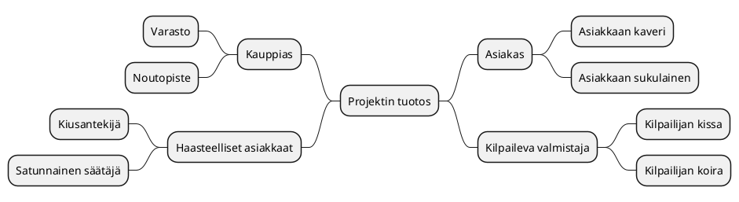

# Tiivistetty vaatimusmäärittely

* [SIJOITA TOIMEKSIANNON NIMI TÄHÄN] 
* Projektimäärittely/vaatimusmäärittelyn tiivistetty versio v 0.3 4.1.2021 (NarsuMan)

## Johdanto


>Kuvaa tavoiteltua kokonaisuutta, hieman taustaa ja aiheeseen olennaisesti liittyviä asioita? Jos kyseessä harjoitustehtävä, niin tarkista voitko 
käytää olemassa olevia tilaajien oikeita nimiä! Muussa tapauksessa vaihdetaan kaikki nimet itse keksittyihin :)

## Tavoitteet 

>Mitä ratkaisun avulla voidaan tehdä? Millaisia ovat sen käyttäjät? Mikä sen tehtävä on yleisesti eri sidosryhmien kannalta? 
Kannattaa nostaa esiin lyhyesti mahdolliset loppukäyttäjä ja oleellisiin palvelusta hyötyviin sidosryhmät

**Mindmap-yleiskuvaus**

Mitä projektin tavoitteet ovat esim. MindMap-muodossa Pohjana esimerkki ohjelmistoratkaisun sisältämisitä toiminnallisuuksista. 


## Sidosryhmäkartta


>Mietitään tarkemmin millaisia käyttäjä/sidosryhmiä liittyy suunniteltuun ratkaisuun/ohjelmistoon/palvelukokonaisuuteen? 
Näitä selkeyttääksemme kirjataan kaikki sidosryhmät sidosryhmäkartan muotoon. Nostetaan samalla esiin mikä on 
ko. sidosryhmän/edustajan palveluun liittyvä motivaatio. Kuvauksen voi laatia esim. piirtämällä, MindMap-muodossa tai soveltaen sopivaa UML-notaatiota.

> Voit tutustu nyt aiemmin mainittuun PlantUML-työkaluun ja kokeilla luoda sidosryhmäkartta käyttäen (http://plantuml.com/)
> Huomaa! PlantUML-lohkon määrittelyssä käytetään Gitlab-ympäristössä eri avainsanoja @startuml/@enduml- rivien sijaan  
> Älä käytä skandinaavisia merkkejä PlantUML-kuvauksessa,koska niiden julkaisu www-sivulla ei välttämättä toimi!**


**Tarkennettut sidosryhmäprofiilit** 


> Eritellään sidosryhmäkartasta eri sidosryhmät/profiilit listaksi.  Tarvittaessa kuvataan tarkemmin valitut sidosryhmät ja tarkennetaan niitä, jos toimeksianto sitä edellyttää

| ID | Tyyppi | Nimi | Kuvaus | Motivaatio |
|:-:|:-:|:-:|:-:|:-:|
| SR-001 | Sidosryhmä/Profiili | Asiakas A | Mies 50-60 V | Olemassa oleva tarve palvelulle |
| SR-002 | Sidosryhmä/Profiili | Rahoittaja | Sijoittajat HEX | Osingot ja tuotot |
| SR-003 | Sidosryhmä/Profiili | [Asiakas C - Profiili 1 ](pohjat/pohja-profiilikuvaus.md) | ?  |
| SR-004 | Sidosryhmä/Profiili | Verottaja | Kerätä verotuloja  |

## Tunnistetut riskit

> Millaisia riskeja liittyy ratkaisun/ohjelmiston/tuoteen kehittämiseen, tuotteen markkinoihin, mahdollisiin kilpailijoihin, resursseihin? 
Nämä on hyvä tunnistaa alkuvaiheessa ja kirjata ne listaksi, jossa jokainen riski kuvataan itsenäisen tunnisteen avulla


| ID | Tyyppi | Kuvaus | 
|:-:|:-:|:-:|
| RISK-001 | Riski | Tuote tulee markkinoille liian myöhään |  
| RISK-002 | Riski | Tuotettava ratkaisu liian monimutkainen |  
| RISK-003 | Riski | ... |  

> Avainsanat SWOT, Riskianalyysi

## Palveluun liittyviä asiakaspolkuja

> Mieti toimeksiantoa ja pohdi onko siitä tunnistettavissa ns. palvelupolkuja? 
> Asiaspolkukuvauksen avulla kuvataan tapahtuma sarjaa joka käydään jossain valitussa tilanteessa läpi palvelun käytön aikana. 
> Asiakas kohtaisia palvelupolkuja voi olla useita, mutta tärkeintä on tunnistaa alkuvaiheessa oleellisimmat. 
> Palvelupolkua kuvattaessa voi hyödyntää esim. Swim lane/BluePrint/tilakone-kuvausta tai muuta sopivaksi katsottua kuvausta.
> Tärkeää on kuitenkin kuvata polku ja käyttää sitä tarvittaessa selkeyttämään ymmärrystä tavoitellusta palvelusta. 
> Käy läpi tekemäsi kuvausta jonkun toisen henkilön kanssa yhdessä? Käy läpi polku ja kerro mitä sen aikana tapahtuu..

**asiakaspolku PlantUML-esimerkki tilakoneena**

> Kokeillaan luonnostella asiakaspolkua PlantUML-työkalun avulla. Kannattaa kokeilla ehdottomasti myös muita tapoja! 
> Sovella esim. PlantUML SDL/Swimlane kuvausta?

```plantuml

Step1: Palvelun kuvaus mainosnäytöllä 
Step2: Asiakas astuu ovesta sisään 
Step3: Palveluun tutustuminen sisätiloissa
Step4: Asiakas kysyy myyjää
Step5: Myyjä esittelee tuotteen
Step6: Asiakas pohdiskelee asiaa
Step7: Asiakas tekee sopimuksen
Step8: Asiakas ei ota tuotettava
Step9: Myyjä suosittelee lisäpalveluita
Step10: Jne
Step11: Asiakas poistuu paikalta

[*] --> Step1
Step1 --> Step2
Step2 --> Step3
Step3 --> Step6
Step3 --> Step4
Step4 --> Step5
Step5 --> Step6
Step6 --> Step7
Step6 --> Step8
Step8 --> Step11
Step7 --> Step9
Step9 --> Step10

```

## Tärkeimmät toiminnallisuudet/ominaisuudet


> Hahmotellaan tähän kohtaan ominaisuudet pelkästään "ranskalaisilla viivoilla", eli mitä palvelulla mielestäsi on mahdollista tehdä?
> Mieti tilannetta, kun joku kysyy mitä palvelulla voi tehdä? Mitä vastaat ja mitkä toiminnot nostatat esiin ehdottomasti valtteina verrattuna muihin vastaaviin palveluihin?
> Päivitä lista myöhemmin, kun se tarkentuu? 
> Tässä kohtaa kannattaa tarkistaa mitä olivat asiakkaan esittämät toiveet palvelusta? Niistä voisi löytyä ehkä joitain tässä vaiheessa?
> Tarkemmat toiminnallisuudet tarkentuvat myöhemmin dokumentissa.  
> Tässä vaiheessa riittää:


- Oleellisia toimintoja 
    - Asiaksi-profiili-1 voi lähettää postia toiselle henkilölle
    - Asiakas-profiili-2 voi saada tietoa aiemmin tehdyistä valinnoista
    - Ylläpito-henkilö voi poistaa laskun
    - Ylläpito-henkilö voi luoda uuden laskun
    - muita?

## Alustavat käyttäjätarinat


> Ketterä kehitys on tuonut mukanaan tavan kuvata asiakkaan tarpeita ns. User Storyjen muodossa. Kirjataan tähän tunnistetut käyttäjätarinat.

* User Story: [Käyttäjänä haluan, että voin luoda raportin tekemistäni ostoista viimeisen kuukauden ajalta, koska se helpottaa oman talouteni hallintaa]()
* User Story: [Pääkäyttäjän haluan poistaa vanhat tunnukset kokonaan, koska se selkeyttää ylläpitoa]()
* Käytännössä ylempi kuvaus on hieman jäykkä ja on järkevitä kirjata storyt suoraan esim. GitLab-issuen muotoon! 

## Yleiset tekniset vaatimukset

> Teknisiä ratkaisuja määriteltäessa on hyvä tunnistaa tarvittavat teknologiat, laitteistot tai muut tarvittavat fyysiset ratkaisut. 
Ohjelmiostoratkaisuja määriteltäessä kannattaa erottaa puhtaasti tekniset/tuotannolliset vaatimukset ja kirjata ne vaatimusmäärittelyyn esimerkiksi teknisinä vaatimuksina. 

| ID | Tyyppi | Kuvaus | 
|:-:|:-:|:-:|
| HWREQ-0002 | Tekniset vaatimukset | Palvelun tärkeimpien palvelujen on oltava vähintään kahdennettu N+1 | |
| HWREQ-0003 | Tekniset vaatimukset | Palvelimen muistikapasiteeti >32GB  ||
| HWREQ-0005 | Tekniset vaatimukset | Palvelimen fyysinen sijainti on oltava EU-aluella| |
| HWREQ-0005 | ... | ... ||

# Toiminnalliset vaatimukset (Functional Requirements)

>Mitä toimintoja palveluun liittyy? Nämä kannattaa kirjata ensi ns. toiminnallisina vaatimuksina? Toiminnallisilla vaatimuksilla kuvataan ohjelmistolta/järjestelmältä vaadittuja toimintoja.
Toiminnalliset vaatimukset ovat helpoimmin tunnistettavia. Vältä useamman vaatimuksen kirjaamista samaan lauseeseen! Jokainen vaatimus erikseen.

| ID | Tyyppi | Kuvaus | Toiminnallisuus johon vaatimus vaikuttaa |								
|:-:|:-:|:-:|:-:|
| FUNCREQ-C0001 | Toiminnallinen vaatimus | Krjautumiseen voi käyttää Facebook-tunnuksia | [Toiminnallisuus X](pohjat/pohja-ominaisuus.md) |
| FUNCREQ-C0002 | Toiminnallinen vaatimus | Käyttöliittymää voidaan ohjata äänikomennoilla | [Toiminnallisuus Y](pohjat/pohja-ominaisuus.md) |
| FUNCREQ-C0003 | Toiminnallinen vaatimus | ... | ... |

# Laadulliset eli ei-toiminnalliset vaatimukset

>Mitä olivat ei-toiminnalliset vaatimukset? Voit esittää eri vaatimuksia erillisessä taulukossa tai viitata tässä [yhteen](pohjat/pohja-vaatimuslistalle.md) laajempaan taulukkoon.
[Ei-toiminnalliset vaatimukset](https://en.wikipedia.org/wiki/Non-functional_requirement) sisältää laajan joukko eri näkökulmia sähköiseen palveluun liittyen. Tärkeimmät kirjoittajan 
näkökulmasta ovat seuraavat: Suorituskyky, tietoturva ja saavutettavuus 

* Suorituskyky
* Tietoturva
* Saavutettavuus

## Suorituskykyyn liittyvät vaatimukset


>Millaisia vaatimuksia palveluun kohdistuu suorituskyvyn näkökulmasta?

| ID | Tyyppi | Kuvaus |
|:-:|:-:|:-:|
| PERFREQ-0000 | Suorituskyky | Kirjautuminen on mahdollista yhtäaikaa 100 käyttäjällä (100 request/s) |					
| PERFREQ-0001 | Suorituskyky | Palvelun maksimi käyttäjä määrä on ? |
| PERFREQ-0002 | Suorituskyky | ... ||

## Tietoturvan vaatimukset


>Millaisia vaatimuksia palveluun kohdistuu tietoturvan näkökulmasta?

| ID | Tyyppi | Kuvaus | Miten testataan? |
|:-:|:-:|:-:|:-:|
| SECURITY-REQ-0001 | Salasanassa on käytettävä vähintään MD5-tason salausta, koska [CONSTRAIN-000]() sitä edellyttää | [Testitapaus X]() |
| SECURITY-REQ-0002 | Jokainen tapahtuma palvelussa on kirjattava käyttölogiin, että niitä voidaan tarkastella myöhemmin | [Testitapaus Y]() |
| SECURITY-REQ-0003 | ... | ... |

## Saavutettavuuden vaatimukset


>Mitä tarkoitetaan saavutettavuudella? Millaisia asioita/ohjeistuksia on otettava huomioon palvelua toteutettaessa?
Tutustu [saavutettavuusdirektiiviin](https://saavutettavuusdirektiivi.fi/saavutettavuus-verkkopalveluissa/) ja kirjaa  

| ID  | Luokka | Kuvaus | Miten testataan? |
|:-:|:-:|:-:|:-:|
| AVAILREQ-0000 | Saavutettavuus | | [Testit]() |	
| AVAILREQ-0001 | Saavutettavuus | | [Testit]() |
| AVAILREQ-0002 | Saavutettavuus | ... | ... |

### Toimeksiannon kannalta tärkeät oleelliset rajaukset

> Eri ohjelmistojena/palvelujen toteutusta ja käyttöä ohjaavat usein lait ja säädökset. Näiden edellyttämät vaatimukset voidaan kirjataan tarvittaessa vaatimusmäärittelyyn.
Rajausten vaikutus koskee usein palvelun jonkin osa-kokonaisuuden toteuttamista. Tästä syystä eri rajoitteet on tunnistettava ajoissa, koska vaikutus 
saataa olla varsin ratkaiseva pitemmällä tähtäimella. Esimerkkinä tästä on viime vuonna voimaan tullut [EU GDPR-säädös](https://en.wikipedia.org/wiki/General_Data_Protection_Regulation).
> Kannattaa tutkia esimerkiksi https://www.sfs.fi/aihealueet/terveydenhuolto/laakinnalliset_laitteet tai http://docs.jhs-suositukset.fi/jhs-suositukset/JHS190/JHS190.html

| ID | Tyyppi | kategoria | Vastuullinen |
|:-:|:-:|:-:|:-:|
| CONSTRAIN-000  | Rajaus | Palvelun kirjautumisprosessin on noudatettava JUHTA-hyväksyttyjä käytänteitä  | [Kirjautuminen ft1](pohjat/pohja-ominaisuus.md) |
| CONSTRAIN-001 | Rajaus | On huomioitava Standardi ZZZ osana palvelun tapahtuma login talletusta | [Log-palvelin](pohjat/pohja-ominaisuus.md)|
| CONSTRAIN-002 | Rajaus | ... | ... |


### Palvelun yleinen rakenne sijoittelunäkymänä (Deployment diagram)

## Palveluun liittyvät muut järjestelmät

> Järjestelmien välisiä yhteyksiä voidaan kuvata tarvittaessa esim. sekvenssikaavion muodossa. 

```plantuml
node1 ->node2: Log Start Request
node2 --> node1 : Logging started
```
## Standardit ja lähteet

> Vaatimusmäärittelyn osana on oleellista tuoda esiin tärkeät lähteet, joista on hyötyä tai merkitystä kokonaisuuden kannalta. Standardit ja ennalta jaetut ohjeistukset ovat hyödyllisiä lähteitä ja tarvittaessa 
selkeyttävät vaatimusten merkitystä.

| ID | Nimi | Linkki | Kuvaus |  
|:-:|:-:|:-:|:-:|
| REF1 | JHS 165 ICT | [JHS Suositukset - vaatimusmäärittelylle](http://www.jhs-suositukset.fi/c/document_library/get_file?uuid=b8118ad7-8ee4-459a-a12b-f56655e4ab9d&groupId=14) | Vaatimusmäärittelyn suositus |
| REF2 | SO 9241-11 | [Käytettävyys](https://fi.wikipedia.org/wiki/K%C3%A4ytett%C3%A4vyys)  | Käytettävyys | 
| REF3 | ... | ... | ... |
