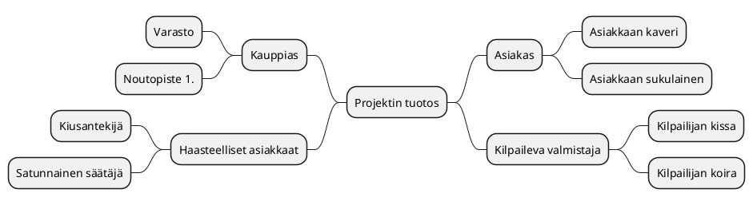
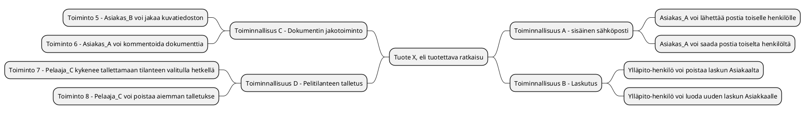
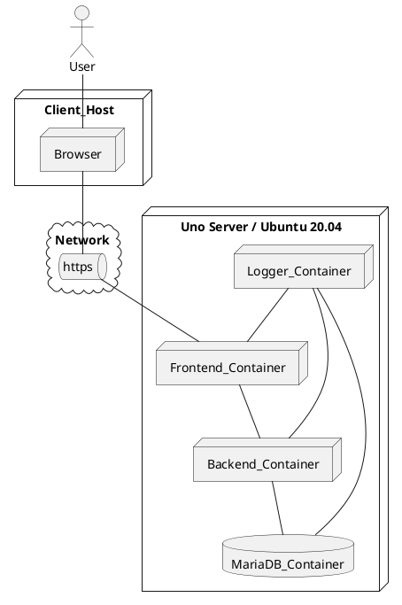

# Vaatimusmäärittely

*HUOM* Löydät ohjeistusta vaatimusmäärittelyn tekemiseen [tiivistetystä vaatimusmäärittelystä](vaatimusmaaritely-tiivis.md), joka löytyy samasta kansiosta.

|  |  |
|:-:|:-:|
| Dokumentti | Vaatimusmäärittely |
| Kuvaus | |
| Laatija: | |
| Versio: | |
| Päivämäärä: | |


## Sisällysluettelo 

1. [Johdanto](#johdanto)
1. [Toimeksiantaja](#toimeksiantaja)
1. [Vaatimusmäärittelyn tekijä](#vaatimusmäärittelyn-tekijä)
1. [Palvelukuvaus](#Palvelukuvaus)
1. [Sidosryhmäkartta](#Sidosryhmäkartta)
1. [Sidosryhmät ja profiilit](#Sidosryhmät ja profiilit) 
1. [Tunnistetut riskit](#Tunnistetut-riskit)
1. [Valitut asiakastarinat](#Valitut-asiakastarinat)
1. [Palveluun liittyviä asiakaspolkuja](#Palveluun-liittyviä-asiakaspolkuja)
1. [Oleelliset käyttötapaukset](#Oleelliset-käyttötapaukset) 
1. [Tärkeimmät yleiset ominaisuudet/toiminnallisuudet](#Tärkeimmät-ominaisuudet/toiminnallisuudet) 
1. [MockUp-prototyyppi](#MockUp-prototyyppi)
1. [Alustavat Käyttäjätarinat](#Alustavat-käyttäjätarinat)
1. [Palvelun järjestelmävaatimukset](#Palvelun-järjestelmävaatimukset) 
1. [Palveluun vaikuttavat rajaukset](#Palveluun vaikuttavat rajaukset) 
1. [Palvelun liityvät laitevaatimukset](#Palvelun liityvät laitevaatimukset)
1. [Palvelun suoritusympäristöön liittyvät vaatimukset](#Palvelun suoritusympäristöön liittyvät vaatimukset)
1. [Palvelun määritellyt ominaisuudet/toiminnnallisuudet](#Palvelun määritellyt ominaisuudet/toiminnnallisuudet)
1. [Palvelun toiminnalliset vaatimukset](#Palvelun toiminnalliset vaatimukset)
1. [Palvelun ei-toiminnalliset vaatimukset](#Palvelun ei-toiminnalliset vaatimukset)
1. [Palvelun alustava arkkitehtuuri](#Palvelun alustava arkkitehtuuri)
1. [Palvelun alustava sijoittelunäkymä](#Palvelun alustava sijoittelunäkymä)
1. [Palvelun alustava tietokantakuvaus)](#Palvelun alustava tietokantakuvaus)
1. [Palvelun integraatiot muihin järjestelmiin](#Palvelun integraatiot muihin järjestelmiin)
1. [Palvelun laadun varmistuksesta](#Palvelun laadun varmistuksesta)
1. [Palvelun hyväksyntätestit](#Palvelun hyväksyntätestit)
1. [Julkaisusuunnitelma](#Julkaisusuunnitelma)
1. [Aiheeseen liityvä standardit ja lähteet](#Aiheeseen liityvä standardit ja lähteet)

## Johdanto

>Kuvaa tavoiteltua kokonaisuutta, hieman taustaa ja aiheeseen olennaisesti liittyviä asioita? Jos kyseessä harjoitustehtävä, niin tarkista voitko 
käytää olemassa olevia tilaajien oikeita nimiä! Muussa tapauksessa vaihdetaan kaikki nimet itse keksittyihin :)

## Tavoitteet 


>Mitä toteutettavan palvelun/ratkaisun avulla tavoitellaan? Tämä voidaan käsitellä myös projektisuunnitelmassa, mutta vaatimusmäärittelyn yhteydessä voidaan tarkemmin kuvat tavoiteltua ratkaisua.

* [Linkki projektisuunnitelmaan?]()
* Tavoite A
* Tavoite B
* Tavoite C

## Palvelukuvaus

>Mitä palvelun avulla voidaan tehdä? Millaisia ovat sen käyttäjät? Mikä sen tehtävä on yleisesti eri sidosryhmien kannalta? 
Kannattaa nostaa esiin lyhyesti mahdolliset loppukäyttäjä ja oleellisiin palvelusta hyötyviin sidosryhmät


## Kohderyhmä

>Kenelle ratkaisua/palvelua kehitetään? Kannattaa nostaa esiin lyhyesti mahdolliset loppukäyttäjä ja oleellisiin palvelusta hyötyviin sidosryhmät

* Kohderyhmä A
* Kohderyhmä B
* Kohderyhmä C

## Sidosryhmäkartta



| ID |  Nimi | Kuvaus | Motivaatio |
|:-:|:-:|:-:|:-:|
| SR-001 | [Asiakas profiili A](pohjat/pohja-profiilikuvaus.md) | Nuori 16-22V | Selkeä tarve palvelulle ja tarvitsee palvelua usein |
| SR-002 | [Asiakas profiili B](pohjat/pohja-profiilikuvaus.md) | Aikuinen 22-45V | Tarve satunnainen, mutta yleisin asiakas  |
| SR-003 | [Sidosryhmä - Rahoittaja]() | Pääomasijoittaja | Palvelun tuottamat tuotot |
| SR-004 | [Sidosryhmä - verottaja]() | Nuori karhu | Kerätä verotuloja  |

## Asiakkaan tarpeet/toiveet?


| VaatimusID | Kuvaus | 								
|:-:|:-:|
| CUSTOMER-REQ-0001 | Käyttäjänä haluan kirjautua käyttäen Facebook-tunnuksia, ettei tarvitse turhaan häslätä | 
| CUSTOMER-REQ-0002 | - |
| CUSTOMER-REQ-0003 | - |
| CUSTOMER-REQ-0004 | - |
| CUSTOMER-REQ-0005 | - | 


## Valitut asiakastarinat

> Haastattele tai "kuvittele" haastattelevasi palvelun kannalta olleellisia profiili/sidosryhmän edustajia ja pyydä heitä kuvaamaan palvelun käyttöön liittyviä oleellisia tilanteita. 
> Miten henkilö/sidosryhmä hyötyy/käyttää palvelua. Kirjoita tämä tarinan muotoon. Kerro mitä palvelun käyttö käytännössä tarkoittaa asiakkaan, pääkäyttäjän etc. näkökulmasta! 
> Alla olevassa videossa näet millaisia tarinoita **ei** ole tarkoitus kirjata tähän osioon :)

> Pyri kirjoittamaan auki tarina vain valitun profiilin/sidosryhmän näkökulmasta (toiset profiilit/sidosryhmät saattavat kyllä esiintyä tarinassa). Tarinassa on kätevä viitata jo aiemmin luotuihin [Profiili](pohjat/pohja-profiilikuvaus.md)-kuvauksiin.** 
> HUOMIO! Älä sekoita asiakastarinaa (Customer story) käyttäjätarinaan (User Story)

**Asiakastarina 1** 

[Profiili 1](pohjat/pohja-profiilikuvaus.md) herää aamusta ja tarkistaa puhelimellaan onko X-palvelussa tilaa aamupäivästä. Huomatessaan, että palvelussa on vapaa aika klo 11:00.........

**Asiakastarina 2** 

[Asiakas-tyyppi 3](pohjat/pohja-profiilikuvaus.md) käynnistää iltapäivällä rakennustyömaalla sementtimyllyä, kun hänelle tulee viesti X-palvelusta.........

## Liiketoiminnan vaatimukset/tavoitteet?

| VaatimusID | Kuvaus | 								
|:-:|:-:|
| BUSINESS-REQ-0001 | Palvelun kirjautuminen tulee olla helppoa, että voimme saavuttaa laajan käyttäjäkunnan = 35% kohderyhmästä | 
| BUSINESS-REQ-0002 | |
| BUSINESS-REQ-0003 | |
| BUSINESS-REQ-0004 | |
| BUSINESS-REQ-0005 | |

## Palveluun liittyviä asiakaspolkuja


**Asiakaspolku esimerkki: Asiakkaan saapuminen liiketilaan onnistuneen ulkomainoksen pohjalta**

```plantuml
Step1: Palvelun kuvaus esillä näyteikkunan mainosnäytössä 
Step2: Asiakas astuu ovesta sisään 
Step3: Palveluun tutustuminen jatkuu sisätiloissa itsenäisesti
Step4: Asiakas kysyy myyjää
Step5: Myyjä esittelee tuotteen lyhyesti
Step6: Asiakas pohdiskelee asiaa
Step7: Asiakas tekee sopimuksen palvelusta
Step8: Asiakas ei ota tuotettava
Step9: Myyjä suosittelee lisäpalveluita
Step10: Myyjä pyytää asiakkaan sähköposti-osoitetta ja henkilöturvatunnusta
Step11: Asiakas kieltäytyy luovuttamasta HETUa ja kauppa keskeytyy
Step12: Miten tämä voidaan välttää?

[*] --> Step1
Step1 --> Step2
Step2 --> Step3
Step3 --> Step6
Step3 --> Step4
Step4 --> Step5
Step5 --> Step6
Step6 --> Step7
Step6 --> Step8
Step9 --> Step6
Step8 --> Step12
Step7 --> Step9
Step9 --> Step10
Step10 --> Step11
Step11 --> Step12
```

## Oleelliset käyttötapaukset

> Palvelupolun  kuljettaessa käydään läpi laajempi ketju palveluun käyttöön liittyviä käyttötilanteitaa. Näitä tilanteita, joissa käsitellään itse ohjelmistopalvelua 
sähköisten rajapintojen/käyttöliittymien kautta kuvata ns. käyttötapauksien (Use Case) avulla.   
> **Käyttötapaus** (Use Case) ymmärretään helposti väärin, koska se liitetään usein pelkästään tuotteen 
**käyttötarkoituksen** kuvaamiseen. Palvelusta ensi kertaa keskusteltaessa puhutaan sen eri **käyttötarkoituksista**, eli sitä mihin 
ohjelmistoa/palvelua voidaan hyödyntää. Kun puhutaan palvelun määrittelystä ja siihen liittyvien käyttötapauksien tunnistamisesta 
on kyseessä hieman eri asia. Käyttötapauksessa keskitytään tarkastelmaan palvelun käyttöä varsin rajatussa tilanteessa. 
Käyttötapaukset (Use Case) kuvaataan UML-kuvauskielen avulla.

>UML Use Case-kuvaus voidaan tehdä PlantUML-kuvauksena, mutta tarkempi käyttötapauksen avaaminen vaatii erillisen kuvaus dokumentin

```plantuml

rectangle Tilaus {
Profiili_1--(Tilauksen tekeminen)
Profiili_1--(Tilauksen muokkaus)
Profiili_1--(Tilauksen peruminen)
}

rectangle Tilausten_hallinta {
Hallinto_1--(Tilauksien tarkistaminen)
Hallinto_1--(Tilauksen muokkaus)
Hallinto_1--(Tilauksen siirto)
Huolto_1--(Tilauksen manuaalinen poisto)
Huolto_1--(Tilauksen tyhjennys)
}

```

> On hyödyllistä kirjata kaikki oleelliset käyttötapaukset yhteen laajempaan Use Case-kuvaukseen, koska sen avulla voi tarkastella
helpommin koko järjestelmää. Huomio! Laajemmassa järjestelmä kokonaisuudessa saattaa olla useita satoja eri käyttötapauksia.

## Palvelun ominaisuudet (Features)



# Toiminnalliset vaatimukset (Functional Requirements)

| ID | Toiminnallisen vaatimuksen kuvaus | Toiminnallinen ominaisuus	|				
|:-:|:-:|:-:|
| [FUNCREQ-C0001]() | Palveluun kirjautumisessa voidaan käyttää Facebook-tunnuksia | [Kirjautumis-ominaisuus](pohjat/pohja-ominaisuus.md) |
| [FUNCREQ-C0002]() | Käyttöliittymää voidaan ohjata tarvittaessa äänikomennoilla | [Ääniohjaustuki-ominaisuus](pohjat/pohja-ominaisuus.md) |
| [FUNCREQ-C0003]() | Käyttäjä voi vaihtaa kirjautumisikkunassa kielen | Kirjatumis-ominaisuus |
| [FUNCREQ-C0004]() | Käyttäjä voi tarvittaessa tulostaa kuitin ostoksistaan | Osto-raportointi-ominaisuus |
| [FUNCREQ-C0005]() | Pääkäyttäjä voi tarkastella asiakkaan viimeisiä ostotapahtumia lokin kautta | Lokihallinta-ominaisuus |
| [FUNCREQ-C0006]() | Käyttäjä voi kirjautua käyttäen Google-tunnuksia | Kirjautumisikkuna-ominaisuus |
| [FUNCREQ-C0007]() | Käyttäjä voi lopettaa palvelun käytön poistaen samalla kaiken henkilötiedon palvelusta | GDPR-tunnuksen-poisto-ominaisuus | 
| [FUNCREQ-C0008]() | Käyttäjä voi kirjautua käyttäen Google-tunnuksia | Kirjautumis-ominaisuus |
| [FUNCREQ-C0009]() | Käyttäjä voi vaihtaa tarvittaessa salasanan kirjautumisivun kautta | Kirjautumis-ominaisuus |


## Ominaisuudet (Feature) ja priorisointi (Priority), sekä julkaisun suunnitelma

| Ominaisuus | Prioriteetti | Kuvaus |
|:-:|:-:|:-:|
| [Lokihallinta-ominaisuus](pohjat/pohja-ominaisuus.md) | P1 | Asiakkaan kannalta tärkeä ominaisuus, tulee käyttöön heti ensimmäisenä päivänä | 
| [Kirjautumis-ominaisuus](pohjat/pohja-ominaisuus.md) | P1 | Tämän on toimittava ehdottomasti | 
| [Raportointi-ominaisuus](pohjat/pohja-ominaisuus.md) | P5 | Tämän voi tehdä myöhemmin |
| [Viestitys-ominaisuus](pohjat/pohja-ominaisuus.md) | P2 | Erittäin tarpeellinen, mutta ensin kirjautuminen kuntoon |
| [GDPR-tunnuksen-poisto-ominaisuus](pohjat/pohja-ominaisuus.md) | P3 | Ei niin kiire, mutta tarvitaan joka tapauksessa |
| ... | ... | ... |

>Pelkästään ominaisuuksien listaamisen sijaan on hyödyllistä suunnitella ennakkoon missä vaiheessa eri ominaisuudet voidaan toteuttaa ja liittää osaksi palvelua. Tätä työtä kutsutaan lyhyesti julkaisusuunnitteluksi (Release Planning).
Julkaisua suunniteltaessa voidaan ryhmitellä eri ominaisuudet ja luoda niistä "konfiguraatioita".   

* [Julkaisuhallinta - esimerkki](..//40-Julkaisusuunnittelu/julkaisusuunnitelma.md)

## Julkaisusuunnitelma

> Julkaisusuunnitelman visualisoidulla muodolla on helpompi esittää ominaisuuksien julkaisut kehityksen aikanan.
Alla oleva kuva on luotu hyödyntäen PlantUML-työkalua. Sen avulla on luoto ns. Gantt-kaavio ominaisuuksien julkaisuajankohdista.

> Oletamme, että tuotteessa on muutamia ominaisuuksia, joiden järjestys on mietitty ennakkoon..

```plantuml
Project starts the 2019-5-15
[Version v1.0 EarlyAdopter] Starts 2019-5-15 and ends 2019-7-30 
[Design Phase] Starts 2019-5-15 and ends 2019-6-15
[Feature 1 v 1.0] Starts 2019-5-25 and ends 2019-6-15
[Feature 2 v 1.0] Starts 2019-5-25 and ends 2019-7-1
[Feature 3 v 1.1] Starts 2019-6-15 and ends 2019-7-15
[Feature 4 v 1.1] Starts 2019-6-25 and ends 2019-7-20
[Feature 5 v 2.3] Starts 2019-6-1 and ends 2019-7-21
[Accceptance Testing ] Starts 2019-7-21 and ends 2019-7-23
```


## Käyttöliittymänäkymä/mockup 

 * [Linkki prototyyppiin / MockUp-toteutukseen]()


## Ketterän kehittämisen käyttötarinat - User Story 


| ID |  Kuvaus | Gitlab Issue Linkki |
|:-:|:-:|:-:|
| US-001 | Käyttäjänä haluan, että voin luoda raportin tekemistäni ostoista viimeisen kuukauden ajalta, koska se helpottaa oman talouteni hallintaa | #8 |
| US-002 | Käyttäjänä haluan, että voin poistaa historian tekemistäni ostoista viimeisen kuukauden ajalta, koska en halua muistella menneitä | Linkki  #8 |


## Tietojärjestelmiä yleisesti koskevista vaatimuksista

>Laajoja tietojärjestelmiä/ohjelmistoja suunniteltaessa vaatimuksia voidaan kirjata eri näkökulmista. Tietojärjestelmien suunnittelussa voi käyttää analogiana kuvaa jäävuoresta, josta pinnalla näkyy osa, mutta iso osa (90%) on piilossa veden alla. Tämä pätee tietojärjestelmän vaatimuksiin. Korkealta tasolta katsottuna näyttää kokonaisuus ehkä selkeältä, mutta yksityiskohtiin mentäessä työ hankaloituu. 


>Vaatimusmäärittelyn työstäminen voidaan nähdä kahden eri näkökulman kannalta.

**Ongelma kenttä (Problem Domain) vs Ratkaisu kentttä (Solution Domain)**

>Eli on tunnettava riittävän tarkasti ongelmakenttä (Asiakkaan/toimeksiantajan tarve), että voidaan kehittää siihen sopiva ratkaisu (esim. ohjelmistopalvelu)

>Tietojärjestelmän vaatimusten eri muotoja voivat olla olla esimerkiksi
>* Asiakasvaatimukset (Customer Needs)
>* Liiketoimintavaatimukset (Business Requirements/Needs)
>* Järjestelmävaatimukset (System Requirements)
>* Ali-järjestelmän vaatimukset (Sub-System Requirement)
>* Komponenttitason vaatimukset (Component Requirements)

>Opintojakson kannalta keskitytään tunnistamaan toiminnalliset vaatimukset, ei-toiminnalliset vaatimukset (suorituskyky, tietoturva ja saavutettavuus)

* [Vaatimusmäärittelystä Wikipediassa](https://en.wikipedia.org/wiki/Requirements_analysis)

*Vaatimusten jäljitettävyydestä*

>Eri vaatimusten eri muodoilla voidaan tarkastella kehitettävää tuotetta eri näkökulmista, mutta eri tasojen välillä olevilla vaatimuksilla voi olla yhteys. 
Näitä yhteyksiä kutsutaan vaatimusten jäljitettävyydeksi (Traceablity). 

> * *Asiakasvaatimus CUST001* -> *Ominaisuus FEA001* --> *Toiminnallinen vaatimus Y*
> * *Asiakasvaatimus CUST001* -> *Liiketoiminnan vaatimus BISREQ100* -> *Ominaisuus FEA001*
> * *Tietoturvavaatimus SEC001* -> *Ominaisuus FEA001*

>Vahvan jäljitettävyyden avulla voidaan tarkastella yksittäisten muutosten vaikutusta koko tuotteeseen. Tässä tilanteessa voidaan yksittäistä vaatimusta "törmäyttää" ja nähdään minne kaikkialle vaikutus ulottuu (Impact analysis).
>Tämän vaatii vaatimusmäärittelytyön tueksi tarkoitukseen sopia työkaluja (Requirement Management Tools)

## Palveluun liittyvät tekniset vaatimukset

>Kokonaisvaltaisia ohjelmisto palveluja määriteltäessa on tärkeä tunnistaa ja määritellä palvelun tuottamiseksi tarvittavat teknologiat, laitteistot tai muut tärkeät osa-järjestelmät. Esimerkkinä tarvittava palvelinympäristö, tietokanta, varmistusjärjestelmät ja muut palvelun toiminnan kannalta oleelliset tarpeet.

*Esimerkkinä on kirjattu muutamia laitteistovaatimuksia (Hardware Requirements)*

| ID | Kuvaus | 
|:-:|:-:|
| HWREQ-0001 | Palvelun on oltava skaalattavissa HA-proxy ratkaisun varassa | |
| HWREQ-0002 | Palvelimen muistikapasiteeti >32GB  ||
| HWREQ-0003 | Palvelimen fyysinen sijainti on oltava EU-aluella| |
| HWREQ-0004 |... ||

## Laadulliset vaatimukset (Non-functional Requirements)


* *Miten tuottesta saadaan kehitettyä riittävän turvallinen? Onko joitain vaatimuksia, jotka on täytettävä tästä johtuen? (tietoturva-security)*
* *Mitkä asiat on huolehdittava, että tuote on hyväksyttävissä viranomaisten käyttöön? (yhteensopivuus-conformance)*
* *Miten paljon käyttäjiä palvelussa voi olla yhtäaikaa(suorituskyky-performance)
* *Onko palvelun tarkoitus joskus toimia laajemmalle käyttäjäkunnalle(skaalautuvuus-scalability)*
* *Miten voidaan varmistaa, että palvelu on saavutettavissa kaikkien käyttäjien kannalta?(skaalautuvuus-scalability)*
* *Onko tarvetta eri kieliversioille?(saavutettavuus-accessability)*
* *Mitä on otettava huomioon palvelua jatkokehitettäessä? (ylläpidettävyys-maintainability)*
* *Mitä teknologioita voidaan käyttää?(ylläpidettävyys-maintainability)*

>[Ei-toiminnalliset vaatimuksia](https://en.wikipedia.org/wiki/Non-functional_requirement) on useita eri tyyppejä, mutta opintojen kannalta tärkeimmiksi on valittu: suorituskyky, tietoturva ja saavutettavuus 
>* Suorituskyky (Performance Requirement)
>* Tietoturva (Security Requirement)
>* Saavutettavuus (Accessability Requirement)

### Suorituskykyvaatimukset (Performance Requirements)

>Millaisia vaatimuksia palveluun kohdistuu suorituskyvyn näkökulmasta?
>Mitä tarkoittaa suorituskyvyn testaus, eli [load testing](https://en.wikipedia.org/wiki/Load_testing) Tutustu myös K6-työkaluun? [K6-Load Tester](https://k6.io/)

| ID | Kuvaus |
|:-:|:-:|
| PERFREQ-0000 | Kirjautuminen on mahdollista yhtäaikaa x käyttäjällä |					
| PERFREQ-0001 | Palvelun maksimi käyttäjä määrä on ? |
| PERFREQ-0002 | Palvelun kotisivu aukeaa < Xs ||

### Tietoturvavaatimukset (Security Requirements)


>Millaisia vaatimuksia palveluun kohdistuu tietoturvan näkökulmasta? 
> Tutustu [VAHTI 1/2013 Sovelluskehityksen tietoturvaohje](https://www.suomidigi.fi/ohjeet-ja-tuki/vahti-ohjeet/vahti-12013-sovelluskehityksen-tietoturvaohje)

| ID |  Kuvaus |
|:-:|:-:|
| SECURITY-REQ-0001 | Salasanassa on käytettävä vähintään MD5-tason salausta, koska vaatimus [CONSTRAIN-000]() sitä edellyttää |
| SECURITY-REQ-0002 | Jokainen tapahtuma palvelussa on kirjattava käyttölogiin, että niitä voidaan tarkastella myöhemmin | 
| SECURITY-REQ-0003 | ... |

### Saavutettavuusvaatimukset (Accessablity Requirements)

>Mitä tarkoitetaan saavutettavuudella? Millaisia asioita/ohjeistuksia on otettava huomioon palvelua toteutettaessa? Tutustu lähteeseen: [https://www.saavutettavuusvaatimukset.fi/](https://www.saavutettavuusvaatimukset.fi/)

| ID  |  Kuvaus |
|:-:|:-:|
| ACCESSREQ-0000 | Palvelun käyttöliittymässä on oltava mahdollista valita selkeä kontrasti-teema |	
| ACCESSREQ-0001 | Käyttöliittymän Fonttikokoa on voitava muuttaa päävalikon kautta |
| ACCESSREQ-0002 |  ... |

## Rajaukset ja reunaehdot (Constraints and limitations)

>Eri ohjelmistojena/palvelujen toteutusta ja käyttöä ohjaavat usein lait ja säädökset. Näiden edellyttämät vaatimukset kirjataan vaatimusmäärittelyyn rajauksina. Rajausten (Constraints) vaikutus voi koskea koko palvelua palvelun jonkin osa-kokonaisuuden toteuttamista. Tästä syystä eri rajoitteet on tunnistettava ajoissa, koska vaikutus saataa olla varsin ratkaiseva pitemmällä tähtäimella. Esimerkkinä tästä on viime vuonna voimaan tullut [EU GDPR-säädös](https://en.wikipedia.org/wiki/General_Data_Protection_Regulation).
Kannattaa tutkia esimerkiksi https://www.sfs.fi/aihealueet/terveydenhuolto/laakinnalliset_laitteet tai http://docs.jhs-suositukset.fi/jhs-suositukset/JHS190/JHS190.html

| ID |  Rajaus/reunaehto | Mihin vaikuttaa |
|:-:|:-:|:-:|
| CONSTRAIN-000  |  Palvelun kirjautumisprosessin on noudatettava JUHTA-hyväksyttyjä käytänteitä  | [Feature Kirjautuminen](pohjat/pohja-ominaisuus.md) |
| CONSTRAIN-001 |  Palvelussa on huomioitava JHS:n suosituksest lokihallinasta | [Feature - Lokihallinta](pohjat/pohja-ominaisuus.md)|
| CONSTRAIN-002 |  ... | ... |

## Ohjelmistoarkkitehtuuri

>Vaatimusmäärittelyn osaksi voidaan tarvittaessa liittää teknillisiä kuvauksia, joiden avulla voidaan tarkentaa eri vaatimuksia. Yksi tärkeä dokumentti voi olla esimerkiksi tekninen arkkitehtuuri. Tämä kuvaus voidaan lyhyessä muodossaan liittää osaksi vaatimusmäärittelyä, mutta yleensä se on varsin laaja itsenäinen dokumentaation osa. Arkkitehtuuri ratkaisujen kuvaamiseksi voidaan laatia yödyntäen apuna UML-kuvauskielen eri diagrammeja. Esimerkkinä alla on  sijoittelunäkymä ([Deployment Diagram](https://plantuml.com/deployment-diagram)). Sijoittelunäkymän avulla voidaan kuvata miten palvelun eri palvelut sijaitsevat ja miten ne kytkeytyvät toisiinsa.

* [Linkki ohjelmistoarkkitehtuurin kuvaukseen](../30-Suunnittelu-ja-toteutus/arkkitehtuuri-ja-tekninentoteutus.md)



### Palvelun/Ohjelmiston alustavat hyväksyntätestit

>Hyväksyntätesteissä keskitytään yleisesti asiakkaan/loppukäyttäjän näkökulmaan. Tavoitteena on kelpuuttaa, eli validoida , onko tuote asiakkaan toiveiden mukainen ja täyttääkö se asetetut vaatimukset.
Hyväksyntätesteillä voidaan selvittää onko tuote myös riittävän suorituskykyinen, käytettävä tai tietoturvallinen asiakkaiden käyttötarkoitukseen. 

| Testitapaus Id | Kuvaus | Kohdistuu mihin?  |								
|:-:|:-:|:-:|
| [Hyväksyntätesti 1](pohjat/pohja-hyvaksyntatesti.md) | esim. Tarkista kirjautuminen palveluun uutena käyttäjänä  | [Feature 1 - Rekisteröinti](pohjat/pohja-ominaisuus.md)  |


## Standardit ja lähteet

>Kirjataan käytetyt lähteet alla olevaan taulukkoon.

| ID | Nimi | Linkki | Kuvaus |  
|:-:|:-:|:-:|:-:|
| REF1 | JHS 165 ICT | [JHS Suositukset - vaatimusmäärittelylle](http://www.jhs-suositukset.fi/c/document_library/get_file?uuid=b8118ad7-8ee4-459a-a12b-f56655e4ab9d&groupId=14) | Vaatimusmäärittelyn suositus |
| REF2 | ISO 9241-11  | [Käytettävyys](https://fi.wikipedia.org/wiki/K%C3%A4ytett%C3%A4vyys)  | Usability | 
| REF3 |  EN 301 549 | [Saavutettavuus](https://fi.wikipedia.org/wiki/Saavutettavuus) | Availability |
| REF4 |  GDPR | [GDPR Asetus](https://europa.eu/youreurope/business/dealing-with-customers/data-protection/data-protection-gdpr/index_fi.htm) | General_Data_Protection_Regulation |
| REF5 | KATAKRI V11 | [Katakri](https://www.defmin.fi/files/1870/KATAKRI_versio_II.pdf) | Kansallinen turvallisuusauditointikriteeristö |


